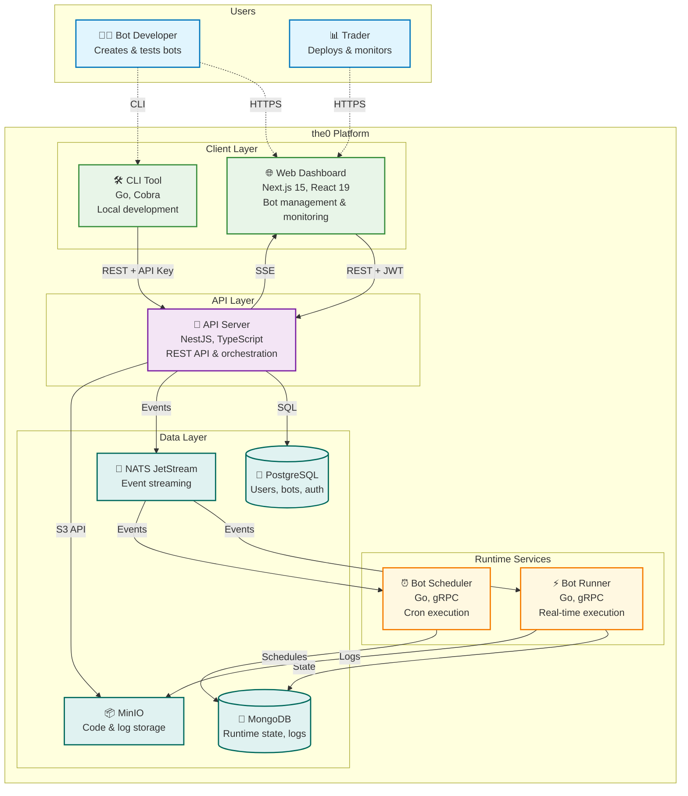

# the0

<div align="center">

**Open-Source Algorithmic Trading Platform**

*Production-grade bot execution engine for quantitative trading*

[](https://opensource.org/licenses/Apache-2.0)
[](https://www.docker.com/)
[](https://www.python.org/)
[](https://www.typescriptlang.org/)
[](https://www.rust-lang.org/)
[](https://isocpp.org/)
[](https://dotnet.microsoft.com/)
[](https://www.scala-lang.org/)
[](https://www.haskell.org/)
[](https://artifacthub.io/packages/helm/the0/the0)

</div>

---

## What is the0?

**the0** is an open-source algorithmic trading execution engine that provides production-grade infrastructure for deploying and managing trading bots across multiple markets. Build strategies in your preferred language—Python, TypeScript, Rust, C++, C#, Scala, or Haskell—then deploy them to a self-hosted execution engine with real-time monitoring and custom React dashboards.

> **Status**: Beta - Active development. Not production-ready. Contributions and feedback welcome.

### Key Features

- **Multi-Language Support** - Build bots in Python, TypeScript, Rust, C++, C#, Scala, or Haskell
- **Custom Frontends** - Create React dashboards tailored to your trading strategies
- **Real-time Execution** - Deploy scheduled or continuous trading bots with isolated execution
- **Self-Hosted** - Full control over your infrastructure and data
- **Docker Ready** - Streamlined deployment with Docker Compose
- **CLI-First Workflow** - Efficient bot management via command-line interface
- **Exchange Agnostic** - Design your bots to work with any trading platform

---

## Quick Start

Deploy the0 locally:

### Prerequisites

- **Docker** 20.10+ and **Docker Compose** 2.0+
- At least 4GB RAM available for containers
- **Git** for cloning the repository

### Option 1: Docker Compose Local Deployment (Recommended)

```bash
# Clone the repository
git clone https://github.com/yourusername/the0.git
cd the0

# Start all services
cd docker
make up

# Access the platform
open http://localhost:3001  # Frontend
open http://localhost:3000  # API
open http://localhost:9001  # MinIO Console (admin/the0password)
```

### Option 2: Kubernetes (Helm)

```bash
# Install from the Helm repository
helm repo add the0 https://alexanderwanyoike.github.io/the0
helm repo update
helm install the0 the0/the0 --namespace the0 --create-namespace
```

**Local development with Minikube:**

```bash
cd k8s
make minikube-up
make setup-hosts
```

See [k8s/README.md](k8s/README.md) for full Kubernetes deployment documentation.

---

## CLI Installation

The the0 CLI tool provides a local development interface for managing your bots.

### Quick Install (Recommended)

```bash
curl -sSL https://raw.githubusercontent.com/alexanderwanyoike/the0/main/scripts/install.sh | sh
```

This detects your OS and architecture, downloads the latest release binary, verifies its checksum, and installs it to `~/.the0/bin/the0`.

### Install from Source

```bash
# Clone the repository if you haven't already
git clone https://github.com/alexanderwanyoike/the0.git
cd the0/cli

# Build and install the CLI
make install

# Verify installation
the0 --help
```

The CLI will be installed to `~/bin/the0`. Make sure `~/bin` is in your PATH.

### Prerequisites for CLI

- **Go 1.21+** - Required for building the CLI
- **Git** - For cloning the repository

### CLI Configuration & Usage

**Configure API endpoint for local deployments:**

```bash
# For Docker Compose deployment
export THE0_API_URL=http://localhost:3000

# For Kubernetes deployment  
export THE0_API_URL=http://api.the0.local:3000
```

**Basic CLI usage:**

```bash
# Authenticate with the platform
the0 auth login

# Manage bots
the0 bot list
the0 bot create my-bot
the0 bot deploy my-bot

# Custom bot commands
the0 custom-bot upload my-trading-bot.zip
the0 custom-bot status my-trading-bot
```

For more CLI commands and usage, see the CLI documentation.

---

## MCP Server (Claude Code Integration)

the0 includes a built-in MCP (Model Context Protocol) server that enables AI assistants like Claude Code to interact directly with the platform. This allows you to manage bots, view logs, and deploy configurations using natural language.

### Configure Claude Code

**Option 1: CLI Command**

```bash
claude mcp add the0 --transport http http://localhost:3000/mcp
```

**Option 2: Configuration File**

Add to your `.mcp.json`:

```json
{
  "mcpServers": {
    "the0": {
      "url": "http://localhost:3000/mcp",
      "transport": "http"
    }
  }
}
```

### Available MCP Tools

| Category | Tool | Description |
|----------|------|-------------|
| **Auth** | `auth_status` | Check API key validity |
| **Bot Instance** | `bot_list` | List deployed bots |
| | `bot_get` | Get bot details |
| | `bot_deploy` | Deploy a new bot |
| | `bot_update` | Update bot configuration |
| | `bot_delete` | Delete a bot |
| **Logs** | `logs_get` | Get execution logs |
| | `logs_summary` | Get log statistics |
| **Custom Bot** | `custom_bot_list` | List available custom bots |
| | `custom_bot_get` | Get custom bot details |
| | `custom_bot_schema` | Get configuration schema |

### Example Usage

Once configured, ask Claude Code:

- *"List my deployed bots"*
- *"Show me the logs for my trading bot"*
- *"What custom bots are available?"*
- *"Deploy a new scheduled bot with this configuration"*

**Note:** MCP tools require authentication via API key. Generate one from the web dashboard or CLI.

---

## Architecture

the0 is built as a microservices execution engine that enables algorithmic trading bot deployment and management:



### How It Works

**🌐 Web Dashboard** - Next.js frontend for bot management, real-time monitoring, and documentation system

**🛠️ CLI Tool** - Go-based command-line interface for local bot development, testing, and deployment automation

**🚀 API Server** - NestJS backend providing REST APIs, JWT authentication, and event orchestration across all services

**⚙️ Runtime Services** - Specialized Go microservices using master-worker patterns for different execution models:
- **Bot Runner**: Real-time trading bot execution
- **Bot Scheduler**: Cron-based scheduled execution

**💾 Data Architecture** - Multi-database approach:
- **PostgreSQL**: User accounts, bot definitions, authentication
- **MongoDB**: Runtime state, job queues, execution logs
- **MinIO**: Bot code storage and logs
- **NATS JetStream**: Event streaming and service coordination

### Key Benefits

- **Isolated**: Each bot runs in isolation with resource management
- **Fast**: Real-time execution with live market data
- **Scalable**: Handles multiple bots and users across distributed infrastructure

---

## Bot Development

### Supported Languages

Build trading bots in any of these languages with official SDK support:

| Language | SDK | Documentation | Package Registry |
|----------|-----|---------------|------------------|
| **Python** | [sdk/python](sdk/python) | [Quick Start](docs/custom-bot-development/python-quick-start.md) | [PyPI](https://pypi.org/project/the0-sdk/) |
| **TypeScript/Node.js** | [sdk/nodejs](sdk/nodejs) | [Quick Start](docs/custom-bot-development/nodejs-quick-start.md) | [npm](https://www.npmjs.com/package/@alexanderwanyoike/the0-node) |
| **Rust** | [sdk/rust](sdk/rust) | [Quick Start](docs/custom-bot-development/rust-quick-start.md) | [crates.io](https://crates.io/crates/the0-sdk) |
| **C++** | [sdk/cpp](sdk/cpp) | [Quick Start](docs/custom-bot-development/cpp-quick-start.md) | Header-only (FetchContent) |
| **C#** | [sdk/dotnet](sdk/dotnet) | [Quick Start](docs/custom-bot-development/csharp-quick-start.md) | [NuGet](https://www.nuget.org/packages/The0.Sdk) |
| **Scala** | [sdk/scala](sdk/scala) | [Quick Start](docs/custom-bot-development/scala-quick-start.md) | [GitHub Packages](https://github.com/alexanderwanyoike/the0/packages) |
| **Haskell** | [sdk/haskell](sdk/haskell) | [Quick Start](docs/custom-bot-development/haskell-quick-start.md) | Source (cabal) |

### Custom Frontends

Build React dashboards tailored to your trading strategies using the React SDK:

| SDK | Documentation | Package |
|-----|---------------|---------|
| [sdk/react](sdk/react) | [Custom Frontends](docs/custom-bot-development/custom-frontends.md) | [@alexanderwanyoike/the0-react](https://www.npmjs.com/package/@alexanderwanyoike/the0-react) |

### Framework Agnostic

the0 doesn't lock you into specific libraries or frameworks. Use any packages from your language's ecosystem—pandas for Python, sttp for Scala, reqwest for Rust, or any other libraries you prefer.

### Example: Simple DCA Bot

```python
from typing import Dict, Any
from alpaca.trading.client import TradingClient

def main(id: str, config: Dict[str, Any]) -> Dict[str, Any]:
    """Dollar Cost Averaging bot - buys a fixed amount regularly"""
    
    # Initialize trading client
    client = TradingClient(
        api_key=config["api_key"],
        secret_key=config["secret_key"],
        paper=config.get("paper", True)
    )
    
    # Calculate and execute purchase
    symbol = config["symbol"]
    amount = config["amount"]
    
    # Place market buy order
    order = client.submit_order(
        symbol=symbol,
        notional=amount,
        side=OrderSide.BUY,
        type=OrderType.MARKET,
        time_in_force=TimeInForce.DAY
    )
    
    return {
        "status": "success",
        "message": f"Purchased ${amount} of {symbol}",
        "order_id": order.id
    }
```

### Bot Types

- **Scheduled Bots** - Run on cron schedules (daily, weekly, monthly)
- **Real-time Bots** - Continuous execution with live data feeds

---

## Documentation

### Getting Started
- [Welcome to the0](/docs/welcome-to-the0.md) - Platform overview
- [Custom Bot Development](/docs/custom-bot-development/) - Build your first bot
- [Quick Start Guide](/docs/custom-bot-development/quick-start-guide.md) - 15-minute DCA bot tutorial

### Deployment Guides
- [Docker Setup](docker/README.md) - Local development environment
- [Kubernetes Deployment](k8s/README.md) - Production deployment

### Development Resources
- [Bot Configuration](docs/custom-bot-development/configuration.md) - Configuration reference
- [Testing & Debugging](docs/custom-bot-development/testing.md) - Development best practices

---

## Contributing

We welcome contributions from developers, traders, and AI enthusiasts! the0 is built by a community that values creativity and innovation.

### AI-Assisted Development

We encourage the use of AI tools and agents in development:

- **AI Assistants Welcome** - Use Claude, ChatGPT, GitHub Copilot, or any AI tools you prefer
- **AI-Generated Code** - AI-written code is acceptable when properly tested
- **Creative Solutions** - We value innovative approaches and problem-solving
- **Quality First** - Ensure your code is properly tested, regardless of origin
- **Context Engineering Over Vibe Coding** - Use context engineering when contributing with AI

### Ways to Contribute

- **Bug Reports** - Found an issue? Let us know
- **Feature Requests** - Have ideas for improvements?
- **Code Contributions** - Submit pull requests (AI-assisted or manual)
- **Documentation** - Help improve our docs and examples
- **Bot Templates** - Share innovative trading strategies and patterns

See [CONTRIBUTING.md](CONTRIBUTING.md) for detailed contribution guidelines.

### Getting Started

1. Fork the repository
2. Create a feature branch (`git checkout -b feature/your-feature`)
3. Build your solution (with or without AI assistance)
4. Add tests
5. Submit a pull request with a clear description

---

## License

This project is licensed under the Apache License 2.0 - see the [LICENSE](LICENSE) file for details.

---

## Support & Community

- **Discord**: [Join our community for support](https://discord.gg/g5mp57nK)
- **Documentation**: [docs.the0.dev](https://docs.the0.dev)
- **GitHub Issues**: [Report bugs or request features](https://github.com/alexanderwanyoike/the0/issues)

---

<div align="center">

**Built by AlphaNeuron**

[Website](https://the0.dev) • [Documentation](https://docs.the0.dev) • [Discord](https://discord.gg/g5mp57nK)

</div>