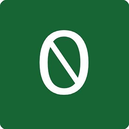
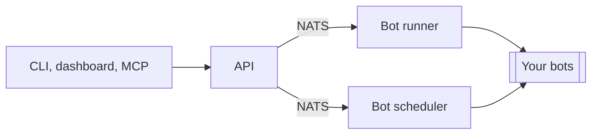

<div align="center">



# the0

**Run your trading bots like production software.**

A self-hosted runtime for algorithmic trading. Write a bot in the language you already use;<br>
the0 runs it, schedules it, keeps its state, streams its logs and gives it a live dashboard.

[](LICENSE)
[](https://github.com/alexanderwanyoike/the0/releases)
[](https://artifacthub.io/packages/search?repo=the0)
[](https://discord.gg/g5mp57nK)

[Docs](https://docs.the0.app) · [Quick start](#quick-start) · [Build a bot](https://docs.the0.app/custom-bot-development/) · [Discord](https://discord.gg/g5mp57nK)

</div>

---

You've tested a strategy on your laptop. Now it has to run every day, survive restarts, remember its positions between runs and tell you what it's doing. That last mile is ops work, and it's the same for every bot. the0 is that last mile, built once:

| | |
|---|---|
| **Runtime** | Every bot runs in its own isolated container, in Python, TypeScript, Rust, C++, C#, Scala or Haskell. |
| **Scheduling** | Run bots continuously, or on a cron schedule per instance. |
| **State** | Key-value state that survives between runs and restarts. |
| **Logs & metrics** | Structured logs and metrics from every run, live in the browser and queryable from the CLI and API. |
| **Dashboards** | Ship a React dashboard with your bot and watch its metrics update in real time. |

Backtesting stays local, next to your research. the0 is where a strategy goes once it's ready to trade.

## A complete bot

```python
import ccxt
from the0 import parse, metric, state, success

bot_id, config = parse()
price = ccxt.binance().fetch_ticker(config["symbol"])["last"]

runs = state.get("runs", 0) + 1
state.set("runs", runs)

metric("price", {"symbol": config["symbol"], "value": price})
success(f"Run {runs}: {config['symbol']} at {price}")
```

Use any exchange client or library you like. Upload the bot once, then start an instance of it on a schedule:

```json
{ "name": "btc-watch", "type": "scheduled/price-watch", "version": "1.0.0",
  "schedule": "*/5 * * * *", "symbol": "BTC/USDT" }
```

```bash
the0 custom-bot deploy           # package and upload the bot
the0 bot deploy instance.json    # run it every five minutes
the0 bot logs <bot_id> -w        # follow its logs
```

The [Python quick start](https://docs.the0.app/custom-bot-development/python-quick-start) walks through the full project, including the bot's config schema and dashboard.

## Quick start

You need Docker with the Compose plugin and about 4 GB of free memory.

```bash
curl -sSL https://install.the0.app | sh   # installs the CLI to ~/.the0/bin
the0 local init                            # prompts for the admin email and password
the0 local start
```

Open http://localhost:3001 and sign in. The API listens on http://localhost:3000.

For a server, follow [Docker Compose](https://docs.the0.app/deployment/docker-compose) or install the [Helm chart](https://docs.the0.app/deployment/kubernetes) on Kubernetes:

```bash
helm repo add the0 https://alexanderwanyoike.github.io/the0
```

## Languages

| Language | SDK | Guide |
|---|---|---|
| Python | [`the0-sdk`](https://pypi.org/project/the0-sdk/) on PyPI | [Quick start](https://docs.the0.app/custom-bot-development/python-quick-start) |
| TypeScript / Node.js | [`the0-node`](https://www.npmjs.com/package/the0-node) on npm | [Quick start](https://docs.the0.app/custom-bot-development/nodejs-quick-start) |
| Rust | [`the0-sdk`](https://crates.io/crates/the0-sdk) on crates.io | [Quick start](https://docs.the0.app/custom-bot-development/rust-quick-start) |
| C++ | Header-only, via [FetchContent](sdk/cpp) | [Quick start](https://docs.the0.app/custom-bot-development/cpp-quick-start) |
| C# | [`The0.Sdk`](https://www.nuget.org/packages/The0.Sdk) on NuGet | [Quick start](https://docs.the0.app/custom-bot-development/csharp-quick-start) |
| Scala | [GitHub Packages](https://github.com/alexanderwanyoike/the0/packages) | [Quick start](https://docs.the0.app/custom-bot-development/scala-quick-start) |
| Haskell | [From source](sdk/haskell) with cabal | [Quick start](https://docs.the0.app/custom-bot-development/haskell-quick-start) |
| React dashboards | [`the0-react`](https://www.npmjs.com/package/the0-react) on npm | [Custom frontends](https://docs.the0.app/custom-bot-development/custom-frontends) |

Working examples for each language live in [`example-bots/`](example-bots).

## Built for AI agents too

The API ships an [MCP server](https://docs.the0.app/integrations/mcp), so Claude Code or any MCP client can list, deploy and debug your bots. Create an API key in the dashboard, then:

```bash
claude mcp add the0 --transport http http://localhost:3000/mcp \
  --header "x-api-key: $THE0_API_KEY"
```

## How it fits together


```mermaid
flowchart LR
    Clients["CLI, dashboard, MCP"] --> API
    API -- NATS --> Runner[Bot runner]
    API -- NATS --> Scheduler[Bot scheduler]
    Runner --> Bots[[Your bots]]
    Scheduler --> Bots
```

The API is NestJS, the runtime and CLI are Go, and the dashboard is Next.js. PostgreSQL holds users and bot definitions, MongoDB holds runtime state, NATS carries events, and an S3-compatible store holds bot code and logs. Bots run as Docker containers under Compose, or as pods and CronJobs on Kubernetes.

> **Beta.** the0 moves fast. Breaking changes ship with a [migration guide](https://docs.the0.app/migration-guides/).

## Contributing

Bug reports, ideas and pull requests are all welcome, AI-assisted ones included as long as they come with tests. Start with [CONTRIBUTING.md](CONTRIBUTING.md), or say hello on [Discord](https://discord.gg/g5mp57nK).

## License

[Apache 2.0](LICENSE)

---

<div align="center">

Built by AlphaNeuron · [the0.app](https://the0.app)

</div>

This one's for you Dad
