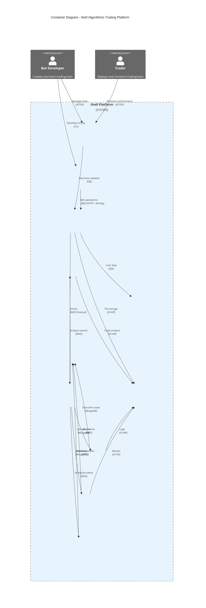

# the0

<div align="center">

**🚀 An Open-Source Algorithmic Trading Platform**

*Create, deploy, and manage trading bots with ease*

[](https://opensource.org/licenses/Apache-2.0)
[](https://www.docker.com/)
[](https://kubernetes.io/)
[](https://www.python.org/)
[](https://nodejs.org/)

</div>

---

## 🎯 What is the0?

**the0** is a comprehensive algorithmic trading platform that empowers developers and traders to create, deploy, and manage trading bots across multiple markets. Whether you're building a simple Dollar Cost Averaging (DCA) strategy or complex multi-asset arbitrage algorithms, the0 provides the infrastructure and tools you need.

> ⚠️ **Early Development**: the0 is currently in active development and not yet production ready. We're building towards a stable release - contributions and feedback are welcome!

### ✨ Key Features

- 🤖 **Custom Bot Development** - Build bots in Python or JavaScript with any libraries you prefer
- 📊 **Advanced Backtesting** - Test strategies with historical data before going live
- ⚡ **Real-time Execution** - Deploy scheduled or continuous trading bots
- 🐳 **Docker Ready** - Easy deployment with Docker Compose
- 📈 **Analytics Dashboard** - Monitor performance and track metrics
- 🌐 **Exchange Agnostic** - Design your bots to work with any trading platform

---

## 🚀 Quick Start

Get the0 running locally in under 5 minutes:

### Prerequisites

- **Docker** 20.10+ and **Docker Compose** 2.0+
- At least 4GB RAM available for containers
- **Git** for cloning the repository

### Option 1: Docker Compose (Recommended)

```bash
# Clone the repository
git clone https://github.com/yourusername/the0.git
cd the0

# Start all services
cd docker
make up

# Access the platform
open http://localhost:3001  # Frontend
open http://localhost:3000  # API
open http://localhost:9001  # MinIO Console (admin/the0password)
```

### Option 2: Kubernetes (Highly Experimental)

```bash
# Navigate to k8s directory
cd k8s

# Single command deployment with local endpoints (experimental)
make minikube

# Note: Kubernetes deployment is highly experimental and may not work properly
```

### Option 3: Development Mode

```bash
# Start infrastructure only
cd docker
make infrastructure

# Run services locally
cd api && yarn dev      # API server
cd frontend && yarn dev # Frontend
cd runtime && go run cmd/app/main.go  # Runtime
```

---

## 🏗️ Architecture

the0 is built as a comprehensive microservices platform that enables algorithmic trading bot development and execution:



### How It Works

**🌐 Web Dashboard** - Next.js frontend for bot management, real-time monitoring, and comprehensive documentation system

**🛠️ CLI Tool** - Go-based command-line interface for local bot development, testing, and deployment automation

**🚀 API Server** - NestJS backend providing REST APIs, JWT authentication, and event orchestration across all services

**⚙️ Runtime Services** - Specialized Go microservices using master-worker patterns for different execution models:
- **Bot Runner**: Real-time trading bot execution
- **Backtest Runner**: Historical strategy validation  
- **Bot Scheduler**: Cron-based scheduled execution

**🔍 Security Analyzer** - Python service with YARA rules for automated security analysis of user-submitted bot code

**🤖 AI Assistant** - FastAPI service providing AI-powered bot development assistance and code generation. Standalone application for now, but will be integrated into the frontend in the future.

**💾 Data Architecture** - Multi-database approach:
- **PostgreSQL**: User accounts, bot definitions, authentication
- **MongoDB**: Runtime state, job queues, execution logs
- **MinIO**: Bot code storage, logs, backtest results
- **NATS JetStream**: Event streaming and service coordination

### Key Benefits

- **🔒 Secure**: Each bot runs in isolation with basic security checks
- **⚡ Fast**: Real-time execution with live market data
- **📈 Scalable**: Automatically handles multiple bots and users
- **🛡️ Reliable**: Robust error handling and monitoring

---

## 🤖 Bot Development

### Framework Agnostic Approach

the0 doesn't lock you into specific libraries or frameworks. Create bots using:

- **Python 3.11+** with any PyPI packages (pandas, numpy, ccxt, etc.)
- **JavaScript/Node.js 20+** with any npm packages
- **Open Standards**: YAML configuration, JSON Schema validation

### Example: Simple DCA Bot

```python
from typing import Dict, Any
from alpaca.trading.client import TradingClient

def main(id: str, config: Dict[str, Any]) -> Dict[str, Any]:
    """Dollar Cost Averaging bot - buys a fixed amount regularly"""
    
    # Initialize trading client
    client = TradingClient(
        api_key=config["api_key"],
        secret_key=config["secret_key"],
        paper=config.get("paper", True)
    )
    
    # Calculate and execute purchase
    symbol = config["symbol"]
    amount = config["amount"]
    
    # Place market buy order
    order = client.submit_order(
        symbol=symbol,
        notional=amount,
        side=OrderSide.BUY,
        type=OrderType.MARKET,
        time_in_force=TimeInForce.DAY
    )
    
    return {
        "status": "success",
        "message": f"Purchased ${amount} of {symbol}",
        "order_id": order.id
    }
```

### Bot Types

- **📅 Scheduled Bots** - Run on cron schedules (daily, weekly, monthly)
- **⚡ Real-time Bots** - Continuous execution with live data feeds

---

## 📚 Documentation

### Getting Started
- [Welcome to the0](frontend/src/docs/welcome-to-the0.md) - Platform overview
- [Custom Bot Development](frontend/src/docs/custom-bot-development/) - Build your first bot
- [Quick Start Guide](frontend/src/docs/custom-bot-development/quick-start-guide.md) - 15-minute DCA bot tutorial

### Deployment Guides
- [Docker Setup](docker/README.md) - Local development environment
- [Kubernetes Deployment](k8s/README.md) - Production deployment
- [CLI Installation](frontend/src/docs/the0-CLI/installation.md) - Command-line tools

### Development Resources
- [Bot Configuration](frontend/src/docs/custom-bot-development/configuration.md) - Configuration reference
- [Testing & Debugging](frontend/src/docs/custom-bot-development/testing.md) - Development best practices
- [Backtesting](frontend/src/docs/custom-bot-development/backtesting.md) - Strategy validation

---


## 🤝 Contributing

We welcome contributions from developers, traders, and AI enthusiasts! the0 is built by a community that values creativity and innovation.

### 🤖 AI-Friendly Development

We encourage the use of AI tools and agents in development:

- ✅ **AI Assistants Welcome** - Use Claude, ChatGPT, GitHub Copilot, or any AI tools you prefer
- ✅ **AI-Generated Code** - AI-written code is perfectly fine as long as it's well-tested
- ✅ **Creative Solutions** - We value innovative approaches and creative problem-solving
- ⚠️ **Quality First** - Ensure your code is properly tested, regardless of how it was created

### Ways to Contribute

- 🐛 **Bug Reports** - Found an issue? Let us know!
- 💡 **Feature Requests** - Have creative ideas for improvements?
- 🔧 **Code Contributions** - Submit pull requests (AI-assisted or not!)
- 📖 **Documentation** - Help improve our docs and examples
- 🤖 **Bot Templates** - Share innovative trading strategies and patterns
- 🎨 **Creative Ideas** - Think outside the box - we love unconventional approaches!

### Development Philosophy

- **🚀 Innovation Over Convention** - Creative solutions are encouraged
- **🧪 Experiment Freely** - Try new approaches and share your learnings  
- **🤝 Collaborate Openly** - Work with both humans and AI to build great software
- **✅ Test Thoroughly** - Well-tested code is good code, regardless of its origin
- **📚 Document Well** - Help others understand your creative solutions

### Getting Started

1. Fork the repository
2. Create a feature branch (`git checkout -b feature/your-creative-idea`)
3. Build your solution (with or without AI assistance!)
4. Add comprehensive tests
5. Document your approach and any AI tools used
6. Submit a pull request with a clear description

We believe the best software comes from combining human creativity with AI capabilities. Don't hesitate to experiment and push boundaries!

---

## 📄 License

This project is licensed under the Apache License 2.0 - see the [LICENSE](LICENSE) file for details.

---

## 🆘 Support & Community

- 📧 **Support**: [support@the0.dev](mailto:support@the0.dev)
- 💬 **Discord**: [Join our community](https://discord.gg/the0-community)
- 📚 **Documentation**: [docs.the0.dev](https://docs.the0.dev)
- 🐙 **GitHub Issues**: [Report bugs or request features](https://github.com/yourusername/the0/issues)

---

<div align="center">

**Built with ❤️ by AlphaNeuron**

[Website](https://the0.dev) • [Documentation](https://docs.the0.dev) • [Discord](https://discord.gg/the0-community)

</div>