# the0

<div align="center">

**Open-Source Algorithmic Trading Platform**

*Production-grade bot execution engine for quantitative trading*

[](https://opensource.org/licenses/Apache-2.0)
[](https://www.docker.com/)
[](https://kubernetes.io/)
[](https://www.python.org/)
[](https://nodejs.org/)

</div>

---

## What is the0?

**the0** is an open-source algorithmic trading execution engine that provides production-grade infrastructure for deploying and managing trading bots across multiple markets. Build strategies in Python or JavaScript, then deploy them to a self-hosted execution engine with real-time monitoring and observability.

> **Status**: Beta - Active development. Not production-ready. Contributions and feedback welcome.

### Key Features

- **Custom Bot Development** - Build bots in Python or JavaScript with any libraries you prefer
- **Real-time Execution** - Deploy scheduled or continuous trading bots with isolated execution
- **Self-Hosted** - Full control over your infrastructure and data
- **Docker Ready** - Streamlined deployment with Docker Compose
- **CLI-First Workflow** - Efficient bot management via command-line interface
- **Exchange Agnostic** - Design your bots to work with any trading platform

---

## Quick Start

Deploy the0 locally:

### Prerequisites

- **Docker** 20.10+ and **Docker Compose** 2.0+
- At least 4GB RAM available for containers
- **Git** for cloning the repository

### Option 1: Docker Compose Local Deployment (Recommended)

```bash
# Clone the repository
git clone https://github.com/yourusername/the0.git
cd the0

# Start all services
cd docker
make up

# Access the platform
open http://localhost:3001  # Frontend
open http://localhost:3000  # API
open http://localhost:9001  # MinIO Console (admin/the0password)
```

### Option 2: Kubernetes (Minikube) (Highly Experimental)

```bash
# Navigate to k8s directory
cd k8s

# Single command deployment with local endpoints (experimental)
make minikube-up
make setup-hosts

# Note: Kubernetes deployment is highly experimental and may not work properly
```

Cloud deployments will be available in the future.

---

## CLI Installation

The the0 CLI tool provides a local development interface for managing your bots. 

### Install from Source

```bash
# Clone the repository if you haven't already
git clone https://github.com/alexanderwanyoike/the0.git
cd the0/cli

# Build and install the CLI
make install

# Verify installation
the0 --help
```

The CLI will be installed to `~/bin/the0`. Make sure `~/bin` is in your PATH.

### Prerequisites for CLI

- **Go 1.21+** - Required for building the CLI
- **Git** - For cloning the repository

### CLI Configuration & Usage

**Configure API endpoint for local deployments:**

```bash
# For Docker Compose deployment
export THE0_API_URL=http://localhost:3000

# For Kubernetes deployment  
export THE0_API_URL=http://api.the0.local:3000
```

**Basic CLI usage:**

```bash
# Authenticate with the platform
the0 auth login

# Manage bots
the0 bot list
the0 bot create my-bot
the0 bot deploy my-bot

# Custom bot commands
the0 custom-bot upload my-trading-bot.zip
the0 custom-bot status my-trading-bot
```

For more CLI commands and usage, see the CLI documentation.

---

## Architecture

the0 is built as a microservices execution engine that enables algorithmic trading bot deployment and management:

```mermaid
graph TB
    subgraph "Users"
        DEV[👨‍💻 Bot Developer<br/>Creates & tests bots]
        TRADER[📊 Trader<br/>Deploys & monitors]
    end
    
    subgraph "the0 Platform"
        subgraph "Client Layer"
            WEB[🌐 Web Dashboard<br/>Next.js 15, React 19<br/>Bot management & monitoring]
            CLI[🛠️ CLI Tool<br/>Go, Cobra<br/>Local development]
        end
        
        subgraph "API Layer"
            API[🚀 API Server<br/>NestJS, TypeScript<br/>REST API & orchestration]
        end
        
        subgraph "Runtime Services"
            BR[⚡ Bot Runner<br/>Go, gRPC<br/>Real-time execution]
            BS[⏰ Bot Scheduler<br/>Go, gRPC<br/>Cron execution]
        end
        
        subgraph "Supporting Services"
            AI[🤖 AI Assistant<br/>Python, FastAPI<br/>Development helper]
        end
        
        subgraph "Data Layer"
            PG[(🐘 PostgreSQL<br/>Users, bots, auth)]
            MONGO[(🍃 MongoDB<br/>Runtime state, logs)]
            NATS[📨 NATS JetStream<br/>Event streaming]
            MINIO[📦 MinIO<br/>Code & log storage]
        end
    end
    
    %% User interactions
    DEV -.->|HTTPS| WEB
    DEV -.->|CLI| CLI
    TRADER -.->|HTTPS| WEB
    
    %% Client to API
    WEB -->|REST + JWT| API
    CLI -->|REST + API Key| API
    API -->|SSE| WEB
    
    %% API to databases
    API -->|SQL| PG
    API -->|Events| NATS
    API -->|S3 API| MINIO
    
    %% Runtime services
    NATS -->|Events| BR
    NATS -->|Events| BS

    BR -->|State| MONGO
    BS -->|Schedules| MONGO

    BR -->|Logs| MINIO
    
    %% Styling
    classDef userClass fill:#e1f5fe,stroke:#0277bd,stroke-width:2px
    classDef clientClass fill:#e8f5e8,stroke:#388e3c,stroke-width:2px
    classDef apiClass fill:#f3e5f5,stroke:#7b1fa2,stroke-width:2px
    classDef runtimeClass fill:#fff8e1,stroke:#f57c00,stroke-width:2px
    classDef serviceClass fill:#fce4ec,stroke:#c2185b,stroke-width:2px
    classDef dataClass fill:#e0f2f1,stroke:#00695c,stroke-width:2px
    
    class DEV,TRADER userClass
    class WEB,CLI clientClass
    class API apiClass
    class BR,BS runtimeClass
    class AI serviceClass
    class PG,MONGO,NATS,MINIO dataClass
```



### How It Works

**🌐 Web Dashboard** - Next.js frontend for bot management, real-time monitoring, and documentation system

**🛠️ CLI Tool** - Go-based command-line interface for local bot development, testing, and deployment automation

**🚀 API Server** - NestJS backend providing REST APIs, JWT authentication, and event orchestration across all services

**⚙️ Runtime Services** - Specialized Go microservices using master-worker patterns for different execution models:
- **Bot Runner**: Real-time trading bot execution
- **Bot Scheduler**: Cron-based scheduled execution

**🤖 AI Assistant** - Standalone service providing AI-powered bot development assistance and code generation. Standalone application for now, but will be integrated into the frontend in the future.

**💾 Data Architecture** - Multi-database approach:
- **PostgreSQL**: User accounts, bot definitions, authentication
- **MongoDB**: Runtime state, job queues, execution logs
- **MinIO**: Bot code storage and logs
- **NATS JetStream**: Event streaming and service coordination

### Key Benefits

- **Isolated**: Each bot runs in isolation with resource management
- **Fast**: Real-time execution with live market data
- **Scalable**: Handles multiple bots and users across distributed infrastructure

---

## Bot Development

### Framework Agnostic Approach

the0 doesn't lock you into specific libraries or frameworks. Create bots using:

- **Python 3.11+** with any PyPI packages (pandas, numpy, ccxt, etc.)
- **JavaScript/Node.js 20+** with any npm packages
- **Open Standards**: YAML configuration, JSON Schema validation

### Example: Simple DCA Bot

```python
from typing import Dict, Any
from alpaca.trading.client import TradingClient

def main(id: str, config: Dict[str, Any]) -> Dict[str, Any]:
    """Dollar Cost Averaging bot - buys a fixed amount regularly"""
    
    # Initialize trading client
    client = TradingClient(
        api_key=config["api_key"],
        secret_key=config["secret_key"],
        paper=config.get("paper", True)
    )
    
    # Calculate and execute purchase
    symbol = config["symbol"]
    amount = config["amount"]
    
    # Place market buy order
    order = client.submit_order(
        symbol=symbol,
        notional=amount,
        side=OrderSide.BUY,
        type=OrderType.MARKET,
        time_in_force=TimeInForce.DAY
    )
    
    return {
        "status": "success",
        "message": f"Purchased ${amount} of {symbol}",
        "order_id": order.id
    }
```

### Bot Types

- **Scheduled Bots** - Run on cron schedules (daily, weekly, monthly)
- **Real-time Bots** - Continuous execution with live data feeds

---

## Documentation

### Getting Started
- [Welcome to the0](/docs/welcome-to-the0.md) - Platform overview
- [Custom Bot Development](/docs/custom-bot-development/) - Build your first bot
- [Quick Start Guide](/docs/custom-bot-development/quick-start-guide.md) - 15-minute DCA bot tutorial

### Deployment Guides
- [Docker Setup](docker/README.md) - Local development environment
- [Kubernetes Deployment](k8s/README.md) - Production deployment

### Development Resources
- [Bot Configuration](docs/custom-bot-development/configuration.md) - Configuration reference
- [Testing & Debugging](docs/custom-bot-development/testing.md) - Development best practices

---

## Contributing

We welcome contributions from developers, traders, and AI enthusiasts! the0 is built by a community that values creativity and innovation.

### AI-Assisted Development

We encourage the use of AI tools and agents in development:

- **AI Assistants Welcome** - Use Claude, ChatGPT, GitHub Copilot, or any AI tools you prefer
- **AI-Generated Code** - AI-written code is acceptable when properly tested
- **Creative Solutions** - We value innovative approaches and problem-solving
- **Quality First** - Ensure your code is properly tested, regardless of origin
- **Context Engineering Over Vibe Coding** - Use context engineering when contributing with AI

### Ways to Contribute

- **Bug Reports** - Found an issue? Let us know
- **Feature Requests** - Have ideas for improvements?
- **Code Contributions** - Submit pull requests (AI-assisted or manual)
- **Documentation** - Help improve our docs and examples
- **Bot Templates** - Share innovative trading strategies and patterns

See [CONTRIBUTING.md](CONTRIBUTING.md) for detailed contribution guidelines.

### Getting Started

1. Fork the repository
2. Create a feature branch (`git checkout -b feature/your-feature`)
3. Build your solution (with or without AI assistance)
4. Add tests
5. Submit a pull request with a clear description

---

## License

This project is licensed under the Apache License 2.0 - see the [LICENSE](LICENSE) file for details.

---

## Support & Community

- **Discord**: [Join our community for support](https://discord.gg/g5mp57nK)
- **Documentation**: [docs.the0.dev](https://docs.the0.dev)
- **GitHub Issues**: [Report bugs or request features](https://github.com/alexanderwanyoike/the0/issues)

---

<div align="center">

**Built by AlphaNeuron**

[Website](https://the0.dev) • [Documentation](https://docs.the0.dev) • [Discord](https://discord.gg/g5mp57nK)

</div>