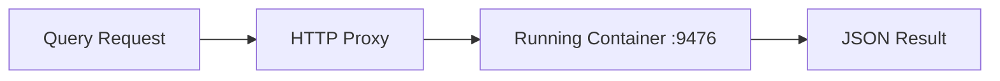
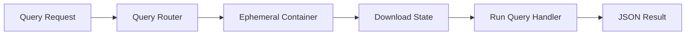

# Query Handlers

Query handlers let you expose read-only data from your bots. They're useful for building dashboards, displaying portfolio summaries, and exposing derived metrics—all without affecting bot execution or state.

## How It Works

Queries are executed differently depending on bot type:

### Realtime Bots

Realtime bots run a query HTTP server on port 9476. Queries are proxied directly to the running container, providing low-latency (~10-50ms) responses.



### Scheduled Bots

Scheduled bots handle queries by spawning ephemeral containers. When a query arrives, the runtime starts a container with the `QUERY_PATH` environment variable set. The SDK detects this and runs in query mode instead of normal execution. This has higher latency (~1-3s) due to container startup.



## Basic Usage

Define query handlers using the SDK's decorator/handler pattern. Each handler receives a request object with path and query parameters:

::: code-group

```python [Python]
from the0 import query, state

@query.handler("/status")
def get_status(req):
    """Get bot status and current values."""
    persisted = state.get("bot_state", {})
    config = query.get_config()

    return {
        "prev_short_sma": persisted.get("prev_short_sma"),
        "prev_long_sma": persisted.get("prev_long_sma"),
        "signal_count": persisted.get("signal_count", 0),
        "symbol": config.get("symbol", "AAPL")
    }

@query.handler("/signals")
def get_signals(req):
    """Get signal count with optional limit."""
    limit = int(req.get("limit", 10))
    persisted = state.get("bot_state", {})

    return {
        "signal_count": persisted.get("signal_count", 0),
        "limit_applied": limit
    }

if __name__ == "__main__":
    query.run()
```

```typescript [TypeScript]
import { query, state, logger } from "@alexanderwanyoike/the0-node";

interface BotState {
    priceHistory: { price: number; timestamp: number }[];
    alertCount: number;
}

query.handler("/current-price", (req) => {
    const botState = state.get<BotState>("bot_state");
    if (!botState?.priceHistory?.length) {
        return { error: "No price data available" };
    }

    const history = botState.priceHistory;
    const latest = history[history.length - 1];
    const oldest = history[0];

    return {
        current_price: latest.price,
        price_24h_ago: oldest.price,
        change_percent: ((latest.price - oldest.price) / oldest.price) * 100,
        data_points: history.length,
    };
});

query.handler("/alerts", (req) => {
    const limit = parseInt(req.get("limit", "10"));
    const botState = state.get<BotState>("bot_state");

    return {
        total_alerts: botState?.alertCount ?? 0,
        limit_applied: limit,
    };
});

query.run();
```

```rust [Rust]
use the0_sdk::{query, state};
use serde::{Deserialize, Serialize};
use serde_json::json;

#[derive(Serialize, Deserialize, Default)]
struct PersistedState {
    prev_short_sma: Option<f64>,
    prev_long_sma: Option<f64>,
    signal_count: u64,
}

fn main() {
    query::handler("/status", |_req| {
        let persisted: PersistedState = state::get("bot_state").unwrap_or_default();
        let config = query::get_config();

        json!({
            "prev_short_sma": persisted.prev_short_sma,
            "prev_long_sma": persisted.prev_long_sma,
            "signal_count": persisted.signal_count,
            "symbol": config.get("symbol").and_then(|v| v.as_str()).unwrap_or("AAPL")
        })
    });

    query::handler("/signals", |req| {
        let limit: i32 = req.get("limit", "10").parse().unwrap_or(10);
        let persisted: PersistedState = state::get("bot_state").unwrap_or_default();

        json!({
            "signal_count": persisted.signal_count,
            "limit_applied": limit
        })
    });

    query::run();
}
```

```cpp [C++]
#include <the0/query.h>
#include <the0/state.h>
#include <nlohmann/json.hpp>

using json = nlohmann::json;

int main() {
    the0::query::handler("/status", [](const the0::QueryRequest& req) {
        auto persisted = the0::state::get("bot_state");
        auto config = the0::query::get_config();

        json response;
        if (persisted.has_value()) {
            response["prev_short_sma"] = (*persisted).value("prev_short_sma", nullptr);
            response["prev_long_sma"] = (*persisted).value("prev_long_sma", nullptr);
            response["signal_count"] = (*persisted).value("signal_count", 0);
        } else {
            response["prev_short_sma"] = nullptr;
            response["prev_long_sma"] = nullptr;
            response["signal_count"] = 0;
        }
        response["symbol"] = config.value("symbol", "AAPL");

        return response;
    });

    the0::query::handler("/signals", [](const the0::QueryRequest& req) {
        int limit = std::stoi(req.get("limit", "10"));
        auto persisted = the0::state::get("bot_state");

        json response;
        response["signal_count"] = persisted.has_value()
            ? (*persisted).value("signal_count", 0)
            : 0;
        response["limit_applied"] = limit;

        return response;
    });

    the0::query::run();
    return 0;
}
```

```csharp [C#]
using The0;
using System.Text.Json;

class PersistedState
{
    public double? PrevShortSma { get; set; }
    public double? PrevLongSma { get; set; }
    public int SignalCount { get; set; }
}

class Program
{
    static void Main(string[] args)
    {
        Query.Handler("/status", req =>
        {
            var persisted = State.Get<PersistedState>("bot_state") ?? new PersistedState();
            var config = Query.GetConfig();

            return new
            {
                prev_short_sma = persisted.PrevShortSma,
                prev_long_sma = persisted.PrevLongSma,
                signal_count = persisted.SignalCount,
                symbol = config.GetProperty("symbol", "AAPL")
            };
        });

        Query.Handler("/signals", req =>
        {
            var limit = int.Parse(req.Get("limit", "10"));
            var persisted = State.Get<PersistedState>("bot_state") ?? new PersistedState();

            return new
            {
                signal_count = persisted.SignalCount,
                limit_applied = limit
            };
        });

        Query.Run();
    }
}
```

```scala [Scala]
import the0.{Query, State}
import io.circe.parser.parse

object QueryMain:
  def main(args: Array[String]): Unit =
    Query.handler("/status") { req =>
      val persisted = State.get("bot_state").flatMap(parse(_).toOption)
      val cursor = persisted.map(_.hcursor)

      val prevShortSma = cursor.flatMap(_.get[Double]("prev_short_sma").toOption)
      val prevLongSma = cursor.flatMap(_.get[Double]("prev_long_sma").toOption)
      val signalCount = cursor.flatMap(_.get[Long]("signal_count").toOption).getOrElse(0L)

      s"""{
        "prev_short_sma": ${prevShortSma.map(_.toString).getOrElse("null")},
        "prev_long_sma": ${prevLongSma.map(_.toString).getOrElse("null")},
        "signal_count": $signalCount
      }"""
    }

    Query.handler("/signals") { req =>
      val limit = req.getOrElse("limit", "10").toIntOption.getOrElse(10)
      val persisted = State.get("bot_state").flatMap(parse(_).toOption)
      val signalCount = persisted.flatMap(_.hcursor.get[Long]("signal_count").toOption).getOrElse(0L)

      s"""{"signal_count": $signalCount, "limit_applied": $limit}"""
    }

    Query.run()
```

```haskell [Haskell]
{-# LANGUAGE OverloadedStrings #-}
{-# LANGUAGE DeriveGeneric #-}

module Main where

import qualified The0.Query as Query
import qualified The0.State as State
import Data.Aeson (FromJSON, ToJSON, object, (.=))
import Data.Aeson.Key (fromText)
import Data.Maybe (fromMaybe)
import GHC.Generics
import Text.Read (readMaybe)

data PersistedState = PersistedState
  { psPrevShortSma :: Maybe Double
  , psPrevLongSma :: Maybe Double
  , psSignalCount :: Int
  } deriving (Show, Generic)

instance FromJSON PersistedState
instance ToJSON PersistedState

defaultState :: PersistedState
defaultState = PersistedState Nothing Nothing 0

main :: IO ()
main = do
    Query.handler "/status" $ \req -> do
        persisted <- fromMaybe defaultState <$> State.get "bot_state"
        return $ object
            [ fromText "prev_short_sma" .= psPrevShortSma persisted
            , fromText "prev_long_sma" .= psPrevLongSma persisted
            , fromText "signal_count" .= psSignalCount persisted
            ]

    Query.handler "/signals" $ \req -> do
        let limitStr = Query.getParam req "limit" "10"
            limit = fromMaybe 10 (readMaybe limitStr :: Maybe Int)
        persisted <- fromMaybe defaultState <$> State.get "bot_state"
        return $ object
            [ fromText "signal_count" .= psSignalCount persisted
            , fromText "limit_applied" .= limit
            ]

    Query.run
```

:::

## Configuration

Add a query entrypoint to your `bot-config.yaml`:

```yaml
name: my-bot
version: 1.0.0
type: realtime
runtime: python311

entrypoints:
  bot: main.py
  query: query.py  # Query handler file
```

For compiled languages, specify the binary or main class:

```yaml
# Rust
entrypoints:
  bot: target/release/my-bot
  query: target/release/my-query

# C++
entrypoints:
  bot: build/my_bot
  query: build/my_query

# Scala (JAR with main class)
entrypoints:
  bot: target/scala-3.3.1/my-bot-assembly.jar
  query: target/scala-3.3.1/my-bot-assembly.jar:QueryMain
```

## Invoking Queries

### CLI

```bash
# Basic query
the0 bot query <bot_id> /status

# With parameters
the0 bot query <bot_id> /signals --params '{"limit": 5}'

# Raw JSON output
the0 bot query <bot_id> /portfolio --raw
```

### API

```bash
# HTTP request
curl -X POST "https://api.the0.app/bot/<bot_id>/query" \
  -H "Authorization: Bearer $TOKEN" \
  -H "Content-Type: application/json" \
  -d '{"path": "/status", "params": {}}'
```

## Common Patterns

### Status Query

Expose current bot state and configuration:

```python
@query.handler("/status")
def get_status(req):
    config = query.get_config()
    persisted = state.get("bot_state", {})

    return {
        "config": {
            "symbol": config.get("symbol"),
            "update_interval": config.get("update_interval_ms", 5000)
        },
        "state": {
            "signal_count": persisted.get("signal_count", 0),
            "has_data": persisted.get("prev_short_sma") is not None
        }
    }
```

### Filtered Results

Accept query parameters to filter or limit results:

```python
@query.handler("/history")
def get_history(req):
    limit = int(req.get("limit", 50))
    offset = int(req.get("offset", 0))

    history = state.get("price_history", [])

    # Apply pagination
    paginated = history[offset:offset + limit]

    return {
        "data": paginated,
        "count": len(paginated),
        "total": len(history),
        "offset": offset,
        "limit": limit
    }
```

### Statistics

Compute derived metrics from state:

```python
@query.handler("/statistics")
def get_statistics(req):
    history = state.get("price_history", [])
    signals = state.get("signal_count", 0)

    if not history:
        return {"error": "No data available"}

    prices = [h["price"] for h in history]

    return {
        "signal_count": signals,
        "data_points": len(history),
        "price_min": min(prices),
        "price_max": max(prices),
        "price_avg": sum(prices) / len(prices)
    }
```

## Best Practices

### Keep Queries Read-Only

Queries should never modify state. They provide a read-only view into bot data:

```python
# Good: Read-only access
@query.handler("/portfolio")
def get_portfolio(req):
    return state.get("portfolio", {})

# Bad: Modifying state in a query
@query.handler("/reset")
def reset_counter(req):
    state.set("counter", 0)  # Don't do this!
    return {"reset": True}
```

### Return Quickly

Queries should respond quickly, especially for realtime bots where they run alongside the main bot process:

```python
# Good: Fast response from state
@query.handler("/status")
def get_status(req):
    return state.get("bot_state", {})

# Bad: Slow operation in query
@query.handler("/analyze")
def analyze(req):
    import requests
    data = requests.get("https://api.example.com/slow")  # Don't do this!
    return data.json()
```

### Provide Sensible Defaults

Handle missing state gracefully:

```python
@query.handler("/signals")
def get_signals(req):
    persisted = state.get("bot_state")

    # Handle missing state
    if not persisted:
        return {
            "signal_count": 0,
            "message": "Bot has not run yet"
        }

    return {
        "signal_count": persisted.get("signal_count", 0)
    }
```

### Use Consistent Response Format

Maintain consistent response structure across queries:

```python
# Consistent structure with metadata
@query.handler("/status")
def get_status(req):
    return {
        "success": True,
        "data": {
            "signal_count": state.get("signal_count", 0)
        }
    }

@query.handler("/history")
def get_history(req):
    return {
        "success": True,
        "data": state.get("history", []),
        "meta": {
            "total": len(state.get("history", []))
        }
    }
```

## Related

- [Persistent State](./state) - Store and retrieve data between executions
- [Bot Types](./bot-types) - Scheduled vs realtime execution
- [Development Overview](./overview) - SDK functions reference
