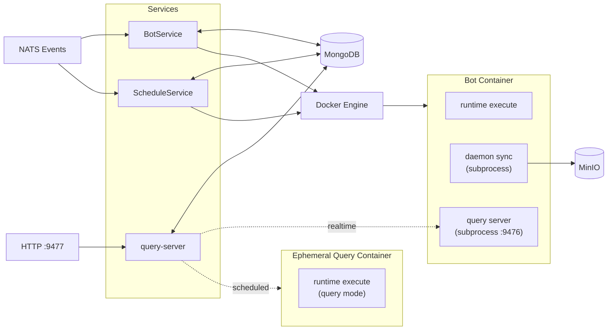
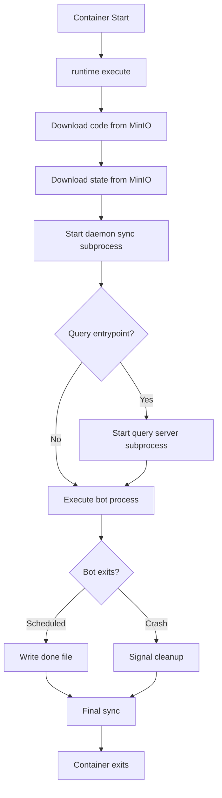

# Docker Mode

Docker mode provides single-process services for running bots in containers. This is the recommended deployment for local development and small-to-medium deployments (up to ~1000 bots per host).

## Architecture

Docker mode uses a **unified execute architecture** where each bot container is self-managing. The runtime services (bot-runner and bot-scheduler) only handle container lifecycle - starting, stopping, and restarting containers. All the complexity of code download, state persistence, and log streaming is delegated to the `runtime execute` command running inside each container.



## Services

**bot-runner** manages live trading bots - containers that run continuously until stopped. The service monitors container health and restarts failed containers through the reconciliation loop.

**bot-scheduler** manages cron-based scheduled bots. It evaluates cron expressions to determine when bots should run, then starts containers that execute once and terminate.

**query-server** handles query requests on port 9477. For realtime bots, it proxies to the container's query server on port 9476. For scheduled bots, it spawns ephemeral containers.

## How It Works

### The Reconciliation Loop

Both BotService and ScheduleService use a reconciliation pattern. Every 30 seconds (configurable), the service queries MongoDB for the desired state - which bots should be running - and compares it against the actual state from Docker. If a bot should be running but isn't, the service starts it. If a container is running but the bot was disabled, the service stops it. If the configuration changed, the service restarts the container.

NATS integration is optional but recommended. Without NATS, changes only take effect at the next reconciliation interval. With NATS, the service receives events immediately and can act on them right away.

### Container Execution

When a container starts, it runs `runtime execute` which handles everything:



### State Persistence

The daemon sync process periodically (every 60s) computes a hash of the state directory and uploads changes to MinIO when detected. Logs are also synced periodically.

For scheduled bots, the daemon also watches for a "done" file. When the bot completes and writes its exit code to this file, the daemon performs a final sync and then exits, allowing the container to terminate cleanly.

## Query Execution

### Realtime Bot Queries

For running bots with a query entrypoint, `runtime execute` starts a query server subprocess on port 9476. Queries are proxied to this server:

1. QueryServer (port 9477) receives HTTP request
2. QueryResolver finds the bot and its container
3. QueryHandler proxies to container IP:9476 (the query server subprocess)
4. Response returned (~10-50ms latency)

### Scheduled Bot Queries

For scheduled bots (not currently running), queries spawn ephemeral containers:

1. QueryServer receives request
2. QueryResolver finds the bot configuration
3. QueryHandler builds executable with `QUERY_PATH` and `QUERY_PARAMS` env vars
4. DockerRunner starts ephemeral container
5. Container runs query mode, returns JSON result
6. Container terminates (~1-3s latency)

## Service State

The services maintain in-memory state to track running containers:

- **RunningBot**: Tracks each bot's container ID, status, start time, and restart count
- **ServiceState**: Thread-safe map of botID → RunningBot with metrics
- **Statuses**: "starting", "running", "stopping", "failed"

This enables the reconciliation loop to compare desired state (MongoDB) with actual state (running containers) and take corrective action.

## Quick Start

Using the CLI:

```bash
the0 local start
```

This starts all services including bot-runner, bot-scheduler, and query-server. Runtime images are built automatically.

## Environment Variables

### Required

```bash
MONGO_URI=mongodb://localhost:27017    # MongoDB connection
MINIO_ENDPOINT=localhost:9000          # MinIO endpoint
MINIO_ACCESS_KEY=the0admin             # MinIO access key
MINIO_SECRET_KEY=the0password          # MinIO secret key
```

### Optional

```bash
NATS_URL=nats://localhost:4222         # NATS for real-time events
```

## Capacity

| Metric | Single Process |
|--------|----------------|
| Bots managed | 10,000+ |
| Memory overhead | ~100MB for 1000 bots |
| Goroutines | 1 per bot + collectors |
| Docker limit | ~1000 containers/host |

**If you need more than 1000 bots: use [Kubernetes mode](./kubernetes-mode).**
