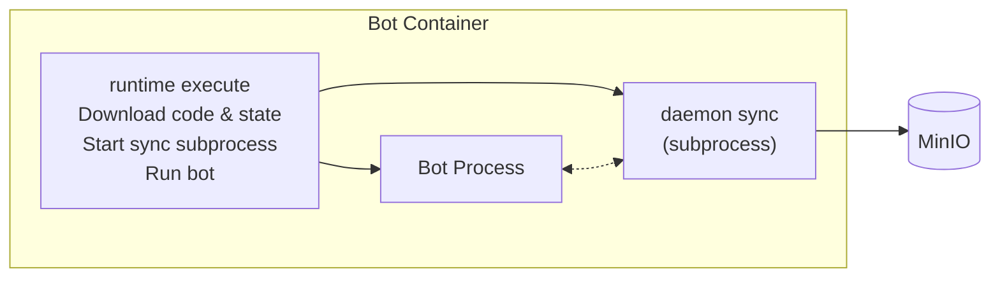
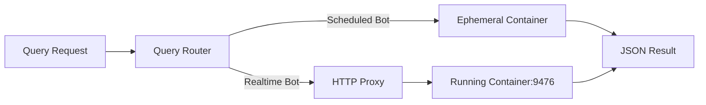

# Runtime Overview

The runtime is a unified container orchestration system that manages bot execution with persistent state. It handles everything from downloading your bot code to syncing state and logs.

## Deployment Modes

The runtime provides two deployment modes:

| Mode | Use Case | Scale |
|------|----------|-------|
| **Docker Mode** | Local development, small deployments | Up to ~1000 bots per host |
| **Kubernetes Mode** | Production scale, high availability | 10,000+ bots |

## The Execute Architecture

The runtime uses a **unified execute architecture** where each bot container is self-managing. Rather than the orchestrator handling code download, state persistence, and log streaming, all of this is delegated to the `runtime execute` command running inside the container.

When a container starts:
1. `runtime execute` downloads the bot code and state from MinIO
2. Starts the `daemon sync` subprocess for state/log persistence
3. For realtime bots with a query entrypoint, starts a query server subprocess on port 9476
4. Executes the bot process directly

## State Persistence

Bot state is automatically synced to MinIO. The `daemon sync` process periodically (every 60s) computes a hash of the state directory and uploads changes when detected. On restart, existing state is downloaded before the bot starts, ensuring continuity across container restarts.

For scheduled bots, the daemon performs a final sync when the bot completes, ensuring all state and logs are captured before the container terminates.

## Query System

The runtime provides a query API for reading computed data from bots without modifying state. Queries are useful for dashboards, portfolio summaries, and derived metrics.

**Realtime bots** run a query HTTP server on port 9476. Queries are proxied directly to the running container, providing low-latency (~10-50ms) responses.

**Scheduled bots** handle queries by spawning ephemeral containers. When a query arrives, the runtime starts a container with the `QUERY_PATH` environment variable set. The bot SDK detects this and runs in query mode instead of normal execution. This has higher latency (~1-3s) due to container startup.

## Supported Runtimes

The platform supports multiple programming languages:

- Python 3.11
- Node.js 20
- Rust
- C++
- C# (.NET 8)
- Scala
- Haskell

A universal runtime image includes all language runtimes and the `runtime` binary.

## Next Steps

- [Docker Mode](./docker-mode) - Learn about local development and small deployments
- [Kubernetes Mode](./kubernetes-mode) - Learn about production-scale deployments
