# Platform Development Guide

Welcome to the the0 platform development guide. This comprehensive documentation is designed for developers who want to understand, contribute to, or extend the the0 algorithmic trading platform.

## 🎯 What This Guide Covers

This guide provides detailed technical documentation for:

- **Platform Architecture**: High-level system design and component interactions
- **Core Services**: Deep dives into each microservice and their responsibilities
- **Infrastructure**: Deployment patterns, data architecture, and development workflows
- **Development Patterns**: Best practices, coding standards, and architectural patterns

## 🏗️ Platform Architecture Overview

the0 is built as a cloud-native, microservices platform that enables algorithmic trading bot development and execution. The architecture emphasizes isolation, scalability, and security.

### Core Design Principles

- **Service Isolation**: Each bot runs in isolated environments with security boundaries
- **Event-Driven**: Loose coupling between services using NATS event streaming
- **Polyglot Persistence**: Right database for the right job (PostgreSQL, MongoDB, NATS JetStream, MinIO)
- **Horizontal Scalability**: Services can scale independently based on load
- **Security First**: Built-in security analysis and runtime isolation

### High-Level Architecture

```mermaid
graph TB
    subgraph "Client Layer"
        WEB[🌐 Web Dashboard<br/>Next.js 15, React 19]
        CLI[🛠️ CLI Tool<br/>Go 1.24+]
    end

    subgraph "API & Orchestration"
        API[🚀 API Server<br/>NestJS, TypeScript]
    end

    subgraph "Runtime Services"
        BR[⚡ Bot Runner<br/>Go, gRPC]
        BT[📈 Backtest Runner<br/>Go, gRPC]
        BS[⏰ Bot Scheduler<br/>Go, gRPC]
    end

    subgraph "Supporting Services"
        SA[🔍 Security Analyzer<br/>Python, YARA]
        AI[🤖 AI Assistant<br/>Python, FastAPI]
    end

    subgraph "Data Layer"
        PG[(🐘 PostgreSQL)]
        MONGO[(🍃 MongoDB)]
        NATS[📨 NATS JetStream]
        MINIO[📦 MinIO]
    end

    WEB -->|REST + JWT| API
    CLI -->|REST + API Key| API
    API -->|Events| NATS
    API -->|SQL| PG
    API -->|S3 API| MINIO

    NATS -->|Events| BR
    NATS -->|Events| BT
    NATS -->|Events| BS
    NATS -->|Events| SA
    NATS -->|Events| AI

    BR -->|State| MONGO
    BT -->|Jobs| MONGO
    BS -->|Schedules| MONGO

    BR -->|Logs| MINIO
    BT -->|Results| MINIO
    SA -->|Analysis| MINIO
```



## 📚 Guide Structure

### 🚀 [Core Services](./services/)
Detailed documentation for each platform service:

- **[API Server](./services/api-server.md)** - Central orchestration and REST API
- **[CLI Tool](./services/cli-tool.md)** - Command-line interface for development
- **[Frontend Dashboard](./services/frontend-dashboard.md)** - Web management interface
- **[Runtime Services](./services/runtime-services.md)** - Bot execution engines
- **[Security Analyzer](./services/0vers33r.md)** - Code security analysis service
- **[AI Agent](./services/ai-agent.md)** - AI-powered development assistant

### 🏗️ [Infrastructure](./infrastructure/)
Platform infrastructure and deployment:

- **[Docker Deployment](./infrastructure/docker-deployment.md)** - Local development with Docker Compose
- **[Kubernetes Deployment](./infrastructure/kubernetes-deployment.md)** - Production orchestration
- **[Data Architecture](./infrastructure/data-architecture.md)** - Data persistence and streaming

### 🎨 [Development Patterns](./development-patterns.md)
Common patterns and best practices:

- Microservices design patterns
- Inter-service communication
- Security patterns
- Error handling and recovery
- Testing strategies

## 🚀 Getting Started as a Contributor

### Prerequisites

- **Docker** 20.10+ and **Docker Compose** 2.0+
- **Node.js** 20+ for API and frontend development
- **Go** 1.24+ for CLI and runtime services
- **Python** 3.11+ for security analyzer and AI agent

### Development Setup

1. **Clone the Repository**
   ```bash
   git clone https://github.com/yourusername/the0.git
   cd the0
   ```

2. **Start Local Development**
   ```bash
   cd docker
   make up
   ```

3. **Access Services**
   - Frontend: http://localhost:3001
   - API: http://localhost:3000
   - MinIO Console: http://localhost:9001 (admin/the0password)

### Development Workflow

1. **Service Development**: Work on individual services in isolation
2. **Integration Testing**: Use Docker Compose for full-stack testing
3. **Security Considerations**: Follow security patterns for bot isolation
4. **Documentation**: Update docs as part of PR process

## 🔧 Key Technologies

### Frontend & API
- **Next.js 15** with App Router and React 19
- **NestJS** with TypeScript for backend APIs
- **Tailwind CSS** with shadcn/ui components
- **Zustand** for state management

### Runtime & CLI
- **Go 1.24+** with gRPC for high-performance services
- **Cobra** framework for CLI command structure
- **Docker** for container orchestration

### Data & Messaging
- **PostgreSQL** for relational data (users, bots, auth)
- **MongoDB** for operational data (state, logs, queues)
- **NATS JetStream** for event streaming
- **MinIO** for object storage (code, results)

### Security & AI
- **YARA** for malware pattern detection
- **Google Gemini** for AI-powered code analysis
- **JWT** for authentication and authorization

## 🛡️ Security Architecture

### Multi-Layer Security

1. **Application Layer**: JWT authentication, API key management
2. **Network Layer**: Service isolation, encrypted communication
3. **Runtime Layer**: Container isolation, resource limits
4. **Code Analysis**: YARA rules, AI semantic analysis

### Bot Isolation Model


## 📊 Data Flow Architecture

### Event-Driven Communication

The platform uses NATS JetStream for reliable event streaming:


### Data Persistence Strategy

- **PostgreSQL**: ACID-compliant transactional data
- **MongoDB**: Flexible document storage for operational data
- **MinIO**: Binary storage for code and results
- **NATS JetStream**: Durable event streams with replay

## 🎯 Common Development Tasks

### Adding a New Service

1. Create service directory with appropriate Dockerfile
2. Add to Docker Compose configuration
3. Implement NATS event handlers
4. Add health checks and monitoring
5. Update service documentation

### Extending Bot Capabilities

1. Add new bot configuration schemas
2. Extend runtime service interfaces
3. Update security analyzer rules
4. Test with various bot types
5. Update CLI commands

### Modifying Security Rules

1. Update YARA rule files in security analyzer
2. Test new rules against known malicious patterns
3. Update AI analysis prompts if needed
4. Document rule changes and reasoning

## 🔍 Monitoring & Observability

### Service Health Monitoring

- **Health Checks**: HTTP endpoints for service liveness
- **Metrics**: Custom metrics for service performance
- **Logging**: Structured JSON logging across services
- **Tracing**: Distributed tracing for request flows

### Key Metrics to Monitor

- Bot execution success rates
- Security analysis processing time
- API response times and error rates
- Resource utilization per service
- Event stream lag and throughput

## 🚨 Troubleshooting Common Issues

### Service Startup Failures

1. **Check Dependencies**: Ensure required services are running
2. **Verify Configuration**: Check environment variables and secrets
3. **Review Logs**: Check service logs for error messages
4. **Validate Connectivity**: Ensure services can communicate

### Performance Issues

1. **Resource Utilization**: Monitor CPU, memory, and I/O
2. **Database Performance**: Check query performance and connection pools
3. **Event Stream Lag**: Monitor NATS JetStream consumer lag
4. **Container Resource Limits**: Review Docker resource allocations

## 🤝 Contributing to the Platform

### Code Contribution Process

1. **Fork and Create Branch**: Use descriptive branch names
2. **Develop and Test**: Follow service-specific testing patterns
3. **Documentation**: Update relevant documentation sections
4. **Pull Request**: Include clear description and testing instructions

### Code Review Guidelines

- **Security First**: All changes reviewed for security implications
- **Performance Impact**: Consider scalability and resource usage
- **Documentation**: Ensure docs are updated with code changes
- **Testing**: Verify test coverage and test quality

## 📚 Additional Resources

- **[API Documentation](/api)** - REST API reference
- **[CLI Guide](/the0-cli)** - Command-line interface documentation
- **[Bot Development](/custom-bot-development)** - Bot creation and deployment
- **[Deployment Guides](/docker-deployment)** - Production deployment patterns

---

*This guide is a living document that evolves with the platform. Contributions and suggestions are welcome!*