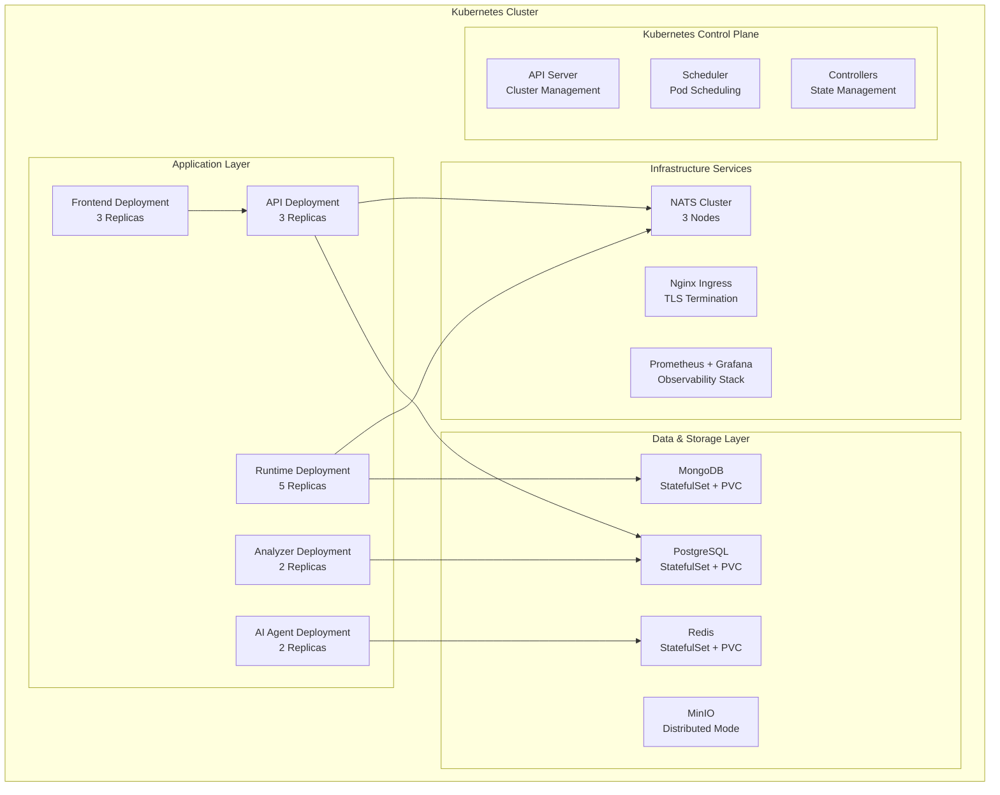

# Kubernetes Deployment

## 🎯 Overview

Kubernetes deployment provides production-grade orchestration for the0 algorithmic trading platform, enabling horizontal scaling, high availability, and automated lifecycle management. Using Helm charts for packaging and Minikube for local development, this deployment strategy supports both development workflows and production-grade distributed deployments with automatic load balancing, health monitoring, and rolling updates.

### Key Benefits

- **High Availability**: Multi-replica deployments with automatic failover
- **Horizontal Scaling**: Auto-scaling based on CPU, memory, and custom metrics
- **Self-Healing**: Automatic container restarts and service recovery
- **Load Balancing**: Built-in load distribution across service replicas
- **Rolling Updates**: Zero-downtime updates with rollback capabilities
- **Resource Optimization**: Efficient resource utilization and scheduling

### Deployment Architecture



## 🛠️ Technology Stack

| Technology | Version | Purpose |
|------------|---------|---------|
| Kubernetes | 1.28+ | Container orchestration platform |
| Helm | 3.12+ | Kubernetes package manager |
| Minikube | 1.32+ | Local Kubernetes development |
| kubectl | Latest | Kubernetes command-line tool |
| NGINX Ingress | Latest | Load balancing and TLS termination |
| Prometheus | Latest | Metrics collection and monitoring |
| Grafana | Latest | Visualization and alerting dashboard |
| Cert-Manager | Latest | Automatic TLS certificate management |

## 🏗️ Architecture & Design

### Namespace Configuration

```yaml
# kubernetes/namespace.yaml
apiVersion: v1
kind: Namespace
metadata:
  name: the0-platform
  labels:
    name: the0-platform
    environment: production
    managed-by: the0-platform
  annotations:
    description: "the0 algorithmic trading platform namespace"
```

### Service Deployments

**API Server Deployment**
```yaml
# kubernetes/api-deployment.yaml
apiVersion: apps/v1
kind: Deployment
metadata:
  name: the0-api
  namespace: the0-platform
  labels:
    app: the0-api
    component: backend
    version: v1
spec:
  replicas: 3
  strategy:
    type: RollingUpdate
    rollingUpdate:
      maxSurge: 1
      maxUnavailable: 1
  selector:
    matchLabels:
      app: the0-api
  template:
    metadata:
      labels:
        app: the0-api
        component: backend
        version: v1
    spec:
      containers:
      - name: the0-api
        image: the0/api:latest
        ports:
        - containerPort: 3000
        env:
        - name: NODE_ENV
          value: "production"
        - name: DATABASE_URL
          valueFrom:
            secretKeyRef:
              name: the0-secrets
              key: database-url
        - name: JWT_SECRET
          valueFrom:
            secretKeyRef:
              name: the0-secrets
              key: jwt-secret
        - name: NATS_URL
          value: "nats://nats-service:4222"
        resources:
          requests:
            memory: "256Mi"
            cpu: "250m"
          limits:
            memory: "512Mi"
            cpu: "500m"
        livenessProbe:
          httpGet:
            path: /health
            port: 3000
          initialDelaySeconds: 30
          periodSeconds: 10
        readinessProbe:
          httpGet:
            path: /health
            port: 3000
          initialDelaySeconds: 5
          periodSeconds: 5
```

**Runtime Service Deployment**
```yaml
# kubernetes/runtime-deployment.yaml
apiVersion: apps/v1
kind: Deployment
metadata:
  name: the0-runtime
  namespace: the0-platform
  labels:
    app: the0-runtime
    component: execution
    version: v1
spec:
  replicas: 5
  strategy:
    type: RollingUpdate
  selector:
    matchLabels:
      app: the0-runtime
  template:
    metadata:
      labels:
        app: the0-runtime
        component: execution
        version: v1
    spec:
      containers:
      - name: bot-runner
        image: the0/runtime:latest
        env:
        - name: NATS_URL
          value: "nats://nats-service:4222"
        - name: MONGODB_URI
          valueFrom:
            secretKeyRef:
              name: the0-secrets
              key: mongodb-uri
        - name: MAX_CONCURRENT_BOTS
          value: "50"
        resources:
          requests:
            memory: "512Mi"
            cpu: "500m"
          limits:
            memory: "1Gi"
            cpu: "1000m"
        livenessProbe:
          grpc:
            port: 8080
          initialDelaySeconds: 60
          periodSeconds: 30
        readinessProbe:
          grpc:
            port: 8080
          initialDelaySeconds: 10
          periodSeconds: 10
```

### Storage Configuration

**PostgreSQL StatefulSet**
```yaml
# kubernetes/postgres-statefulset.yaml
apiVersion: apps/v1
kind: StatefulSet
metadata:
  name: postgres
  namespace: the0-platform
spec:
  serviceName: postgres
  replicas: 1
  selector:
    matchLabels:
      app: postgres
  template:
    metadata:
      labels:
        app: postgres
    spec:
      containers:
      - name: postgres
        image: postgres:15-alpine
        env:
        - name: POSTGRES_DB
          value: the0_platform
        - name: POSTGRES_USER
          valueFrom:
            secretKeyRef:
              name: postgres-secrets
              key: username
        - name: POSTGRES_PASSWORD
          valueFrom:
            secretKeyRef:
              name: postgres-secrets
              key: password
        - name: PGDATA
          value: /var/lib/postgresql/data
        ports:
        - containerPort: 5432
        volumeMounts:
        - name: postgres-storage
          mountPath: /var/lib/postgresql/data
        - name: postgres-config
          mountPath: /etc/postgresql/postgresql.conf
          readOnly: true
        resources:
          requests:
            memory: "1Gi"
            cpu: "500m"
          limits:
            memory: "2Gi"
            cpu: "1000m"
  volumeClaimTemplates:
  - metadata:
      name: postgres-storage
    spec:
      accessModes: ["ReadWriteOnce"]
      storageClassName: fast-ssd
      resources:
        requests:
          storage: 100Gi
  - metadata:
      name: postgres-config
    spec:
      accessModes: ["ReadOnly"]
      storageClassName: fast-ssd
      resources:
        requests:
          storage: 1Gi
```

### Horizontal Pod Autoscaling

```yaml
# kubernetes/api-hpa.yaml
apiVersion: autoscaling/v2
kind: HorizontalPodAutoscaler
metadata:
  name: the0-api-hpa
  namespace: the0-platform
spec:
  scaleTargetRef:
    apiVersion: apps/v1
    kind: Deployment
    name: the0-api
  minReplicas: 2
  maxReplicas: 10
  metrics:
  - type: Resource
    resource:
      name: cpu
      target:
        type: Utilization
        averageUtilization: 70
  - type: Resource
    resource:
      name: memory
      target:
        type: Utilization
        averageUtilization: 80
  behavior:
    scaleUp:
      stabilizationWindowSeconds: 60
      policies:
      - type: Pods
        value: 2
    scaleDown:
      stabilizationWindowSeconds: 300
      policies:
      - type: Pods
        value: 1
```

## 🔧 Helm Chart Configuration

### Chart Structure

```
helm/the0/
├── Chart.yaml                 # Chart metadata and dependencies
├── values.yaml               # Default configuration values
├── values-production.yaml    # Production-specific values
├── values-development.yaml    # Development-specific values
├── templates/                 # Kubernetes templates
│   ├── namespace.yaml
│   ├── api/
│   │   ├── deployment.yaml
│   │   ├── service.yaml
│   │   ├── hpa.yaml
│   │   └── configmap.yaml
│   ├── frontend/
│   │   ├── deployment.yaml
│   │   └── service.yaml
│   ├── runtime/
│   │   ├── deployment.yaml
│   │   ├── service.yaml
│   │   └── configmap.yaml
│   ├── database/
│   │   ├── postgres.yaml
│   │   ├── mongodb.yaml
│   │   └── redis.yaml
│   ├── infrastructure/
│   │   ├── nats.yaml
│   │   ├── minio.yaml
│   │   └── monitoring.yaml
│   └── ingress/
│       └── ingress.yaml
└── charts/                  # Dependency charts
    └── postgresql-15.5.4.tgz
    └── redis-18.2.3.tgz
```

### Helm Configuration

**Chart.yaml**
```yaml
apiVersion: v2
name: the0
description: the0 Algorithmic Trading Platform
type: application
version: 1.0.0
appVersion: "1.0.0"

dependencies:
  - name: postgresql
    version: 15.5.4
    condition: database.enabled
  - name: redis
    version: 18.2.3
    condition: redis.enabled
  - name: mongodb
    version: 7.0.6
    condition: mongodb.enabled

maintainers:
  - name: the0-platform
    email: platform@the0.dev
    url: https://github.com/the0platform/the0

keywords:
  - trading
  - algorithmic
  - fintech
  - bots
  - kubernetes
  - microservices

annotations:
  category: FinancialTechnology
  licenses: Apache-2.0
```

**Values Configuration**
```yaml
# Global settings
global:
  imageRegistry: registry.the0.dev
  imagePullPolicy: IfNotPresent
  storageClass: fast-ssd
  domain: platform.the0.dev

# Application settings
api:
  replicaCount: 3
  image:
    repository: the0/api
    tag: "latest"
    pullPolicy: IfNotPresent

  service:
    type: ClusterIP
    port: 3000
    targetPort: 3000

  resources:
    requests:
      memory: "256Mi"
      cpu: "250m"
    limits:
      memory: "512Mi"
      cpu: "500m"

  autoscaling:
    enabled: true
    minReplicas: 2
    maxReplicas: 10
    targetCPUUtilizationPercentage: 70
    targetMemoryUtilizationPercentage: 80

# Frontend settings
frontend:
  replicaCount: 3
  image:
    repository: the0/frontend
    tag: "latest"

  service:
    type: ClusterIP
    port: 3001

  resources:
    requests:
      memory: "128Mi"
      cpu: "100m"
    limits:
      memory: "256Mi"
      cpu: "250m"

# Runtime settings
runtime:
  replicaCount: 5
  image:
    repository: the0/runtime
    tag: "latest"

  resources:
    requests:
      memory: "512Mi"
      cpu: "500m"
    limits:
      memory: "1Gi"
      cpu: "1000m"

  maxConcurrentBots: 50

# Database configuration
database:
  postgresql:
    enabled: true
    auth:
      username: the0
      database: the0_platform
      existingSecret: postgres-credentials

    primary:
      persistence:
        enabled: true
        size: 100Gi
        storageClass: fast-ssd

  mongodb:
    enabled: true
    auth:
      enabled: true
      username: the0_mongo
      database: bot_runner
      existingSecret: mongodb-credentials

    persistence:
      enabled: true
      size: 50Gi

  redis:
    enabled: true
    auth:
      enabled: true
      existingSecret: redis-credentials
    password: "your-secure-redis-password"

    persistence:
      enabled: true
      size: 10Gi

# Infrastructure services
nats:
  enabled: true
  cluster:
    enabled: true
    replicaCount: 3
    jetstream:
      enabled: true
      memoryStore:
        enabled: true
        size: 1Gi

minio:
  enabled: true
  mode: distributed
  persistence:
    enabled: true
    size: 100Gi

  rootUser: the0_minio
  rootPassword: "your-secure-minio-password"

  existingSecret: minio-credentials

# Ingress configuration
ingress:
  enabled: true
  className: nginx
  tls:
    enabled: true
    secretName: the0-tls
  host: platform.the0.dev
  paths:
    - path: /
      service: api
      port: 3000
    - path: /
      service: frontend
      port: 3001
```

## 🚀 Development Workflow

### Minikube Setup

```bash
# 1. Install Minikube
curl -LO https://storage.googleapis.com/minikube/releases/latest/minikube-linux-amd64
sudo install minikube-linux-amd64 /usr/local/bin/minikube

# 2. Start Minikube cluster
minikube start --cpus=4 --memory=8192 --disk-size=50g \
  --kubernetes-version=v1.28.2 \
  --docker-opt=overlayfs2 \
  --insecure-registry=registry.the0.dev

# 3. Configure kubectl
minikube kubectl -- get pods
eval $(minikube docker-env)

# 4. Enable required addons
minikube addons enable ingress
minikube addons enable metrics-server

# 5. Build and deploy with Helm
helm dependency build
helm install the0 ./helm/the0 --namespace the0-platform \
  --set global.imagePullPolicy=Always \
  --set ingress.enabled=true \
  --set domain=the0.local \
  --set ingress.ingressClassName=nginx
```

### Development Deployment

```bash
# Development environment deployment
helm upgrade --install the0 ./helm/the0 \
  --namespace the0-dev \
  --values ./helm/the0/values-development.yaml \
  --wait \
  --timeout 10m

# Development-specific overrides
--set api.image.pullPolicy=Always \
--set frontend.replicaCount=1 \
--set runtime.replicaCount=2 \
--set database.postgresql.primary.persistence.enabled=false \
--set minio.mode=standalone \
--set ingress.ingressClassName=nginx \
--set domain=the0-dev.local
```

### Production Deployment

```bash
# Production environment deployment
helm upgrade --install the0 ./helm/the0 \
  --namespace the0-platform \
  --values ./helm/the0/values-production.yaml \
  --wait \
  --timeout 15m \
  --atomic

# Production-specific configurations
--set global.imagePullPolicy=IfNotPresent \
--set api.replicaCount=5 \
--set runtime.replicaCount=10 \
--set database.postgresql.primary.persistence.enabled=true \
--set minio.mode=distributed \
--set ingress.tls.enabled=true \
--set autoscaling.enabled=true
```

### Multi-Environment Support

```bash
# Environment-specific configurations
environments/
├── staging/
│   ├── values.yaml
│   ├── secrets.yaml
│   └── ingress.yaml
├── production/
│   ├── values.yaml
│   ├── secrets.yaml
│   └── ingress.yaml
└── development/
    ├── values.yaml
    └── secrets.yaml

# Deploy to specific environment
helm upgrade --install the0 ./helm/the0 \
  --namespace the0-${ENV} \
  --values environments/${ENV}/values.yaml \
  --values environments/${ENV}/secrets.yaml
```

## 🧪 Testing

### Integration Testing

```yaml
# kubernetes/test-integration.yaml
apiVersion: v1
kind: Pod
metadata:
  name: the0-integration-test
  namespace: the0-platform
spec:
  restartPolicy: Never
  containers:
  - name: api-test
    image: the0/api:latest
    env:
      - name: TEST_MODE
        value: "true"
      - name: API_URL
        value: "http://the0-api:3000"
    command: ["/bin/sh", "-c"]
    args:
    - |
      echo "Testing API connectivity..."
      curl -f http://the0-api:3000/health || echo "API health check failed"

      echo "Testing database connectivity..."
      curl -f http://the0-api:3000/api/health/db || echo "Database health check failed"

      echo "Testing NATS connectivity..."
      curl -f http://the0-api:3000/api/health/nats || echo "NATS health check failed"
  restartPolicy: Never
```

### Load Testing

```yaml
# kubernetes/load-test.yaml
apiVersion: v1
kind: Job
metadata:
  name: the0-load-test
  namespace: the0-platform
spec:
  parallelism: 10
  template:
    spec:
      containers:
      - name: load-generator
        image: the0/load-test:latest
        env:
          - name: API_URL
            value: "http://the0-api:3000"
          - name: TEST_DURATION
            value: "60"
        command: ["hey", "-z", "10", "-c", "10", "-m", "POST", "-d", '{"test": "data"}', "http://$(API_URL)/api/test"]
      restartPolicy: Never
```

## 📊 Performance & Scaling

### Resource Allocation

```yaml
# Production resource limits
resources:
  requests:
    cpu: 2
    memory: 8Gi
  limits:
    cpu: 8
    memory: 16Gi

# Node affinity and taints
affinity:
  nodeAffinity:
    requiredDuringSchedulingIgnoredDuringExecution:
    - nodeSelectorTerms:
      - matchExpressions:
        - key: node-type
          operator: In
          values: ["production"]
    preferredDuringSchedulingIgnoredDuringExecution:
      - weight: 100
        preferenceMatchExpressions:
          - weight: 50
            - matchExpressions:
              - key: zone
                operator: In
                values: ["zone-a", "zone-b"]
```

### Performance Monitoring

```yaml
# Prometheus monitoring configuration
apiVersion: v1
kind: ConfigMap
metadata:
  name: prometheus-config
  namespace: monitoring
data:
  prometheus.yml: |
    global:
      scrape_interval: 15s
      evaluation_interval: 15s

    rule_files:
      - "kubernetes-pods.yml"
      - "kubernetes-service-endpoints.yml"
      - "kubernetes-ingress.yml"

    scrape_configs:
      - job_name: 'the0-platform'
        kubernetes_sd_configs:
          - role: pod
          namespaces:
            names:
              - the0-platform
        relabel_configs:
          - source_labels: [__meta_kubernetes_pod_label_app]
            - regex: __meta_kubernetes_pod_label_(.+)
            - target_label: app
          - action: keep
```

### Autoscaling Strategies

```yaml
# CPU-based autoscaling
apiVersion: autoscaling/v2
kind: HorizontalPodAutoscaler
metadata:
  name: the0-api-cpu-hpa
  namespace: the0-platform
spec:
  scaleTargetRef:
    apiVersion: apps/v1
    kind: Deployment
    name: the0-api
  minReplicas: 3
  maxReplicas: 20
  metrics:
  - type: Resource
    resource:
      name: cpu
      target:
        type: Utilization
        averageUtilization: 70
    behavior:
      scaleUp:
        stabilizationWindowSeconds: 60
      scaleDown:
        stabilizationWindowSeconds: 300
        policies:
          - type: Percent
            value: 10
```

## 🔍 Monitoring & Observability

### Health Check Configuration

```yaml
# Pod-level health checks
apiVersion: v1
kind: Pod
spec:
  containers:
  - name: the0-api
    livenessProbe:
      httpGet:
        path: /health
        port: 3000
        scheme: HTTP
        httpHeaders:
          User-Agent: Kubernetes-Healthcheck/1.0
      initialDelaySeconds: 30
      periodSeconds: 10
      timeoutSeconds: 5
      successThreshold: 1
      failureThreshold: 3

    readinessProbe:
      httpGet:
        path: /health/ready
        port: 3000
        scheme: HTTP
        httpHeaders:
          User-Agent: Kubernetes-Healthcheck/1.0
      initialDelaySeconds: 5
      periodSeconds: 5
      timeoutSeconds: 3
      successThreshold: 1
      failureThreshold: 3

# Custom health endpoint in application
@app.get('/health')
def health_check():
    checks = {
        'database': check_database_health(),
        'nats': check_nats_health(),
        'minio': check_minio_health(),
        'redis': check_redis_health(),
        'external_apis': check_external_api_health()
    }

    all_healthy = all(check.value == 'healthy' for check in checks.values())

    status_code = 200 if all_healthy else 503

    return jsonify({
        'status': 'healthy' if all_healthy else 'degraded',
        'checks': checks,
        'timestamp': datetime.utcnow().isoformat(),
        'version': get_application_version()
    }), status_code
```

### Metrics Collection

```yaml
# ServiceMonitor for Prometheus
apiVersion: monitoring.coreos.com/v1
kind: ServiceMonitor
metadata:
  name: the0-api-metrics
  namespace: the0-platform
  labels:
    app: the0-api
spec:
  selector:
    matchLabels:
      app: the0-api
  endpoints:
    - port: http
      path: /metrics
      interval: 30s
      honorLabels: true
```

### Distributed Tracing

```yaml
# Jaeger tracing configuration
apiVersion: jaegertracing.io/v1
kind: Jaeger
metadata:
  name: the0-tracing
spec:
  strategy: production
  storage:
    type: elasticsearch
    elasticsearch:
      nodeCount: 1
      storage:
        size: 50Gi
      hostPort: 9200
  agent:
    option: java-agent
    image: jaegertracing/jaeger-agent:1
    resources:
      limits:
        memory: 512Mi
        cpu: 200m
```

## 🛡️ Security

### Pod Security Policies

```yaml
# Restrictive security policy
apiVersion: policy/v1beta1
kind: PodSecurityPolicy
metadata:
  name: the0-restrictive
  namespace: the0-platform
spec:
  podSelector:
    matchLabels:
      app: the0-api
  policyTypes:
    - EphemeralContainers
    - HostNamespace
    - HostIPC
    - HostPID
    - HostNetwork
    - NonRootFiles
    - PrivilegeEscalation
    - ReadOnlyRootFilesystem
    - DefaultAllowPrivilegeEscalation
    - LinuxCapabilities
    - Seccomp
    - SELinux
    - AppArmor
    - RuntimeClass

  runAsUser:
    rule: 'MustRunAsNonRoot'
  fsGroup:
    rule: 'MustRunAs'
    ranges:
      - rule: 'MustRunAs'
        ranges:
          - min: 1000
          max: 2000
  readOnlyRootFilesystem: true
  allowPrivilegeEscalation: false
  allowedCapabilities:
    - NET_BIND_SERVICE
  - CHOWN
    - SETGID
    - SETUID
  volumes:
    - configMap:
      rule: 'MustRunAs'
```

### Network Policies

```yaml
# Network isolation policies
apiVersion: networking.k8s.io/v1
kind: NetworkPolicy
metadata:
  name: the0-network-policy
  namespace: the0-platform
spec:
  podSelector:
    matchLabels:
      app: the0-api
  policyTypes:
    - Ingress
    - Egress
  ingress:
    - from:
        - namespaceSelector:
            matchLabels:
              name: ingress-nginx
      - ports:
        - protocol: TCP
          port: 3000
  egress:
    - to:
        - namespaceSelector:
            matchLabels:
              name: kube-system
          matchLabels:
              app: kube-dns
      - ports:
        - protocol: TCP
          port: 53
```

### Secrets Management

```yaml
# External secrets configuration
apiVersion: v1
kind: Secret
metadata:
  name: the0-secrets
  namespace: the0-platform
  type: Opaque
data:
  database-url: cG9zdGJtc3Rlc2... # Base64 encoded
  jwt-secret: c3VwZXJ1cmV... # Base64 encoded
  minio-access-key: dGhlMG1... # Base64 encoded
  minio-secret-key: bWluaW8... # Base64 encoded
  mongodb-uri: bW9uZ29kYm... # Base64 encoded
  redis-password: c2VjcmVkaW5... # Base64 encoded
  gemini-api-key: QUJDQ1... # Base64 encoded

# ExternalSecrets for cloud provider integration
apiVersion: v1
kind: Secret
metadata:
  name: cloud-credentials
  namespace: the0-platform
type: ExternalSecret
externalSecrets:
  - name: aws-credentials
    secretKeyRef:
      name: aws-credentials-secret
      key: access-key-id
    secretKeyRef:
      name: aws-credentials-secret
      key: secret-access-key
```

## 🚀 Deployment

### Pre-deployment Checklist

```bash
#!/bin/bash
# Pre-deployment validation script
set -e

echo "🔍 Pre-deployment validation..."

# Check cluster connectivity
kubectl cluster-info --request-timeout=10s || {
  echo "❌ Cannot connect to Kubernetes cluster"
  exit 1
}

# Check helm installation
if ! command -v helm &> /dev/null; then
  echo "❌ Helm is not installed"
  exit 1
fi

# Validate chart syntax
helm lint ./helm/the0 || {
  echo "❌ Helm chart validation failed"
  exit 1
}

# Check available resources
kubectl top nodes || {
  echo "⚠️  Cannot check node resources"
}

# Validate namespaces
kubectl get namespace the0-platform || {
  echo "⚠️  Namespace does not exist, will be created"
}

echo "✅ Pre-deployment validation passed"
```

### Deployment Script

```bash
#!/bin/bash
# Automated deployment script
set -e

NAMESPACE=${1:-"the0-platform"}
ENVIRONMENT=${2:-"staging"}
CHART_PATH=${3:-"./helm/the0"}

echo "🚀 Deploying the0 platform to $NAMESPACE in $ENVIRONMENT..."

# Create namespace if it doesn't exist
kubectl create namespace $NAMESPACE --dry-run=client -o yaml | kubectl apply -f -

# Add/update Helm repositories
helm repo add bitnami https://charts.bitnami.com/bitnami
helm repo update

# Deploy the application
helm upgrade --install the0 $CHART_PATH \
  --namespace $NAMESPACE \
  --values ./helm/the0/values-${ENVIRONMENT}.yaml \
  --wait \
  --timeout 15m \
  --atomic \
  --set global.imagePullPolicy=IfNotPresent

if [ $? -eq 0 ]; then
  echo "✅ Deployment successful!"

  # Post-deployment validation
  echo "🔍 Validating deployment..."
  sleep 30

  # Check pod status
  kubectl get pods -n $NAMESPACE -l app=the0-api

  # Check service endpoints
  kubectl get services -n $NAMESPACE
  kubectl get ingress -n $NAMESPACE

  # Run health checks
  kubectl exec -n $NAMESPACE deployment/the0-api -- curl -f http://localhost:3000/health

  echo "✅ Deployment validation completed"
else
  echo "❌ Deployment failed!"
  exit 1
fi
```

### CI/CD Pipeline

```yaml
# GitHub Actions workflow
name: Deploy to Kubernetes

on:
  push:
    branches: [main, develop]
  pull_request:
    branches: [main]

env:
  REGISTRY: ghcr.io
  IMAGE_NAME: ${{ github.repository }}
  NAMESPACE: the0-platform

jobs:
  build:
    runs-on: ubuntu-latest
    steps:
    - name: Checkout code
      uses: actions/checkout@v4

    - name: Set up Docker Buildx
      uses: docker/setup-buildx-action@v3

    - name: Login to Container Registry
      uses: docker/login-action@v3
      with:
        registry: ${{ env.REGISTRY }}
        username: ${{ github.actor }}
        password: ${{ secrets.GITHUB_TOKEN }}

    - name: Build and push Docker images
      run: |
        docker buildx build --platform linux/amd64,linux/arm64 -t ${{ env.REGISTRY }}/$IMAGE_NAME:${{ github.sha }} \
          --cache-from type=gha \
          --push .

  deploy:
    needs: build
    runs-on: ubuntu-latest
    if: github.ref == 'refs/heads/main'
    steps:
    - name: Configure kubectl
      uses: azure/k8s-set-context@v4
      with:
        method: kubeconfig
        kubeconfig: ${{ secrets.KUBE_CONFIG }}

    - name: Deploy with Helm
      run: |
        helm upgrade --install the0 ./helm/the0 \
          --namespace ${{ env.NAMESPACE }} \
          --set global.imageRegistry=${{ env.REGISTRY }} \
          --set global.imageTag=${{ github.sha }} \
          --wait \
          --timeout 15m
```

## 🔄 Integration Points

### Service Mesh Integration

```yaml
# Istio service mesh configuration
apiVersion: networking.istio.io/v1alpha3
kind: Gateway
metadata:
  name: the0-gateway
  namespace: the0-platform
spec:
  selector:
    istio: ingressgateway
  servers:
  - port:
      number: 443
      name: https
      protocol: HTTPS
      hosts:
      - platform.the0.dev
  - port:
      number: 80
      name: http
      protocol: HTTP
      hosts:
      - platform.the0.dev
```

### External DNS Integration

```yaml
# ExternalDNS configuration
apiVersion: externaldns.k8s.io/v1alpha1
kind: DNSEndpoint
metadata:
  name: the0-platform-dns
  namespace: the0-platform
spec:
  endpoints:
  - hostname: platform.the0.dev
    recordType: CNAME
    targets:
      - ip: 1.2.3.4
      - ip: 1.2.3.5
```

### Database Integration

```yaml
# CloudNativePG operator integration
apiVersion: postgresql.cnpg.io/v1
kind: Cluster
metadata:
  name: postgres-cluster
spec:
  instances:
    - name: postgres-instance
      data:
        size: 20Gi
        type: fast-ssd
      minReplicas: 3
      maxReplicas: 6
      monitoring:
        enabled: true
      queries:
        enabled: true
      backup:
        enabled: true
        retentionPolicy: "30d"
```

## 🐛 Troubleshooting

### Common Issues

1. **Pod Pending State**
   - **Symptoms**: Pods stuck in Pending, not scheduling
   - **Causes**: Resource constraints, taints, image pull issues
   - **Solutions**: Check resource requests, node taints, image availability
   - **Prevention**: Resource requests, proper node labeling, image availability

2. **CrashLoopBackOff**
   - **Symptoms**: Containers repeatedly crashing
   - **Causes**: Application errors, configuration issues, resource limits
   - **Solutions**: Check pod logs, resource limits, health probes
   - **Prevention**: Proper error handling, appropriate resource allocation

3. **Network Issues**
   - **Symptoms**: Services cannot communicate
   - **Causes**: Incorrect service discovery, network policies
   - **Solutions**: Verify service DNS, check network policies
   - **Prevention**: Proper network policy configuration

### Debugging Commands

```bash
# Pod debugging
kubectl describe pod <pod-name> -n the0-platform

# View pod logs
kubectl logs <pod-name> -n the0-platform --tail=100

# Port forwarding for debugging
kubectl port-forward service/the0-api 3000:3000 -n the0-platform

# Execute commands in pod
kubectl exec -it <pod-name> -n the0-platform -- /bin/sh

# Check events
kubectl get events -n the0-platform --sort-by='.lastTimestamp' --field-selector='involvedObject.name=<pod-name>'

# Resource usage
kubectl top pods -n the0-platform
kubectl top nodes
```

## 📈 Future Roadmap

### Planned Enhancements

- **Multi-Cluster Support**: Federation across multiple Kubernetes clusters
- **GitOps Integration**: ArgoCD or Flux for automated deployments
- **Service Mesh**: Full Istio or Linkerd integration
- **Machine Learning**: K8s-based resource optimization and auto-scaling
- **Edge Computing**: Edge deployment for low-latency trading

### Infrastructure Improvements

- **Cluster Autoscaling**: Automatic cluster size adjustment
- **Disaster Recovery**: Multi-region deployment and failover
- **Security Hardening**: Advanced security policies and compliance
- **Cost Optimization**: Resource rightsizing and spot instance usage

## 📚 Additional Resources

### Documentation

- [Kubernetes Documentation](https://kubernetes.io/docs/)
- [Helm Documentation](https://helm.sh/docs/)
- [Istio Documentation](https://istio.io/docs/)
- [KEDA Documentation](https://keda.sh/docs/)

### Tools & Utilities

- **kubectl**: Kubernetes command-line tool
- **helm**: Kubernetes package manager
- **k9s**: Kubernetes cluster manager
- **lens**: IDE for Kubernetes development
- **stern**: Log viewer for multiple pods

### Related Services

- **Docker Deployment**: Local development alternative
- **Platform Services**: Individual service documentation
- **Infrastructure Guides**: Comprehensive platform deployment

---

*Last updated: October 2024*