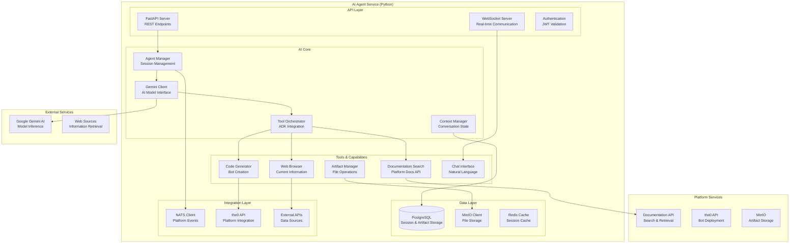

# AI Agent

## 🎯 Service Overview

The AI Agent is a sophisticated Python-based microservice that provides intelligent development assistance for trading bot creation and optimization. Built with FastAPI and powered by Google's Gemini 2.5 Flash AI model, the service serves as an intelligent development companion that can browse the web, access documentation, create code artifacts, and provide context-aware assistance throughout the bot development lifecycle. It represents the cutting-edge integration of AI capabilities into the trading platform development workflow.

### Key Responsibilities

- **Intelligent Bot Development**: AI-assisted code generation and optimization suggestions
- **Documentation Integration**: Real-time access to the0 platform documentation and API references
- **Web Browsing**: Current information retrieval for market data and trading strategies
- **Artifact Management**: Creation, storage, and deployment of bot code and configurations
- **Session Management**: Context-aware conversations with persistent conversation state
- **Tool Orchestration**: Coordination of multiple AI tools for comprehensive assistance

### Business Value

The AI Agent dramatically accelerates bot development by providing intelligent assistance, reducing development time from hours to minutes while improving code quality through AI-powered best practices. It democratizes advanced trading strategy development by making sophisticated AI assistance accessible to all platform users.

## 🛠️ Technology Stack

| Technology | Version | Purpose |
|------------|---------|---------|
| Python | 3.11+ | Core runtime and asyncio framework |
| FastAPI | 0.116+ | High-performance async API framework |
| Google Gemini | 2.5 Flash | AI model for intelligent assistance |
| Google ADK | 1.6.1 | AI Development Kit for tool orchestration |
| AsyncPG | 0.30+ | PostgreSQL async driver |
| SQLAlchemy | 2.0+ | Database ORM and migrations |
| Alembic | 1.13+ | Database migration management |
| Pydantic | 2.11+ | Data validation and serialization |
| uvicorn | 0.35+ | ASGI server for FastAPI |
| httpx | 0.28+ | Async HTTP client for web browsing |

### Architecture Patterns

- **Tool-Based AI**: Agent architecture using Google's ADK for tool orchestration
- **Session Management**: Persistent conversation state and context tracking
- **Event-Driven**: NATS integration for real-time platform communication
- **Microservices**: Clean separation of concerns with modular components
- **Repository Pattern**: Data access abstraction with SQLAlchemy

## 🏗️ Architecture & Design

### Service Architecture



### Agent Workflow

1. **Session Initialization**: Create session context and load conversation history
2. **User Request Processing**: Parse natural language requests and determine intent
3. **Tool Selection**: Choose appropriate tools based on request type
4. **Information Gathering**: Execute tools (search, browse, generate code)
5. **AI Processing**: Use Gemini to analyze and synthesize information
6. **Response Generation**: Create intelligent, contextual responses
7. **Artifact Creation**: Generate and store code/configurations as needed
8. **Session Update**: Update conversation context and memory

### Component Breakdown

| Component | Responsibility | Technology |
|-----------|----------------|------------|
| Agent Manager | Session lifecycle, context management, tool orchestration | Google ADK, FastAPI |
| Gemini Client | AI model communication, prompt engineering, response processing | Google Generative AI |
| Documentation Search | Platform documentation retrieval, semantic search | HTTP client, embeddings |
| Web Browser | Safe web browsing, information extraction | httpx, BeautifulSoup4 |
| Code Generator | Bot code creation, optimization, testing | Code templates, AI generation |
| Artifact Manager | File storage, versioning, deployment coordination | MinIO, PostgreSQL |

## 📡 AI Agent Capabilities

### Tool-Based Architecture

```python
# Google ADK tool definition
from google.adk.agents import Agent
from google.adk.tools import Tool

@Tool
def search_documentation(query: str) -> DocumentationResult:
    """Search the0 platform documentation"""
    search_service = DocumentationSearchService()
    results = search_service.search(query)
    return DocumentationResult(
        query=query,
        results=results,
        total_found=len(results)
    )

@Tool
def browse_web(url: str) -> WebContentResult:
    """Safely browse web content"""
    browser = SafeWebBrowser()
    content = await browser.fetch_content(url)
    return WebContentResult(
        url=url,
        content=content.text,
        title=content.title,
        safe_content=content.sanitized_content
    )

@Tool
def create_bot_template(strategy_type: str, parameters: dict) -> BotTemplate:
    """Create a trading bot template"""
    generator = BotTemplateGenerator()
    template = generator.generate(strategy_type, parameters)
    return BotTemplate(
        type=strategy_type,
        code=template.code,
        configuration=template.config,
        explanation=template.explanation
    )

@Tool
def analyze_code(code: str, language: str) -> CodeAnalysisResult:
    """Analyze and optimize code"""
    analyzer = CodeAnalyzer()
    analysis = analyzer.analyze(code, language)
    return CodeAnalysisResult(
        quality_score=analysis.quality_score,
        optimizations=analysis.suggestions,
        security_issues=analysis.security_issues,
        performance_tips=analysis.performance_recommendations
    )

# Agent configuration
agent = Agent(
    name="the0-development-assistant",
    model="gemini-2.0-flash-exp",
    instructions="""You are an AI assistant specialized in helping users develop trading bots for the the0 platform.

Your capabilities include:
1. Creating and optimizing trading bot code
2. Searching the0 platform documentation
3. Browsing the web for current trading information
4. Analyzing and improving existing code
5. Providing market insights and strategy suggestions

Always provide helpful, actionable advice and create working code examples when appropriate.
""",
    tools=[search_documentation, browse_web, create_bot_template, analyze_code]
)
```

### Session Management

```python
# Session context management
class SessionManager:
    def __init__(self):
        self.active_sessions = {}
        self.session_store = SessionStore()

    async def create_session(self, user_id: str, initial_context: dict = None) -> Session:
        """Create new AI agent session"""
        session_id = str(uuid.uuid4())

        session = Session(
            id=session_id,
            user_id=user_id,
            created_at=datetime.utcnow(),
            context=initial_context or {},
            conversation_history=[],
            artifacts=[]
        )

        # Store session
        await self.session_store.save_session(session)
        self.active_sessions[session_id] = session

        return session

    async def update_context(self, session_id: str, new_context: dict):
        """Update session context"""
        if session_id in self.active_sessions:
            session = self.active_sessions[session_id]
            session.context.update(new_context)
            session.updated_at = datetime.utcnow()

            await self.session_store.save_session(session)

    async def add_artifact(self, session_id: str, artifact: Artifact):
        """Add artifact to session"""
        if session_id in self.active_sessions:
            session = self.active_sessions[session_id]
            session.artifacts.append(artifact)
            session.updated_at = datetime.utcnow()

            await self.session_store.save_session(session)

    async def get_session_history(self, session_id: str, limit: int = 50) -> List[ConversationMessage]:
        """Retrieve conversation history"""
        session = await self.session_store.get_session(session_id)
        return session.conversation_history[-limit:] if session else []
```

## 🔧 Configuration

### Environment Variables

| Variable | Required | Default | Description |
|----------|----------|---------|-------------|
| `GEMINI_API_KEY` | Yes | N/A | Google Gemini AI API key |
| `DATABASE_URL` | Yes | N/A | PostgreSQL connection string |
| `MINIO_ENDPOINT` | Yes | N/A | MinIO server endpoint |
| `MINIO_ACCESS_KEY` | Yes | N/A | MinIO access key |
| `MINIO_SECRET_KEY` | Yes | N/A | MinIO secret key |
| `THE0_API_URL` | Yes | N/A | the0 platform API URL |
| `NATS_URL` | Yes | N/A | NATS server URL |
| `REDIS_URL` | No | `redis://localhost:6379` | Redis session cache URL |
| `MAX_CONVERSATION_LENGTH` | No | `100` | Maximum conversation messages |
| `ARTIFACT_RETENTION_DAYS` | No | `30` | Artifact retention period |
| `WEB_BROWSE_TIMEOUT` | No | `30` | Web browsing timeout in seconds |

### Configuration Structure

```python
# Configuration management
class AIAgentConfig:
    gemini: GeminiConfig
    database: DatabaseConfig
    minio: MinIOConfig
    nats: NATSConfig
    redis: RedisConfig
    agent: AgentConfig
    security: SecurityConfig

@dataclass
class GeminiConfig:
    api_key: str
    model: str = "gemini-2.0-flash-exp"
    temperature: float = 0.7
    max_tokens: int = 8192
    timeout_seconds: int = 60
    safety_settings: SafetySettings = None

@dataclass
class AgentConfig:
    max_conversation_length: int = 100
    session_timeout_minutes: int = 120
    max_tools_per_request: int = 10
    artifact_retention_days: int = 30
    web_browse_domains_allowlist: List[str] = None

# Configuration loading
def load_config() -> AIAgentConfig:
    config_file = os.getenv("CONFIG_FILE", "config.yaml")

    with open(config_file, 'r') as f:
        config_data = yaml.safe_load(f)

    # Override with environment variables
    config_data["gemini"]["api_key"] = os.getenv("GEMINI_API_KEY")
    config_data["database"]["url"] = os.getenv("DATABASE_URL")
    # ... other overrides

    return AIAgentConfig(**config_data)
```

## 🚀 Development

### Local Development Setup

```bash
# 1. Clone and navigate to AI agent
git clone <repository-url>
cd the0/services/the0-ai

# 2. Create virtual environment
python -m venv venv
source venv/bin/activate

# 3. Install dependencies
pip install -r requirements.txt
pip install -r requirements-dev.txt  # Development dependencies

# 4. Set up environment
cp .env.example .env
# Edit .env with your API keys and configuration

# 5. Initialize database
alembic upgrade head

# 6. Start development server
uvicorn main:app --reload --host 0.0.0.0 --port 8000

# 7. Run tests
pytest tests/ -v
```

### Project Structure

```
the0-ai/
├── main.py                         # FastAPI application entry point
├── requirements.txt                  # Production dependencies
├── requirements-dev.txt              # Development dependencies
├── alembic.ini                     # Database migration configuration
├── config.py                       # Application configuration
├── Dockerfile                       # Container configuration
├── api/                             # FastAPI route handlers
│   ├── agent_service.py          # Agent interaction endpoints
│   ├── auth.py                  # Authentication middleware
│   ├── chat.py                  # WebSocket chat interface
│   ├── artifacts.py              # Artifact management
│   └── health.py                 # Health check endpoints
├── core/                             # Core AI agent functionality
│   ├── agent_manager.py          # Session and context management
│   ├── gemini_client.py          # Gemini AI integration
│   ├── tool_orchestrator.py      # Tool coordination
│   └── conversation_engine.py   # Dialog management
├── tools/                            # AI agent tools
│   ├── documentation_search.py   # Documentation search tool
│   ├── web_browser.py           # Safe web browsing tool
│   ├── code_generator.py        # Bot code generation tool
│   ├── market_analyzer.py       # Market data analysis tool
│   └── code_analyzer.py         # Code optimization tool
├── models/                           # Database models
│   ├── session.py                # Session data model
│   ├── artifact.py              # Artifact storage model
│   ├── conversation.py          # Conversation message model
│   └── user.py                  # User data model
├── database/                         # Database layer
│   ├── connection.py            # Database connection management
│   ├── repositories.py          # Data access layer
│   └── migrations/             # Alembic migration files
├── storage/                          # Storage abstraction
│   ├── minio_client.py          # MinIO file operations
│   ├── redis_cache.py           # Redis caching layer
│   └── file_manager.py         # File system operations
├── utils/                            # Utility functions
│   ├── security.py              # Security utilities
│   ├── logging.py               # Logging configuration
│   ├── validation.py            # Input validation
│   └── helpers.py               # Common helper functions
├── tests/                            # Test files
│   ├── unit/                    # Unit tests
│   ├── integration/             # Integration tests
│   ├── fixtures/                # Test data and fixtures
│   └── conftest.py               # Test configuration
└── docs/                              # Service documentation
    ├── api.md                   # API endpoint documentation
    ├── deployment.md             # Deployment guide
    └── examples/                # Usage examples
```

### Key Development Patterns

```python
# FastAPI application with dependency injection
from fastapi import FastAPI, Depends
from core.agent_manager import AgentManager

app = FastAPI(
    title="the0 AI Agent",
    description="AI-powered development assistant for the0 platform",
    version="1.0.0"
)

# Dependency injection for services
def get_agent_manager() -> AgentManager:
    return AgentManager()

def get_gemini_client() -> GeminiClient:
    return GeminiClient()

# Agent endpoint with session management
@app.post("/api/agent/chat")
async def chat_with_agent(
    request: ChatRequest,
    agent_manager: AgentManager = Depends(get_agent_manager),
    gemini_client: GeminiClient = Depends(get_gemini_client)
):
    """Chat with AI agent"""

    # Get or create session
    session = await agent_manager.get_or_create_session(
        user_id=request.user_id,
        session_id=request.session_id
    )

    # Process user message with AI
    response = await gemini_client.process_message(
        message=request.message,
        context=session.context,
        tools_enabled=request.enable_tools
    )

    # Update session with new conversation
    await agent_manager.add_conversation_message(
        session_id=session.id,
        user_message=request.message,
        agent_response=response.message
    )

    # Store any generated artifacts
    if response.artifacts:
        for artifact in response.artifacts:
            await agent_manager.store_artifact(
                session_id=session.id,
                artifact=artifact
            )

    return ChatResponse(
        session_id=session.id,
        message=response.message,
        artifacts=[a.dict() for a in response.artifacts],
        tool_calls=response.tool_calls
    )

# WebSocket for real-time chat
@app.websocket("/ws/agent/{session_id}")
async def websocket_chat_endpoint(
    websocket: WebSocket,
    session_id: str,
    agent_manager: AgentManager = Depends(get_agent_manager)
):
    """WebSocket endpoint for real-time AI chat"""

    await websocket.accept()

    # Get session
    session = await agent_manager.get_session(session_id)
    if not session:
        await websocket.close(code=4004, reason="Invalid session")
        return

    try:
        while True:
            # Receive message from client
            data = await websocket.receive_json()
            user_message = data.get("message")

            # Process with AI
            response = await agent_manager.process_message(
                session=session,
                message=user_message
            )

            # Stream response
            await websocket.send_json({
                "type": "response",
                "message": response.message,
                "session_id": session_id
            })

    except WebSocketDisconnect:
        # Handle disconnection
        await agent_manager.cleanup_session(session_id)
```

## 🧪 Testing

### Test Structure

```bash
# Run all tests
pytest tests/ -v

# Run unit tests only
pytest tests/unit/ -v

# Run integration tests
pytest tests/integration/ -v

# Run with coverage
pytest --cov=core --cov=api --cov-report=html tests/

# Run API tests
pytest tests/api/ -v

# Run AI model tests
pytest tests/ai_model/ -v
```

### Test Categories

- **Unit Tests**: Individual component testing (Gemini client, tools, agents)
- **Integration Tests**: Service integration (database, MinIO, NATS)
- **API Tests**: FastAPI endpoint testing with TestClient
- **AI Model Tests**: Gemini AI integration and tool execution testing
- **Security Tests**: Input validation, session security, tool access control

### Test Setup

```python
# Example test for Gemini client integration
import pytest
from unittest.mock import AsyncMock, patch
from core.gemini_client import GeminiClient

class TestGeminiClient:
    @pytest.fixture
    def mock_gemini_response(self):
        """Mock Gemini API response"""
        return {
            "candidates": [{
                "content": {
                    "parts": [{
                        "text": "This is a sample trading bot code"
                    }]
                }
            }]
        }

    async def test_process_message_with_tools(self, mock_gemini_response):
        """Test AI message processing with tool execution"""

        with patch('google.generativeai.GenerativeModel.generate_content') as mock_generate:
            mock_generate.return_value = AsyncMock(
                return_value=Mock(response=Mock(**mock_gemini_response))
            )

            client = GeminiClient(api_key="test-key")
            response = await client.process_message(
                message="Create a momentum trading bot",
                context={},
                tools_enabled=True
            )

            assert response.message is not None
            assert len(response.tool_calls) > 0
            assert response.artifacts is not None

    async def test_code_generation_quality(self):
        """Test generated code quality and safety"""

        client = GeminiClient(api_key="test-key")
        response = await client.generate_code(
            strategy_type="momentum",
            parameters={"symbol": "BTCUSDT", "period": 14}
        )

        # Verify code structure
        assert "def main(" in response.code
        assert "calculate_rsi" in response.code
        assert "import " in response.code

        # Verify safety checks
        assert "eval(" not in response.code
        assert "exec(" not in response.code
        assert "subprocess" not in response.code

# Example test for tool orchestration
class TestToolOrchestrator:
    @pytest.fixture
    def mock_documentation_search(self):
        return DocumentationResult(
            query="RSI strategy",
            results=[
                {"title": "RSI Indicator Guide", "content": "..."},
                {"title": "Momentum Trading", "content": "..."}
            ]
        )

    async def test_tool_selection_and_execution(self, mock_documentation_search):
        """Test automatic tool selection based on user request"""

        with patch('tools.documentation_search.search') as mock_search:
            mock_search.return_value = mock_documentation_search

            orchestrator = ToolOrchestrator()
            tools_executed = await orchestrator.process_request(
                message="Tell me about RSI trading strategies"
            )

            # Verify documentation search tool was selected
            assert any(tool.name == "search_documentation" for tool in tools_executed)
            assert len(tools_executed) == 1
```

## 📊 Performance & Scalability

### Performance Characteristics

| Metric | Target | Current | Notes |
|--------|--------|---------|-------|
| AI Response Time | <10s | ~6s | Average Gemini API response |
| Session Creation | <100ms | ~50ms | Database and cache operations |
| Artifact Storage | <2s | ~1s | MinIO upload and metadata |
| Tool Execution | <5s | ~3s | Average tool completion time |
| Concurrent Sessions | 1000+ | ~500 | Per service instance |

### Scalability Strategies

```python
# Async session management with connection pooling
class SessionPool:
    def __init__(self, max_sessions: int = 1000):
        self.semaphore = asyncio.Semaphore(max_sessions)
        self.active_sessions = {}
        self.session_cache = LRUCache(maxsize=10000)

    async def get_session(self, session_id: str) -> Optional[Session]:
        async with self.semaphore:
            # Check cache first
            if session_id in self.session_cache:
                return self.session_cache[session_id]

            # Load from database
            session = await self.db.load_session(session_id)
            if session:
                self.session_cache[session_id] = session
                self.active_sessions[session_id] = session

            return session

# Gemini client with request batching and caching
class OptimizedGeminiClient:
    def __init__(self):
        self.request_queue = asyncio.Queue(maxsize=100)
        self.response_cache = {}
        self.batch_processor = BatchProcessor()

    async def process_batch_requests(self, requests: List[AIRequest]) -> List[AIResponse]:
        """Process multiple requests in batch for efficiency"""
        batched_requests = self._prepare_batch(requests)

        response = await self.gemini_model.generate_content(batched_requests)

        # Parse and cache responses
        results = []
        for i, req in enumerate(requests):
            result = self._extract_response(response, i)
            self.response_cache[req.cache_key] = result
            results.append(result)

        return results

# Artifact storage with compression and versioning
class ArtifactStorage:
    async def store_artifact(self, artifact: Artifact) -> str:
        """Store artifact with compression and versioning"""

        # Compress code artifacts
        compressed_content = self._compress_content(artifact.content)

        # Generate version
        version = self._generate_version(artifact)

        # Store with metadata
        storage_path = f"artifacts/{artifact.session_id}/{version}"

        await self.minio_client.put_object(
            bucket_name="ai-artifacts",
            object_name=storage_path,
            data=compressed_content,
            metadata={
                "session_id": artifact.session_id,
                "version": version,
                "type": artifact.type,
                "created_at": str(artifact.created_at)
            }
        )

        return storage_path
```

## 🔍 Monitoring & Observability

### AI Metrics

```python
# Prometheus metrics for AI operations
from prometheus_client import Counter, Histogram, Gauge, Gauge

# Metrics definitions
ai_requests_total = Counter(
    'ai_requests_total',
    'Total number of AI requests processed',
    ['model', 'request_type', 'status']
)

ai_response_time_seconds = Histogram(
    'ai_response_time_seconds',
    'AI model response time in seconds',
    ['model', 'tool_count', 'token_count']
)

active_sessions = Gauge(
    'active_ai_sessions',
    'Currently active AI sessions'
)

tools_executed_total = Counter(
    'tools_executed_total',
    'Total number of tools executed by AI agent',
    ['tool_name', 'execution_status', 'session_type']
)

artifacts_created_total = Counter(
    'artifacts_created_total',
    'Total number of artifacts created',
    ['artifact_type', 'quality_score']
)

conversation_length = Histogram(
    'conversation_length',
    'Length of AI conversations',
    ['session_type', 'user_tier']
)

# Metrics collection
class AIMetrics:
    def __init__(self):
        self.collector = PrometheusMetrics()

    def record_ai_request(self, request_type: str, model: str,
                       token_count: int, response_time: float, status: str):
        ai_requests_total.labels(
            request_type=request_type,
            model=model,
            status=status
        ).inc()

        ai_response_time_seconds.labels(
            model=model,
            tool_count=str(len(request.tools or [])),
            token_count=str(token_count)
        ).observe(response_time)

    def record_tool_execution(self, tool_name: str, execution_time: float, success: bool):
        tools_executed_total.labels(
            tool_name=tool_name,
            execution_status='success' if success else 'failure',
            session_type='chat'
        ).inc()

    def record_artifact_creation(self, artifact_type: str, quality_score: float):
        artifacts_created_total.labels(
            artifact_type=artifact_type,
            quality_score=str(int(quality_score))
        ).inc()
```

### Health Checks

```python
# Comprehensive health check for AI agent
class AIHealthChecker:
    def __init__(self):
        self.gemini_client = GeminiClient()
        self.db_pool = DatabasePool()
        self.minio_client = MinioClient()
        self.redis_client = RedisClient()

    async def check_health(self) -> Dict:
        """Comprehensive health check"""
        health_status = {
            "status": "healthy",
            "checks": {},
            "timestamp": datetime.utcnow().isoformat(),
            "version": get_version()
        }

        # Check Gemini AI connectivity
        try:
            await self.gemini_client.health_check()
            health_status["checks"]["gemini"] = "connected"
        except Exception as e:
            health_status["checks"]["gemini"] = f"error: {str(e)}"
            health_status["status"] = "degraded"

        # Check database connectivity
        try:
            async with self.db_pool.acquire() as conn:
                await conn.execute("SELECT 1")
            health_status["checks"]["database"] = "connected"
        except Exception as e:
            health_status["checks"]["database"] = f"error: {str(e)}"
            health_status["status"] = "unhealthy"

        # Check MinIO connectivity
        try:
            await self.minio_client.list_buckets()
            health_status["checks"]["minio"] = "connected"
        except Exception as e:
            health_status["checks"]["minio"] = f"error: {str(e)}"
            health_status["status"] = "unhealthy"

        # Check Redis connectivity
        try:
            await self.redis_client.ping()
            health_status["checks"]["redis"] = "connected"
        except Exception as e:
            health_status["checks"]["redis"] = f"error: {str(e)}"
            health_status["status"] = "degraded"

        # Check active sessions
        try:
            active_count = await self.get_active_sessions_count()
            health_status["checks"]["active_sessions"] = str(active_count)
        except Exception as e:
            health_status["checks"]["active_sessions"] = f"error: {str(e)}"

        return health_status
```

## 🛡️ Security

### Security Measures

- **API Key Protection**: Secure Gemini API key management
- **Input Sanitization**: Comprehensive input validation and sanitization
- **Content Filtering**: AI response safety filtering and moderation
- **Web Browsing Safety**: Restricted web access with allowlists
- **Session Security**: Encrypted session storage and secure session management
- **Artifact Security**: Code artifact scanning and safe storage

### Security Implementation

```python
# Secure AI client with safety filters
class SecureGeminiClient:
    def __init__(self, api_key: str):
        self.api_key = api_key
        self.safety_settings = {
            "harassment": "block",
            "hate_speech": "block",
            "sexually_explicit": "block",
            "dangerous_content": "block"
        }

    async def generate_safe_response(self, prompt: str, context: dict) -> AIResponse:
        """Generate AI response with safety filtering"""

        # Add safety context to prompt
        safety_prompt = self._add_safety_context(prompt, context)

        try:
            response = await self.model.generate_content(
                safety_prompt,
                safety_settings=self.safety_settings
            )

            # Check response safety
            safety_ratings = self._extract_safety_ratings(response)

            if self._is_unsafe_content(safety_ratings):
                return AIResponse(
                    message="I cannot provide that response due to safety restrictions.",
                    safe_content=False,
                    safety_violations=safety_ratings
                )

            return AIResponse(
                message=response.text,
                safe_content=True,
                tool_calls=self._extract_tool_calls(response),
                artifacts=self._extract_artifacts(response)
            )

        except Exception as e:
            logger.error(f"AI generation failed: {e}")
            return AIResponse(
                message="I encountered an error processing your request.",
                safe_content=True,
                error=str(e)
            )

    def _add_safety_context(self, prompt: str, context: dict) -> str:
        """Add safety context to AI prompt"""
        safety_context = """
        You are a helpful AI assistant for trading bot development.

        IMPORTANT SAFETY GUIDELINES:
        1. Never generate code that could be used for malicious purposes
        2. Avoid code injection, system calls, or file manipulation
        3. Do not provide instructions for harmful trading strategies
        4. Ensure all generated code follows security best practices
        5. Do not access sensitive user data or credentials

        Current context: {context}

        User request: {prompt}

        Provide helpful, safe, and educational responses.
        """

        return safety_context

# Safe web browsing implementation
class SafeWebBrowser:
    def __init__(self):
        self.allowed_domains = [
            "github.com",
            "pypi.org",
            "npmjs.org",
            "docs.the0.dev",
            "stackoverflow.com"
        ]
        self.blocked_patterns = [
            "malware",
            "exploit",
            "hack",
            "crack"
        ]

    async def safe_browse(self, url: str) -> WebContent:
        """Safely browse web content"""

        # Validate URL
        if not self._is_url_safe(url):
            raise SecurityError(f"URL not allowed: {url}")

        try:
            # Use timeout and content filtering
            async with httpx.AsyncClient(timeout=30) as client:
                response = await client.get(url)
                content = response.text

                # Filter unsafe content
                filtered_content = self._filter_content(content)

                return WebContent(
                    url=url,
                    content=filtered_content,
                    title=self._extract_title(response.text),
                    safe_content=True
                )

        except httpx.TimeoutException:
            raise WebBrowsingError(f"Timeout browsing {url}")
        except Exception as e:
            logger.error(f"Web browsing failed: {e}")
            raise WebBrowsingError(f"Failed to browse {url}")

    def _is_url_safe(self, url: str) -> bool:
        """Check if URL is allowed"""
        from urllib.parse import urlparse
        parsed = urlparse(url)

        # Check domain allowlist
        if parsed.netloc not in self.allowed_domains:
            return False

        # Check for blocked patterns
        url_lower = url.lower()
        for pattern in self.blocked_patterns:
            if pattern in url_lower:
                return False

        return True
```

## 🚀 Deployment

### Docker Deployment

```dockerfile
# AI Agent Dockerfile
FROM python:3.11-slim

# Install system dependencies
RUN apt-get update && apt-get install -y \
    gcc \
    g++ \
    curl \
    && rm -rf /var/lib/apt/lists/*

# Set working directory
WORKDIR /app

# Copy requirements and install Python dependencies
COPY requirements.txt .
RUN pip install --no-cache-dir -r requirements.txt

# Copy application code
COPY . .

# Create non-root user
RUN useradd -m -u 1000 aiagent && \
    mkdir -p /app/logs && \
    chown -R aiagent:aiagent /app

USER aiagent

# Health check
HEALTHCHECK --interval=30s --timeout=10s --start-period=5s --retries=3 \
    CMD curl -f http://localhost:8000/health || exit 1

EXPOSE 8000

CMD ["uvicorn", "main:app", "--host", "0.0.0.0", "--port", "8000"]
```

### Kubernetes Deployment

```yaml
apiVersion: apps/v1
kind: Deployment
metadata:
  name: the0-ai-agent
spec:
  replicas: 3
  selector:
    matchLabels:
      app: the0-ai-agent
  template:
    metadata:
      labels:
        app: the0-ai-agent
    spec:
      containers:
      - name: ai-agent
        image: the0/ai-agent:latest
        ports:
        - containerPort: 8000
        env:
        - name: GEMINI_API_KEY
          valueFrom:
            secretKeyRef:
              name: the0-secrets
              key: gemini-api-key
        - name: DATABASE_URL
          valueFrom:
            secretKeyRef:
              name: the0-secrets
              key: database-url
        - name: MINIO_ENDPOINT
          value: "http://minio-service:9000"
        - name: REDIS_URL
          value: "redis://redis-service:6379"
        resources:
          requests:
            memory: "1Gi"
            cpu: "1000m"
          limits:
            memory: "4Gi"
            cpu: "2000m"
        livenessProbe:
          httpGet:
            path: /health
            port: 8000
          initialDelaySeconds: 60
          periodSeconds: 30
        readinessProbe:
          httpGet:
            path: /health
            port: 8000
          initialDelaySeconds: 10
          periodSeconds: 5
---
apiVersion: v1
kind: Service
metadata:
  name: the0-ai-agent-service
spec:
  selector:
    app: the0-ai-agent
  ports:
  - port: 80
    targetPort: 8000
  type: ClusterIP
```

## 🔄 Integration Points

### Platform Integration

```python
# Integration with the0 API for bot deployment
class The0PlatformIntegration:
    def __init__(self, api_url: str, api_key: str):
        self.api_client = httpx.AsyncClient(
            base_url=api_url,
            headers={"Authorization": f"Bearer {api_key}"}
        )

    async def deploy_bot_from_session(self, session_id: str) -> BotDeploymentResult:
        """Deploy bot created in AI session"""

        # Get latest artifacts from session
        artifacts = await self.session_manager.get_session_artifacts(session_id)

        # Find bot code artifact
        bot_artifact = next(
            (a for a in artifacts if a.type == "bot_code"),
            None
        )

        if not bot_artifact:
            raise ValueError("No bot code found in session")

        # Deploy to the0 platform
        deployment_data = {
            "name": f"ai-generated-bot-{session_id[:8]}",
            "type": "custom",
            "code": bot_artifact.content,
            "description": f"AI-generated bot from session {session_id}",
            "tags": ["ai-generated", "auto-created"]
        }

        response = await self.api_client.post("/api/custom-bots", json=deployment_data)

        if response.status_code == 201:
            result = response.json()
            return BotDeploymentResult(
                success=True,
                bot_id=result["id"],
                deployment_url=f"/bots/{result['id']}"
            )
        else:
            return BotDeploymentResult(
                success=False,
                error=f"Deployment failed: {response.text}"
            )

# Documentation API integration
class DocumentationSearchService:
    def __init__(self, docs_api_url: str):
        self.docs_client = httpx.AsyncClient(base_url=docs_api_url)

    async def search_documentation(self, query: str) -> List[DocumentationResult]:
        """Search the0 platform documentation"""

        response = await self.docs_client.get(
            f"/api/docs/search",
            params={"q": query, "limit": 10}
        )

        if response.status_code == 200:
            data = response.json()
            return [
                DocumentationResult(
                    title=result["title"],
                    content=result["content"],
                    url=result["url"],
                    score=result["score"]
                )
                for result in data["results"]
            ]

        return []

# NATS integration for real-time events
class NATSIntegration:
    def __init__(self, nats_url: str):
        self.nc = nats.connect(nats_url)

    async def publish_bot_suggestion(self, session_id: str, suggestion: BotSuggestion):
        """Publish bot creation suggestion event"""

        event = {
            "type": "ai.bot.suggestion",
            "timestamp": datetime.utcnow().isoformat(),
            "data": {
                "session_id": session_id,
                "suggestion": suggestion.dict(),
                "user_id": suggestion.user_id
            }
        }

        await self.nc.publish("ai.agent.events", json.dumps(event).encode())

    async def subscribe_to_platform_events(self):
        """Subscribe to platform events for context"""

        await self.nc.subscribe("bot.execution.completed", self.handle_bot_execution)
        await self.nc.subscribe("backtest.completed", self.handle_backtest_completion)

    async def handle_bot_execution(self, msg):
        """Handle bot execution completion event"""
        event_data = json.loads(msg.data.decode())

        # Update AI agent context with execution results
        await self.context_manager.update_context(
            session_id=event_data.get("session_id"),
            updates={
                "recent_execution": event_data,
                "market_conditions": event_data.get("market_data"),
                "performance_metrics": event_data.get("metrics")
            }
        )
```

## 🐛 Troubleshooting

### Common Issues

1. **Gemini API Rate Limiting**
   - **Symptoms**: API timeouts, 429 errors
   - **Causes**: High request volume, API quota exceeded
   - **Solutions**: Implement exponential backoff, request batching, caching
   - **Prevention**: Rate limiting, request optimization

2. **Context Management Issues**
   - **Symptoms**: Lost conversation state, inconsistent responses
   - **Causes**: Session timeout, cache failures, database issues
   - **Solutions**: Session persistence, cache warming, error handling
   - **Prevention**: Regular health checks, session validation

3. **Tool Execution Failures**
   - **Symptoms**: Tools not executing, incomplete responses
   - **Causes**: Network issues, API changes, configuration errors
   - **Solutions**: Fallback mechanisms, error recovery, tool validation
   - **Prevention**: Tool health monitoring, comprehensive testing

### Debugging Tools

```bash
# Debug AI agent
python -m pytest -s tests/unit/test_gemini_client.py

# Check Gemini API connectivity
python -c "
from core.gemini_client import GeminiClient
client = GeminiClient(api_key='test-key')
result = await client.health_check()
print(f'API Status: {result}')
"

# Monitor AI metrics
curl http://localhost:8000/metrics

# Debug session management
python -c "
from core.session_manager import SessionManager
manager = SessionManager()
sessions = await manager.get_active_sessions()
print(f'Active sessions: {len(sessions)}')
"

# Test web browsing safety
python tools/web_browser.py --test-url https://github.com
```

## 📈 Future Roadmap

### Planned Enhancements

- **Multi-Model Support**: Integration with multiple AI models (Claude, GPT-4, etc.)
- **Advanced Code Generation**: Sophisticated template-based bot creation
- **Market Data Integration**: Real-time market data analysis and insights
- **Collaborative Features**: Multi-user AI-assisted development sessions
- **Voice Interface**: Natural voice interaction for development assistance

### Technical Debt

- **Error Handling**: Standardize error responses and recovery mechanisms
- **Performance**: Optimize AI model usage and response caching
- **Testing**: Increase test coverage for edge cases and AI interactions
- **Documentation**: Inline code documentation and API specifications

## 📚 Additional Resources

### Documentation

- [Google Gemini API Documentation](https://ai.google.dev/gemini-api)
- [Google ADK Documentation](https://developers.google.com/ai/agent-development)
- [FastAPI Documentation](https://fastapi.tiangolo.com/)
- [AsyncPG Documentation](https://magicstack.github.io/asyncpg/)

### Tools & Utilities

- **AI Studio**: Google's AI model testing and development
- **Postman**: API testing and documentation
- **Redis CLI**: Cache debugging and management
- **pytest**: Python testing framework with async support

### Related Services

- **API Server**: Platform integration and authentication
- **Documentation Site**: Search and content management
- **MinIO**: Artifact storage and retrieval

---

*Last updated: October 2024*