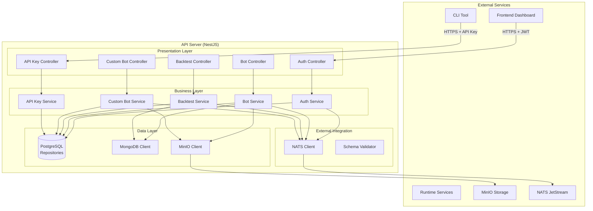

# API Server

## 🎯 Service Overview

The API Server is the central orchestration hub of the0 platform, built with NestJS that provides REST APIs, authentication, and coordinates communication between all platform services. It serves as the primary entry point for both the web dashboard and CLI tool.

### Key Responsibilities

- **Authentication & Authorization**: JWT-based user authentication and API key management
- **Bot Management**: CRUD operations for trading bots and custom bots
- **Backtesting Orchestration**: Manage backtest jobs and result retrieval
- **Event Publishing**: Coordinate with runtime services via NATS messaging
- **File Storage**: Integration with MinIO for bot code and result storage
- **Database Operations**: Manage PostgreSQL data persistence for users, bots, and metadata

### Business Value

The API Server provides a unified, secure interface to all platform capabilities, ensuring consistent data management, security enforcement, and reliable service coordination across the entire trading platform.

## 🛠️ Technology Stack

| Technology | Version | Purpose |
|------------|---------|---------|
| NestJS | 11.x | Node.js framework for building efficient APIs |
| TypeScript | 5.x | Type-safe JavaScript development |
| PostgreSQL | 14+ | Primary database for relational data |
| MongoDB | 5.x | Document storage for operational data |
| Drizzle ORM | 0.29+ | Type-safe database access and migrations |
| NATS | 2.x | Message streaming for service coordination |
| MinIO | Latest | S3-compatible object storage |
| JWT | - | JSON Web Token authentication |
| Ajv | 8.x | JSON schema validation |

### Architecture Patterns

- **Controller-Service-Repository**: Clean separation of concerns with controllers handling HTTP, services managing business logic, and repositories for data access
- **Module-based Design**: Organized into feature modules (auth, bot, backtest, custom-bot)
- **Dependency Injection**: NestJS DI container for loose coupling and testability
- **Global Validation**: Automatic request validation using DTOs and validation pipes

## 🏗️ Architecture & Design

### Service Architecture



### Component Breakdown

| Component | Responsibility | Technology |
|-----------|----------------|------------|
| Auth Module | User authentication, JWT token management, password hashing | NestJS, Passport, JWT |
| Bot Module | Trading bot CRUD operations, validation, execution coordination | NestJS, Drizzle ORM |
| Backtest Module | Backtest job management, result storage, status tracking | NestJS, NATS, MinIO |
| Custom Bot Module | Custom bot upload, security analysis, approval workflow | NestJS, MinIO, NATS |
| API Key Module | API key generation, validation, management for CLI access | NestJS, UUID |
| Database Layer | Schema definitions, migrations, connection management | Drizzle ORM, PostgreSQL |
| NATS Module | Event publishing, service coordination, message handling | NestJS, NATS client |

## 📡 API & Communication

### REST API Endpoints

| Method | Endpoint | Description | Auth |
|--------|----------|-------------|------|
| **Authentication** |
| POST | `/api/auth/login` | User login with email/password | Public |
| POST | `/api/auth/register` | User registration | Public |
| POST | `/api/auth/refresh` | Refresh JWT token | JWT Refresh |
| POST | `/api/auth/logout` | User logout | JWT |
| **Bots** |
| GET | `/api/bots` | List user's bots | JWT |
| POST | `/api/bots` | Create new bot | JWT |
| GET | `/api/bots/:id` | Get bot details | JWT |
| PUT | `/api/bots/:id` | Update bot | JWT |
| DELETE | `/api/bots/:id` | Delete bot | JWT |
| POST | `/api/bots/:id/deploy` | Deploy bot to runtime | JWT |
| **Custom Bots** |
| POST | `/api/custom-bots/upload` | Upload custom bot code | JWT |
| GET | `/api/custom-bots` | List user's custom bots | JWT |
| GET | `/api/custom-bots/:id` | Get custom bot details | JWT |
| **Backtests** |
| POST | `/api/backtests` | Create new backtest | JWT |
| GET | `/api/backtests` | List user's backtests | JWT |
| GET | `/api/backtests/:id` | Get backtest details | JWT |
| GET | `/api/backtests/:id/results` | Download backtest results | JWT |
| **API Keys (CLI)** |
| POST | `/api/api-keys` | Generate new API key | JWT |
| GET | `/api/api-keys` | List API keys | JWT |
| DELETE | `/api/api-keys/:id` | Revoke API key | JWT |

### Event Handling

| Event | Source | Handler | Action |
|-------|--------|---------|--------|
| `custom-bot.submitted` | Custom Bot Service | NATS Subscriber | Trigger security analysis |
| `custom-bot.approved` | Security Analyzer | NATS Subscriber | Update bot status to approved |
| `custom-bot.declined` | Security Analyzer | NATS Subscriber | Update bot status with reasons |
| `bot.execution.started` | Runtime Services | NATS Subscriber | Update bot execution status |
| `bot.execution.completed` | Runtime Services | NATS Subscriber | Store execution results |
| `backtest.started` | Runtime Services | NATS Subscriber | Update backtest status |
| `backtest.completed` | Runtime Services | NATS Subscriber | Store backtest results |

### Database Interactions

```typescript
// Example: Bot creation with validation
export class BotService {
  async createBot(userId: string, createBotDto: CreateBotDto): Promise<Bot> {
    // Validate bot configuration against external schema
    await this.validateBotSchema(createBotDto);

    // Create bot record in PostgreSQL
    const bot = await this.botRepository.create({
      ...createBotDto,
      userId,
      status: 'draft',
    });

    // Publish bot creation event
    await this.natsService.publish('bot.created', {
      botId: bot.id,
      userId,
      timestamp: new Date().toISOString(),
    });

    return bot;
  }
}
```

## 🔧 Configuration

### Environment Variables

| Variable | Required | Default | Description |
|----------|----------|---------|-------------|
| `PORT` | No | `3000` | API server port |
| `NODE_ENV` | No | `development` | Environment mode |
| `DATABASE_URL` | Yes | N/A | PostgreSQL connection string |
| `DATABASE_TYPE` | No | `postgresql` | Database type (postgresql/sqlite) |
| `JWT_SECRET` | Yes | N/A | JWT signing secret |
| `JWT_EXPIRES_IN` | No | `24h` | JWT token expiration |
| `FRONTEND_URL` | No | `http://localhost:3001` | Frontend CORS origin |
| `NATS_URL` | Yes | N/A | NATS server URL |
| `MINIO_ENDPOINT` | Yes | N/A | MinIO server endpoint |
| `MINIO_ACCESS_KEY` | Yes | N/A | MinIO access key |
| `MINIO_SECRET_KEY` | Yes | N/A | MinIO secret key |
| `BOT_MANAGER_API_URL` | Yes | N/A | External bot manager API |
| `BOT_MANAGER_API_KEY` | Yes | N/A | Bot manager API key |

### Configuration Files

- `src/config/configuration.ts`: Centralized configuration using @nestjs/config
- `drizzle.config.ts`: Database schema and migration configuration
- `src/database/schema/`: Drizzle ORM schema definitions for all tables

```typescript
// Example configuration structure
export default () => ({
  port: parseInt(process.env.PORT, 10) || 3000,
  database: {
    url: process.env.DATABASE_URL,
    type: process.env.DATABASE_TYPE || 'postgresql',
  },
  jwt: {
    secret: process.env.JWT_SECRET,
    expiresIn: process.env.JWT_EXPIRES_IN || '24h',
  },
  nats: {
    url: process.env.NATS_URL,
  },
  // ... other config sections
});
```

## 🚀 Development

### Local Development Setup

```bash
# 1. Clone and navigate to API service
git clone <repository-url>
cd the0/api

# 2. Install dependencies
yarn install

# 3. Set up environment
cp .env.example .env
# Edit .env with your database and service settings

# 4. Run database migrations
yarn db:generate
yarn db:migrate

# 5. Start development server
yarn start:dev
```

### Project Structure

```
api/
├── src/                          # Source code
│   ├── auth/                     # Authentication module
│   │   ├── auth.controller.ts     # Login/register endpoints
│   │   ├── auth.service.ts        # JWT/token management
│   │   ├── jwt.strategy.ts       # Passport JWT strategy
│   │   └── dto/                  # Auth DTOs
│   ├── bot/                      # Bot management module
│   │   ├── bot.controller.ts     # Bot CRUD endpoints
│   │   ├── bot.service.ts        # Bot business logic
│   │   └── dto/                  # Bot DTOs and validation
│   ├── backtest/                 # Backtesting module
│   │   ├── backtest.controller.ts
│   │   ├── backtest.service.ts
│   │   └── dto/
│   ├── custom-bot/               # Custom bot module
│   │   ├── custom-bot.controller.ts
│   │   ├── custom-bot.service.ts
│   │   └── dto/
│   ├── api-key/                  # API key management
│   │   ├── api-key.controller.ts
│   │   ├── api-key.service.ts
│   │   └── dto/
│   ├── database/                 # Database layer
│   │   ├── schema/               # Drizzle schemas
│   │   ├── migrations/           # Migration files
│   │   └── migrate.ts            # Migration runner
│   ├── nats/                     # NATS integration
│   │   ├── nats.module.ts
│   │   └── nats.service.ts
│   └── common/                   # Shared utilities
│       ├── decorators/            # Custom decorators
│       ├── guards/               # Auth guards
│       └── pipes/                # Validation pipes
├── test/                         # Test files
├── package.json
├── tsconfig.json
└── drizzle.config.ts             # Database configuration
```

### Key Development Patterns

```typescript
// Controller pattern with validation
@Controller('bots')
@UseGuards(JwtAuthGuard)
export class BotController {
  constructor(private readonly botService: BotService) {}

  @Post()
  @UsePipes(new ValidationPipe({ whitelist: true, forbidNonWhitelisted: true }))
  async createBot(@Body() createBotDto: CreateBotDto, @CurrentUser() user: User) {
    return this.botService.createBot(user.id, createBotDto);
  }

  @Get(':id')
  async getBot(@Param('id') id: string, @CurrentUser() user: User) {
    return this.botService.getBot(id, user.id);
  }
}

// Service pattern with error handling
@Injectable()
export class BotService {
  constructor(
    private readonly botRepository: BotRepository,
    private readonly natsService: NatsService,
  ) {}

  async createBot(userId: string, createBotDto: CreateBotDto): Promise<Bot> {
    try {
      // Business logic
      const bot = await this.botRepository.create({
        ...createBotDto,
        userId,
      });

      // Event publishing
      await this.natsService.publish('bot.created', { botId: bot.id });

      return bot;
    } catch (error) {
      throw new BadRequestException('Failed to create bot: ' + error.message);
    }
  }
}
```

## 🧪 Testing

### Test Structure

```bash
# Run all tests
yarn test

# Run tests in watch mode
yarn test:watch

# Run tests with coverage
yarn test:cov

# Run end-to-end tests
yarn test:e2e
```

### Test Categories

- **Unit Tests**: Individual service and controller testing with Jest
- **Integration Tests**: Database operations and external service integration
- **End-to-End Tests**: Complete API workflows using Supertest

### Test Coverage Requirements

- Minimum coverage: 80%
- Critical paths (auth, payment): 95%
- Business logic: 90%

```typescript
// Example test structure
describe('BotService', () => {
  let service: BotService;
  let repository: jest.Mocked<BotRepository>;

  beforeEach(async () => {
    const module = await Test.createTestingModule({
      providers: [
        BotService,
        { provide: BotRepository, useValue: mockRepository },
      ],
    }).compile();

    service = module.get<BotService>(BotService);
    repository = module.get(BotRepository);
  });

  describe('createBot', () => {
    it('should create bot successfully', async () => {
      const createBotDto = { name: 'Test Bot', config: {} };
      const expectedBot = { id: '1', ...createBotDto };

      repository.create.mockResolvedValue(expectedBot);

      const result = await service.createBot('user-1', createBotDto);

      expect(result).toEqual(expectedBot);
      expect(repository.create).toHaveBeenCalledWith({
        ...createBotDto,
        userId: 'user-1',
      });
    });
  });
});
```

## 📊 Performance & Scalability

### Performance Characteristics

| Metric | Target | Current | Notes |
|--------|--------|---------|-------|
| API Response Time | <200ms | ~150ms | Database queries optimized |
| Authentication Time | <50ms | ~30ms | JWT verification |
| File Upload | <5s | ~2s | Custom bot uploads (10MB limit) |
| Database Queries | <100ms | ~60ms | Indexed queries |

### Scaling Strategies

- **Horizontal Scaling**: Stateless API allows multiple instances behind load balancer
- **Database Connection Pooling**: Efficient database connection management
- **Caching**: Redis integration for frequently accessed data (planned)
- **Async Processing**: Background jobs for long-running operations via NATS

### Performance Optimizations

```typescript
// Database query optimization
@Injectable()
export class BotRepository {
  async findUserBots(userId: string, pagination: PaginationDto) {
    return this.db.select()
      .from(bots)
      .where(eq(bots.userId, userId))
      .limit(pagination.limit)
      .offset(pagination.offset)
      .orderBy(desc(bots.createdAt)); // Indexed column
  }

// Response compression and caching
@Get()
@CacheKey('bots')
@CacheTTL(300) // 5 minutes
async getBots(@Query() paginationDto: PaginationDto) {
  return this.botService.findBots(paginationDto);
}
```

## 🔍 Monitoring & Observability

### Health Checks

```bash
# Health check endpoint
GET /health

# Expected response
{
  "status": "healthy",
  "timestamp": "2024-01-01T00:00:00.000Z",
  "uptime": 3600,
  "checks": {
    "database": "ok",
    "nats": "ok",
    "minio": "ok"
  }
}
```

### Key Metrics

| Metric | Type | Description |
|--------|------|-------------|
| `api.requests.total` | Counter | Total API requests |
| `api.response.time` | Histogram | API response time distribution |
| `auth.jwt.issued` | Counter | JWT tokens issued |
| `auth.jwt.refreshed` | Counter | JWT token refreshes |
| `bot.created` | Counter | Bots created |
| `bot.deployed` | Counter | Bots deployed |
| `database.queries` | Counter | Database query count |

### Logging Strategy

- **Format**: Structured JSON logging with Winston
- **Levels**: ERROR, WARN, INFO, DEBUG
- **Context**: Request IDs, user context, correlation IDs
- **Integration**: Centralized logging via external service

```typescript
// Example logging with context
import { Logger, Injectable } from '@nestjs/common';

@Injectable()
export class BotService {
  private readonly logger = new Logger(BotService.name);

  async createBot(userId: string, createBotDto: CreateBotDto): Promise<Bot> {
    this.logger.log('Creating bot', {
      userId,
      botName: createBotDto.name,
      correlationId: generateCorrelationId(),
    });

    try {
      const bot = await this.botRepository.create({
        ...createBotDto,
        userId,
      });

      this.logger.log('Bot created successfully', {
        botId: bot.id,
        userId,
      });

      return bot;
    } catch (error) {
      this.logger.error('Failed to create bot', {
        userId,
        error: error.message,
        stack: error.stack,
      });
      throw error;
    }
  }
}
```

## 🛡️ Security

### Security Measures

- **JWT Authentication**: Secure token-based authentication with refresh tokens
- **API Key Management**: Secure API key generation and validation for CLI access
- **Input Validation**: Comprehensive DTO validation with class-validator
- **SQL Injection Prevention**: Parameterized queries via Drizzle ORM
- **CORS Configuration**: Proper cross-origin resource sharing setup
- **Rate Limiting**: API rate limiting per user/IP (planned)
- **Security Headers**: Helmet.js for security headers

### Security Best Practices

```typescript
// JWT authentication guard
@Injectable()
export class JwtAuthGuard extends AuthGuard('jwt') {
  canActivate(context: ExecutionContext) {
    return super.canActivate(context);
  }

  handleRequest(err, user, info) {
    if (err || !user) {
      throw err || new UnauthorizedException('Invalid authentication token');
    }
    return user;
  }
}

// Input validation with DTO
import { IsString, IsNotEmpty, MaxLength, IsOptional } from 'class-validator';

export class CreateBotDto {
  @IsString()
  @IsNotEmpty()
  @MaxLength(100)
  name: string;

  @IsOptional()
  @IsString()
  description?: string;

  @IsNotEmpty()
  config: Record<string, any>;
}

// Secure password hashing
import * as bcrypt from 'bcrypt';

@Injectable()
export class AuthService {
  async hashPassword(password: string): Promise<string> {
    const saltRounds = 12;
    return bcrypt.hash(password, saltRounds);
  }
}
```

## 🚀 Deployment

### Build Process

```bash
# Build for production
yarn build

# Run database migrations
yarn db:migrate

# Start production server
yarn start:prod
```

### Deployment Configuration

| Environment | Config Source | Key Settings |
|-------------|---------------|--------------|
| Development | `.env.local` | Local database, debug logging |
| Staging | Environment variables | Production-like database |
| Production | Kubernetes Secrets | PostgreSQL, JWT secrets |

### Container Configuration

```dockerfile
# Multi-stage Dockerfile for production
FROM node:20-alpine AS builder

WORKDIR /app
COPY package*.json ./
RUN yarn install --frozen-lockfile

COPY . .
RUN yarn build

# Production stage
FROM node:20-alpine AS production

WORKDIR /app
COPY --from=builder /app/dist ./dist
COPY --from=builder /app/node_modules ./node_modules
COPY --from=builder /app/package.json ./

EXPOSE 3000
USER node

CMD ["node", "dist/main"]
```

### Kubernetes Deployment

```yaml
apiVersion: apps/v1
kind: Deployment
metadata:
  name: the0-api
spec:
  replicas: 3
  selector:
    matchLabels:
      app: the0-api
  template:
    metadata:
      labels:
        app: the0-api
    spec:
      containers:
      - name: api
        image: the0/api:latest
        ports:
        - containerPort: 3000
        env:
        - name: DATABASE_URL
          valueFrom:
            secretKeyRef:
              name: the0-secrets
              key: database-url
        - name: JWT_SECRET
          valueFrom:
            secretKeyRef:
              name: the0-secrets
              key: jwt-secret
        resources:
          requests:
            memory: "256Mi"
            cpu: "250m"
          limits:
            memory: "512Mi"
            cpu: "500m"
        livenessProbe:
          httpGet:
            path: /health
            port: 3000
          initialDelaySeconds: 30
          periodSeconds: 10
        readinessProbe:
          httpGet:
            path: /health
            port: 3000
          initialDelaySeconds: 5
          periodSeconds: 5
```

## 🔄 Integration Points

### Upstream Dependencies

| Service | Protocol | Purpose |
|---------|----------|---------|
| Frontend Dashboard | HTTPS REST | Primary user interface |
| CLI Tool | HTTPS REST | Developer tooling |
| External Bot Manager API | HTTPS REST | Bot schema validation |

### Downstream Dependencies

| Service | Protocol | Purpose |
|---------|----------|---------|
| PostgreSQL | TCP/SQL | Primary data persistence |
| MongoDB | TCP/MongoDB | Operational data storage |
| NATS JetStream | TCP/TLS | Event streaming and coordination |
| MinIO | HTTPS/S3 | Object storage for bot code |
| Runtime Services | NATS Events | Bot execution coordination |

### Event Contracts

```typescript
// Bot creation event
export interface BotCreatedEvent {
  type: 'bot.created';
  data: {
    botId: string;
    userId: string;
    name: string;
    config: Record<string, any>;
  };
  timestamp: string;
  correlationId: string;
}

// Custom bot submission event
export interface CustomBotSubmittedEvent {
  type: 'custom-bot.submitted';
  data: {
    botId: string;
    userId: string;
    fileName: string;
    fileSize: number;
    minioPath: string;
  };
  timestamp: string;
  correlationId: string;
}
```

## 🐛 Troubleshooting

### Common Issues

1. **Database Connection Failed**
   - **Symptoms**: 500 errors, connection timeout
   - **Causes**: Wrong connection string, database down, network issues
   - **Solutions**: Verify DATABASE_URL, check database status, test connectivity
   - **Prevention**: Use connection pooling, implement health checks

2. **JWT Token Invalid**
   - **Symptoms**: 401 Unauthorized responses
   - **Causes**: Expired token, wrong secret, malformed token
   - **Solutions**: Check JWT_SECRET, implement token refresh, validate token format
   - **Prevention**: Proper error handling, refresh token mechanism

3. **NATS Connection Issues**
   - **Symptoms**: Events not published, service coordination failures
   - **Causes**: NATS server down, wrong URL, network connectivity
   - **Solutions**: Verify NATS_URL, check NATS server status, implement retries
   - **Prevention**: Connection health monitoring, automatic reconnection

4. **MinIO Upload Failures**
   - **Symptoms**: Custom bot uploads failing, 500 errors
   - **Causes**: Wrong credentials, bucket missing, storage full
   - **Solutions**: Verify MinIO credentials, check bucket exists, monitor storage
   - **Prevention**: Proper error handling, storage monitoring

### Debugging Tools

```bash
# Debug mode with environment variables
DEBUG=* yarn start:dev

# Health check endpoint
curl http://localhost:3000/health

# Database connection test
yarn db:studio  # Opens Drizzle Studio

# NATS connection test
nats-cli stream ls
```

### Performance Debugging

```bash
# Memory usage monitoring
docker stats the0-api

# Database query performance
yarn db:studio --analyze

# API response time testing
curl -w "@curl-format.txt" http://localhost:3000/api/bots
```

## 📈 Future Roadmap

### Planned Enhancements

- **GraphQL API**: Alternative query interface for complex data fetching
- **API Versioning**: Implement API versioning for backward compatibility
- **Rate Limiting**: Implement sophisticated rate limiting and throttling
- **Caching Layer**: Redis integration for improved performance
- **API Documentation**: Auto-generated OpenAPI/Swagger documentation
- **Webhook Support**: Event-driven notifications for external integrations

### Technical Debt

- **Error Handling**: Standardize error responses across all endpoints
- **Logging**: Improve structured logging and correlation IDs
- **Testing**: Increase test coverage for edge cases and error scenarios
- **Performance**: Optimize database queries and add appropriate indexes

## 📚 Additional Resources

### Documentation

- [NestJS Documentation](https://docs.nestjs.com/)
- [Drizzle ORM Guide](https://orm.drizzle.team/)
- [JWT Best Practices](https://auth0.com/blog/json-web-token-best-practices)
- [API Design Guidelines](/api-design-patterns)

### Tools & Utilities

- **Postman Collection**: API testing collection
- **Database Migrations**: Drizzle migration management
- **Health Monitoring**: Built-in health check endpoints

### Related Services

- **Frontend Dashboard**: Primary consumer of API
- **Runtime Services**: Coordinates bot execution via NATS
- **Security Analyzer**: Processes custom bot security analysis

---

*Last updated: October 2024*