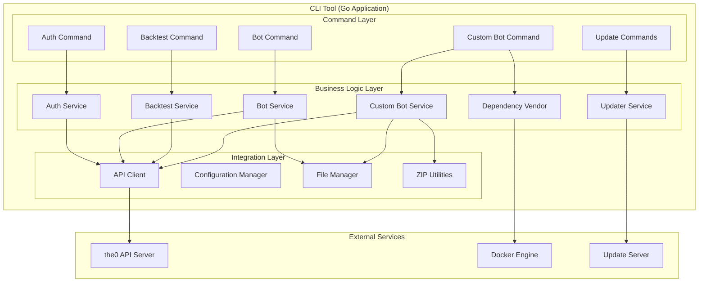

# CLI Tool

## 🎯 Service Overview

The the0 CLI is a comprehensive command-line interface built with Go and the Cobra framework that enables developers to create, deploy, and manage trading bots from the terminal. It serves as the primary development tool for platform interaction, providing local development workflows, custom bot packaging, and platform management capabilities.

### Key Responsibilities

- **Bot Management**: Deploy, list, update, and delete bot instances
- **Backtest Management**: Execute and monitor trading strategy backtests
- **Custom Bot Development**: Package and deploy custom trading algorithms
- **Authentication**: Secure API key management and authentication
- **Self-Updates**: Automatic CLI updates with binary replacement
- **Dependency Vendoring**: Docker-based Python package management

### Business Value

The CLI tool provides developers with a streamlined terminal-based experience for the entire bot development lifecycle, from local development to production deployment, while maintaining security and consistency across different platforms.

## 🛠️ Technology Stack

| Technology | Version | Purpose |
|------------|---------|---------|
| Go | 1.24+ | High-performance cross-platform binary development |
| Cobra | 1.8+ | Command-line interface framework and command organization |
| Docker Client | Latest | Python dependency vendoring for custom bots |
| Tablewriter | Latest | Terminal table formatting for display |
| Color | Latest | Cross-platform colored terminal output |
| YAML.v3 | Latest | Configuration file parsing |
| Semver | 3.2+ | Version comparison and management |

### Architecture Patterns

- **Command Pattern**: Each CLI command implements specific functionality with consistent interface
- **Factory Pattern**: Command creation and registration through factory functions
- **Strategy Pattern**: Different update strategies for various platforms and scenarios
- **Template Method**: Common deployment workflow shared across bot types

## 🏗️ Architecture & Design

### Service Architecture



### Component Breakdown

| Component | Responsibility | Technology |
|-----------|----------------|------------|
| Auth Commands | API key management, authentication status, logout | Go, Cobra, secure storage |
| Bot Commands | Bot CRUD operations, deployment, monitoring | Go, JSON parsing, API client |
| Backtest Commands | Backtest lifecycle management, result retrieval | Go, progress tracking |
| Custom Bot Commands | Bot packaging, dependency vendoring, deployment | Go, Docker, ZIP, YAML |
| Updater Service | Version checking, binary updates, rollback | Go, HTTP client, file operations |
| API Client | HTTP communication with the0 API | Go, JSON, error handling |

## 📡 CLI Command Structure

### Command Hierarchy

```
the0
├── auth                    # Authentication management
│   ├── login               # Set API key
│   ├── status              # Check authentication
│   └── logout             # Remove stored credentials
├── bot                     # Bot instance management
│   ├── deploy <config>     # Deploy new bot
│   ├── list                # List all bots
│   ├── update <id> <config> # Update existing bot
│   └── delete <id>        # Delete bot
├── backtest                # Backtest management
│   ├── deploy <config>     # Deploy new backtest
│   ├── list                # List all backtests
│   └── delete <id>        # Delete backtest
├── custom-bot              # Custom bot development
│   ├── deploy              # Package and deploy custom bot
│   ├── list                # List deployed custom bots
│   ├── versions <name>     # List available versions
│   └── schema <type> <version> <name> # Get JSON schema
├── check-update            # Check for CLI updates
└── self-update            # Update CLI binary
```

### Core Command Implementations

```go
// Command factory pattern
func NewBotCmd() *cobra.Command {
    cmd := &cobra.Command{
        Use:   "bot",
        Short: "Manage bot instances",
        Long:  "Deploy, list, update, and delete trading bot instances",
    }

    cmd.AddCommand(NewBotDeployCmd())
    cmd.AddCommand(NewBotListCmd())
    cmd.AddCommand(NewBotUpdateCmd())
    cmd.AddCommand(NewBotDeleteCmd())

    return cmd
}

// Example command implementation
func NewBotDeployCmd() *cobra.Command {
    return &cobra.Command{
        Use:   "deploy <config.json>",
        Short: "Deploy a new bot instance",
        Args:  cobra.ExactArgs(1),
        RunE:  runBotDeploy,
    }
}

func runBotDeploy(cmd *cobra.Command, args []string) error {
    configPath := args[0]

    // Load and validate configuration
    config, err := loadBotConfig(configPath)
    if err != nil {
        return fmt.Errorf("failed to load config: %w", err)
    }

    // Deploy via API
    return deployBot(config)
}
```

## 🔧 Configuration

### Environment Variables

| Variable | Required | Default | Description |
|----------|----------|---------|-------------|
| `THE0_API_URL` | No | `https://api.the0.dev` | API server base URL |
| `THE0_CLI_UPDATE_CHANNEL` | No | `production` | Update channel (production/staging) |
| `THE0_QUIET` | No | Unset | Suppress update notifications when set |

### Configuration Files

| File | Purpose | Format |
|------|---------|--------|
| `~/.the0/credentials.json` | Stored API key | JSON |
| `bot-config.yaml` | Custom bot configuration | YAML |
| `.the0ignore` | File exclusion patterns | Gitignore-style |
| `requirements.txt` | Python dependencies | pip requirements |

### Bot Configuration Example

```json
{
  "name": "momentum-trader",
  "type": "scheduled/rsi-momentum",
  "version": "1.0.0",
  "schedule": "0 */4 * * *",
  "risk_level": "medium",
  "max_position_size": 1000,
  "symbols": ["BTCUSDT", "ETHUSDT"],
  "parameters": {
    "rsi_period": 14,
    "rsi_oversold": 30,
    "rsi_overbought": 70
  }
}
```

### Custom Bot Configuration

```yaml
name: "advanced-arbitrage-bot"
description: "Multi-exchange arbitrage trading bot"
version: 2.1.0
author: "trading-developer"
type: "realtime"

entrypoints:
  bot: "main.py"
  backtest: "backtest.py"

schema:
  bot: "bot-schema.json"
  backtest: "backtest-schema.json"

metadata:
  tags: ["arbitrage", "multi-exchange", "realtime"]
  category: "defi"
  license: "MIT"

readme: "README.md"

dependencies:
  python: "requirements.txt"
  node: "package.json"

requirements:
  - Docker for dependency vendoring (optional)
  - Python 3.11+ runtime support
```

## 🚀 Development

### Local Development Setup

```bash
# 1. Clone and navigate to CLI
git clone <repository-url>
cd the0/cli

# 2. Install dependencies
go mod download

# 3. Run tests
make test

# 4. Build development binary
make build

# 5. Install locally
make install

# 6. Verify installation
the0 --version
```

### Project Structure

```
cli/
├── main.go                      # Application entry point
├── cmd/                         # Command implementations
│   ├── auth.go                  # Authentication commands
│   ├── bot.go                   # Bot management commands
│   ├── backtest.go              # Backtest commands
│   ├── custom_bot.go            # Custom bot commands
│   ├── check_update.go          # Update checking
│   └── self_update.go          # Self-update command
├── internal/                    # Internal packages
│   ├── api.go                  # API client implementation
│   ├── auth.go                 # Authentication logic
│   ├── config.go               # Configuration management
│   ├── ignore.go               # .the0ignore parsing
│   ├── vendor.go               # Docker-based vendoring
│   ├── zip.go                 # ZIP packaging utilities
│   ├── version.go              # Version parsing and comparison
│   └── updater.go             # Self-update logic
├── tests/                       # Test files
│   ├── api_test.go            # API client tests
│   ├── auth_test.go           # Authentication tests
│   ├── vendor_test.go         # Vendoring tests
│   └── updater_test.go       # Update logic tests
├── Makefile                     # Build automation
├── go.mod                      # Go module definition
└── .the0ignore                 # Self-exclusion for packaging
```

### Key Development Patterns

```go
// API client pattern with retry logic
type APIClient struct {
    baseURL    string
    httpClient *http.Client
    apiKey     string
}

func (c *APIClient) DeployBot(config BotConfig) (*Bot, error) {
    payload, _ := json.Marshal(config)

    req, err := http.NewRequest("POST", c.baseURL+"/bot", bytes.NewBuffer(payload))
    if err != nil {
        return nil, err
    }

    req.Header.Set("Authorization", "ApiKey "+c.apiKey)
    req.Header.Set("Content-Type", "application/json")

    resp, err := c.httpClient.Do(req)
    if err != nil {
        return nil, err
    }
    defer resp.Body.Close()

    if resp.StatusCode != http.StatusOK {
        return nil, fmt.Errorf("API error: %d", resp.StatusCode)
    }

    var bot Bot
    if err := json.NewDecoder(resp.Body).Decode(&bot); err != nil {
        return nil, err
    }

    return &bot, nil
}

// Configuration validation pattern
func validateBotConfig(config BotConfig) error {
    if config.Name == "" {
        return errors.New("bot name is required")
    }
    if config.Type == "" {
        return errors.New("bot type is required")
    }
    if config.Version == "" {
        return errors.New("bot version is required")
    }
    return nil
}

// Progress display pattern
func displayProgress(operation string, current, total int) {
    percentage := float64(current) / float64(total) * 100
    bar := strings.Repeat("█", int(percentage/5))
    empty := strings.Repeat("░", 20-int(bar)/5)

    fmt.Printf("\r%s: [%s%s] %.1f%%", operation, bar, empty, percentage)
}
```

## 🧪 Testing

### Test Structure

```bash
# Run all tests
make test

# Run tests with coverage
make test-coverage

# Run integration tests
make test-integration

# Run specific test
go test -run TestBotDeploy
```

### Test Categories

- **Unit Tests**: Individual function and method testing
- **Integration Tests**: API client and external service integration
- **CLI Tests**: Full command-line workflow testing
- **Update Tests**: Self-update mechanism testing

### Test Coverage Requirements

- Minimum coverage: 85%
- Critical paths (authentication, updates): 95%
- Error handling: 90%

```go
// Example test structure
func TestBotDeploy(t *testing.T) {
    tests := []struct {
        name     string
        config   BotConfig
        expected *Bot
        wantErr  bool
    }{
        {
            name: "valid config",
            config: BotConfig{
                Name:    "test-bot",
                Type:    "scheduled/rsi",
                Version: "1.0.0",
            },
            expected: &Bot{
                ID:     "bot-123",
                Name:   "test-bot",
                Status: "deployed",
            },
            wantErr: false,
        },
        {
            name: "missing name",
            config: BotConfig{
                Type:    "scheduled/rsi",
                Version: "1.0.0",
            },
            wantErr: true,
        },
    }

    for _, tt := range tests {
        t.Run(tt.name, func(t *testing.T) {
            // Mock API client
            mockAPI := &MockAPIClient{}
            mockAPI.On("DeployBot", tt.config).Return(tt.expected, nil)

            cmd := NewBotDeployCmd()
            cmd.SetArgs([]string{"config.json"})

            err := cmd.Execute()

            if (err != nil) != tt.wantErr {
                t.Errorf("BotDeploy() error = %v, wantErr %v", err, tt.wantErr)
            }
        })
    }
}
```

## 📊 Performance & Scalability

### Performance Characteristics

| Metric | Target | Current | Notes |
|--------|--------|---------|-------|
| CLI Startup Time | <100ms | ~50ms | Minimal dependency loading |
| Bot Deployment | <3s | ~1.5s | API + file processing |
| Custom Bot Packaging | <10s | ~6s | Including vendoring |
| Update Check | <2s | ~1s | Fast timeout optimization |
| ZIP Creation | <5s | ~2s | For 50MB custom bot |

### Optimization Strategies

- **Binary Size**: Use Go's build flags for size optimization
- **Parallel Processing**: Concurrent file operations for custom bot packaging
- **Caching**: Local caching of API responses where appropriate
- **Connection Pooling**: Reuse HTTP connections for API calls

```go
// Performance optimization example
func (v *Vendor) vendorDependencies() error {
    var wg sync.WaitGroup
    errChan := make(chan error, 2)

    // Concurrent Docker and non-Docker vendoring
    wg.Add(2)

    go func() {
        defer wg.Done()
        if err := v.dockerVendor(); err != nil {
            errChan <- err
        }
    }()

    go func() {
        defer wg.Done()
        if err := v.localVendor(); err != nil {
            errChan <- err
        }
    }()

    wg.Wait()
    close(errChan)

    for err := range errChan {
        if err != nil {
            return err
        }
    }

    return nil
}
```

## 🔍 Monitoring & Observability

### Logging Strategy

- **Format**: Human-readable terminal output with emojis
- **Levels**: ERROR, WARN, INFO, DEBUG
- **Structured Output**: JSON mode for CI/CD integration
- **Progress Indicators**: Real-time progress for long operations

```go
// Example logging with structured output
type Logger struct {
    quiet   bool
    json    bool
    debug   bool
}

func (l *Logger) Info(message string, fields ...interface{}) {
    if l.json {
        output := map[string]interface{}{
            "level":   "info",
            "message": message,
            "timestamp": time.Now().UTC(),
        }

        if len(fields) > 0 {
            output["details"] = fields
        }

        json.NewEncoder(os.Stdout).Encode(output)
    } else {
        fmt.Printf("ℹ️  %s\n", message)
    }
}

func (l *Logger) Error(message string, err error) {
    if l.json {
        json.NewEncoder(os.Stdout).Encode(map[string]interface{}{
            "level":   "error",
            "message": message,
            "error":   err.Error(),
            "timestamp": time.Now().UTC(),
        })
    } else {
        fmt.Printf("❌ %s: %v\n", message, err)
    }
}
```

### Key Metrics

| Metric | Type | Description |
|--------|------|-------------|
| `cli.startup.time` | Histogram | CLI application startup time |
| `bot.deploy.duration` | Histogram | Time to deploy a bot |
| `custom-bot.package.size` | Gauge | Size of packaged custom bots |
| `update.check.latency` | Histogram | Update check response time |
| `api.request.count` | Counter | Total API requests made |
| `api.request.errors` | Counter | API request failures |

### Health Checks

```bash
# Built-in health checks
the0 auth status    # Check API connectivity
the0 check-update   # Check update service
the0 --version      # Verify CLI installation
```

## 🛡️ Security

### Security Measures

- **API Key Storage**: Secure local storage with file permissions (600)
- **HTTPS Only**: All API communication over HTTPS
- **Input Validation**: Comprehensive validation of all user inputs
- **Dependency Scanning**: Automated security scanning of dependencies
- **Binary Verification**: SHA256 checksums for self-updates

### Security Best Practices

```go
// Secure API key storage
func storeAPIKey(key string) error {
    // Create config directory with restrictive permissions
    configDir := filepath.Join(os.Getenv("HOME"), ".the0")
    if err := os.MkdirAll(configDir, 0700); err != nil {
        return err
    }

    // Write credentials file with restricted permissions
    credFile := filepath.Join(configDir, "credentials.json")
    data := map[string]string{"api_key": key}
    jsonData, _ := json.Marshal(data)

    return os.WriteFile(credFile, jsonData, 0600)
}

// Input validation
func validateAPIKey(key string) error {
    if len(key) < 32 {
        return errors.New("API key too short")
    }

    // Only allow alphanumeric characters and specific symbols
    matched, _ := regexp.MatchString(`^[a-zA-Z0-9_\-\.]+$`, key)
    if !matched {
        return errors.New("API key contains invalid characters")
    }

    return nil
}

// Secure update verification
func (u *Updater) verifyBinary(data []byte, expectedSHA256 string) error {
    hasher := sha256.New()
    hasher.Write(data)
    actualSHA256 := hex.EncodeToString(hasher.Sum(nil))

    if actualSHA256 != expectedSHA256 {
        return fmt.Errorf("binary verification failed: expected %s, got %s",
            expectedSHA256, actualSHA256)
    }

    return nil
}
```

## 🚀 Deployment

### Build Process

```bash
# Development build
make build VERSION=dev-$(git rev-parse --short HEAD)

# Release builds
make release VERSION=v1.2.3

# Cross-platform releases
make release-all

# Install locally
make install
```

### Version Management

The CLI supports build-time version injection for proper versioning:

```go
var VERSION = "0.0.0-dev" // Overridden by build flags

// Build command example:
// go build -ldflags="-X main.VERSION=v1.2.3-abc123" main.go
```

### Cross-Platform Distribution

| Platform | Architecture | Binary Name |
|-----------|--------------|--------------|
| Windows | AMD64 | the0-windows-amd64.exe |
| Windows | ARM64 | the0-windows-arm64.exe |
| macOS | AMD64 | the0-darwin-amd64 |
| macOS | ARM64 | the0-darwin-arm64 |
| Linux | AMD64 | the0-linux-amd64 |
| Linux | ARM64 | the0-linux-arm64 |

### Installation Methods

1. **From Source** (for developers):
   ```bash
   git clone <repo-url>
   cd cli
   make install
   ```

2. **Binary Download** (for users):
   ```bash
   curl -L https://github.com/the0platform/cli/releases/latest/download/the0-linux-amd64 -o the0
   chmod +x the0
   sudo mv the0 /usr/local/bin/
   ```

3. **Package Managers** (planned):
   - Homebrew (macOS): `brew install the0`
   - Chocolatey (Windows): `choco install the0`
   - APT (Debian/Ubuntu): `apt install the0`

## 🔄 Integration Points

### API Integration

| Endpoint | Method | Purpose |
|----------|---------|---------|
| `/auth/validate-api-key` | GET | Validate API key |
| `/bot` | GET/POST/PUT/DELETE | Bot management |
| `/backtest` | GET/POST/DELETE | Backtest management |
| `/custom-bots` | GET/POST | Custom bot management |
| `/custom-bots/{name}/versions` | GET | List bot versions |

### Docker Integration

The CLI integrates with Docker for Python dependency vendoring:

```go
// Docker-based vendoring implementation
func (v *Vendor) dockerVendor() error {
    ctx, cancel := context.WithTimeout(context.Background(), 5*time.Minute)
    defer cancel()

    cmd := exec.CommandContext(ctx, "docker", "run", "--rm",
        "-v", v.workDir+":/app",
        "-w", "/app",
        "python:3.11-slim",
        "pip", "install", "--target", "vendor", "-r", "requirements.txt")

    output, err := cmd.CombinedOutput()
    if err != nil {
        return fmt.Errorf("docker vendoring failed: %v\nOutput: %s", err, string(output))
    }

    return nil
}
```

### File System Integration

```go
// .the0ignore pattern matching
func parseIgnoreFile(path string) ([]string, error) {
    file, err := os.Open(path)
    if err != nil {
        return nil, err
    }
    defer file.Close()

    var patterns []string
    scanner := bufio.NewScanner(file)
    for scanner.Scan() {
        line := strings.TrimSpace(scanner.Text())
        if line != "" && !strings.HasPrefix(line, "#") {
            patterns = append(patterns, line)
        }
    }

    return patterns, scanner.Err()
}
```

## 🐛 Troubleshooting

### Common Issues

1. **Authentication Failed**
   - **Symptoms**: 401 errors, API key rejected
   - **Causes**: Invalid/expired API key, network issues
   - **Solutions**: Re-authenticate with `the0 auth login`, check API URL
   - **Prevention**: Regular API key rotation, network monitoring

2. **Docker Vendoring Failed**
   - **Symptoms**: Custom bot deployment fails, vendor directory missing
   - **Causes**: Docker not running, no Docker, invalid requirements.txt
   - **Solutions**: Start Docker, install Docker, fix requirements format
   - **Prevention**: Docker health checks, requirements validation

3. **Update Failed**
   - **Symptoms**: Self-update command fails, binary corruption
   - **Causes**: Permission issues, network problems, checksum mismatch
   - **Solutions**: Run with sudo, check network, manual reinstall
   - **Prevention**: Proper file permissions, update verification

4. **Configuration Validation Errors**
   - **Symptoms**: JSON/YAML parsing errors, missing fields
   - **Causes**: Invalid syntax, missing required fields
   - **Solutions**: Validate configuration with JSON/YAML linters
   - **Prevention**: Configuration validation before deployment

### Debugging Tools

```bash
# Debug mode with verbose output
export DEBUG=1
the0 bot deploy config.json

# Check API connectivity
curl -I $THE0_API_URL/health

# Validate JSON configuration
cat config.json | jq .

# Test Docker connectivity
docker run --rm hello-world

# Check file permissions
ls -la ~/.the0/
```

### Performance Debugging

```bash
# Time CLI operations
time the0 bot deploy config.json

# Profile memory usage (requires debug build)
go build -race -o the0-debug main.go
./the0-debug bot deploy config.json

# Monitor network requests
export THE0_DEBUG_REQUESTS=1
the0 bot list
```

## 📈 Future Roadmap

### Planned Enhancements

- **Shell Completion**: Generate completion scripts for bash/zsh/fish
- **Interactive Mode**: Interactive bot configuration wizard
- **Template System**: Bot configuration templates and scaffolding
- **Plugin System**: Extensible command architecture
- **CI/CD Integration**: GitHub Actions and GitLab CI workflows
- **Multi-Tenant Support**: Switch between different the0 accounts

### Technical Debt

- **Error Messages**: Improve error message clarity and suggestions
- **Configuration Validation**: Enhanced validation with better error messages
- **Test Coverage**: Increase coverage for edge cases and error scenarios
- **Documentation**: Inline help improvements and examples

## 📚 Additional Resources

### Documentation

- [Cobra Documentation](https://github.com/spf13/cobra)
- [Go Best Practices](https://golang.org/doc/effective_go.html)
- [CLI Design Guidelines](/cli-design-patterns)

### Tools & Utilities

- **jq**: JSON manipulation for configuration validation
- **yamllint**: YAML configuration linting
- **shellcheck**: Shell script validation for packaging

### Related Services

- **API Server**: Primary backend integration point
- **Custom Bot Marketplace**: Bot publishing and discovery
- **Frontend Dashboard**: Alternative management interface

---

*Last updated: October 2024*