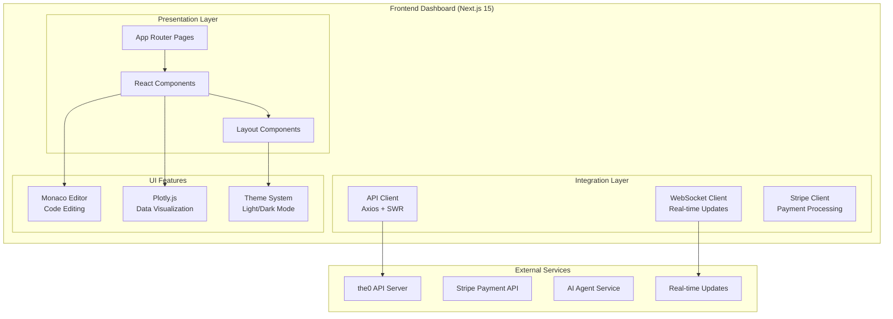

# Frontend Dashboard

## 🎯 Service Overview

The Frontend Dashboard is a modern web application built with Next.js 15 and React 19 that provides users with a comprehensive interface for managing trading bots, monitoring performance, accessing AI assistance, and exploring the custom bot marketplace. It serves as the primary user-facing interface for the0 platform, delivering real-time data visualization, bot configuration, and platform analytics.

### Key Responsibilities

- **Bot Management**: Create, configure, deploy, and monitor trading bots
- **Real-time Monitoring**: Live dashboards with WebSocket updates for bot status
- **Backtest Visualization**: Interactive charts and performance analytics using Plotly.js
- **Custom Bot Marketplace**: Browse, purchase, and deploy community-created bots
- **AI Agent Integration**: Interface for AI-powered development assistance
- **User Authentication**: Secure login, registration, and session management
- **Code Editing**: Monaco Editor for in-browser bot code editing
- **Payment Processing**: Stripe integration for premium features and bot purchases

### Business Value

The Frontend Dashboard provides users with an intuitive, powerful interface for all platform interactions, reducing the learning curve for algorithmic trading while offering advanced features for experienced traders. It transforms complex trading operations into accessible visual interfaces and actionable insights.

## 🛠️ Technology Stack

| Technology | Version | Purpose |
|------------|---------|---------|
| Next.js | 15.3.1 | React framework with App Router and Turbopack |
| React | 19.1.0 | Component library for building user interfaces |
| TypeScript | 5.x | Type-safe JavaScript development |
| Tailwind CSS | 3.4.7 | Utility-first CSS framework |
| shadcn/ui | Latest | Component library built on Radix UI primitives |
| Radix UI | Latest | Accessible, unstyled UI components |
| Plotly.js | 2.34.0 | Interactive data visualization and charting |
| Monaco Editor | 0.52.2 | VS Code-like code editing experience |
| Axios | 1.9.0 | HTTP client for API communication |
| Jest | 29.7.0 | Testing framework with React Testing Library |

### Architecture Patterns

- **App Router**: Next.js 15's file-based routing with nested layouts
- **Server Components**: Hybrid SSR/SSG with server-side data fetching
- **Component Composition**: Reusable UI components with compound patterns
- **State Management**: Zustand for client state, React Server Components for server state
- **Progressive Enhancement**: Works without JavaScript for basic functionality

## 🏗️ Architecture & Design

### Service Architecture



### Component Breakdown

| Component | Responsibility | Technology |
|-----------|----------------|------------|
| Bot Management | CRUD operations, configuration, deployment | React Server Components, Zustand |
| Dashboard Analytics | Real-time metrics, charts, performance data | Plotly.js, WebSocket |
| AI Agent Interface | Chat interface, artifact management, code generation | Monaco Editor, WebSocket |
| Custom Bot Marketplace | Bot browsing, purchasing, deployment | Stripe, React Components |
| Authentication System | Login, registration, session management | JWT, Server Actions |
| Code Editor | In-browser bot editing, syntax highlighting | Monaco Editor, TypeScript |
| Theme System | Light/dark mode, UI preferences | CSS Variables, Context API |

## 📡 UI Architecture

### Page Structure

```
/                              # Homepage / landing
├── /auth                       # Authentication flows
│   ├── /login                  # User login
│   └── /register              # User registration
├── /dashboard                  # Main dashboard area
│   ├── /bots                  # Bot management
│   │   ├── /[id]             # Bot details
│   │   └── /create           # Create new bot
│   ├── /backtests             # Backtest management
│   │   ├── /[id]             # Backtest results
│   │   └── /create           # Create new backtest
│   ├── /custom-bots           # Custom bot marketplace
│   │   ├── /[id]             # Bot details
│   │   └── /my-bots         # User's custom bots
│   └── /analytics            # Performance analytics
├── /ai-agent                  # AI development assistant
├── /settings                  # User settings
├── /install-cli              # CLI installation guide
└── /about                   # About page
```

### Key UI Components

```typescript
// Example: Bot configuration component with form validation
interface BotConfigFormProps {
  bot?: Bot;
  onSubmit: (config: BotConfig) => Promise<void>;
  onCancel: () => void;
}

export function BotConfigForm({ bot, onSubmit, onCancel }: BotConfigFormProps) {
  const [config, setConfig] = useState<BotConfig>(bot?.config || {});
  const [isLoading, setIsLoading] = useState(false);

  const handleSubmit = async (e: React.FormEvent) => {
    e.preventDefault();
    setIsLoading(true);
    try {
      await onSubmit(config);
    } catch (error) {
      toast.error('Failed to save bot configuration');
    } finally {
      setIsLoading(false);
    }
  };

  return (
    <Card className="w-full max-w-2xl">
      <CardHeader>
        <CardTitle>{bot ? 'Edit Bot' : 'Create Bot'}</CardTitle>
      </CardHeader>
      <CardContent>
        <form onSubmit={handleSubmit} className="space-y-6">
          {/* Configuration fields with validation */}
          <BotNameField value={config.name} onChange={setConfig} />
          <BotTypeSelect value={config.type} onChange={setConfig} />
          <BotParameters value={config.parameters} onChange={setConfig} />

          <div className="flex justify-end space-x-2">
            <Button type="button" variant="outline" onClick={onCancel}>
              Cancel
            </Button>
            <Button type="submit" disabled={isLoading}>
              {isLoading && <Spinner className="mr-2" />}
              {bot ? 'Update' : 'Create'}
            </Button>
          </div>
        </form>
      </CardContent>
    </Card>
  );
}
```

### State Management Pattern

```typescript
// Zustand store for bot management
interface BotStore {
  bots: Bot[];
  currentBot: Bot | null;
  isLoading: boolean;
  error: string | null;

  // Actions
  fetchBots: () => Promise<void>;
  createBot: (config: BotConfig) => Promise<Bot>;
  updateBot: (id: string, config: BotConfig) => Promise<void>;
  deleteBot: (id: string) => Promise<void>;
  setCurrentBot: (bot: Bot | null) => void;
}

export const useBotStore = create<BotStore>((set, get) => ({
  bots: [],
  currentBot: null,
  isLoading: false,
  error: null,

  fetchBots: async () => {
    set({ isLoading: true, error: null });
    try {
      const response = await apiClient.get('/bots');
      set({ bots: response.data, isLoading: false });
    } catch (error) {
      set({ error: error.message, isLoading: false });
    }
  },

  createBot: async (config: BotConfig) => {
    try {
      const response = await apiClient.post('/bots', config);
      const newBot = response.data;
      set(state => ({
        bots: [...state.bots, newBot],
        currentBot: newBot
      }));
      return newBot;
    } catch (error) {
      set({ error: error.message });
      throw error;
    }
  },

  // ... other actions
}));
```

## 🔧 Configuration

### Environment Variables

| Variable | Required | Default | Description |
|----------|----------|---------|-------------|
| `NEXT_PUBLIC_API_URL` | No | `http://localhost:3000` | API server base URL |
| `NEXT_PUBLIC_STRIPE_PUBLISHABLE_KEY` | Yes | N/A | Stripe publishable key for payments |
| `NEXT_PUBLIC_WS_URL` | No | `ws://localhost:3000` | WebSocket server URL |
| `NEXT_PUBLIC_APP_URL` | No | `http://localhost:3001` | Frontend application URL |
| `NEXT_PUBLIC_ENVIRONMENT` | No | `development` | Application environment |

### Next.js Configuration

```javascript
/** @type {import('next').NextConfig} */
const nextConfig = {
  reactStrictMode: true,
  pageExtensions: ["js", "jsx", "ts", "tsx"],
  output: "standalone", // For Docker deployment
  experimental: {
    appDir: true, // App Router support
  },
  env: {
    NEXT_PUBLIC_API_URL: process.env.NEXT_PUBLIC_API_URL,
    NEXT_PUBLIC_STRIPE_PUBLISHABLE_KEY: process.env.NEXT_PUBLIC_STRIPE_PUBLISHABLE_KEY,
  },
  images: {
    domains: ['assets.the0.dev'], // External image domains
  },
};

export default nextConfig;
```

## 🚀 Development

### Local Development Setup

```bash
# 1. Clone and navigate to frontend
git clone <repository-url>
cd the0/frontend

# 2. Install dependencies
yarn install

# 3. Set environment variables
cp .env.example .env.local
# Edit .env.local with your configuration

# 4. Start development server
yarn dev

# 5. Open browser
open http://localhost:3001
```

### Project Structure

```
frontend/
├── src/                          # Source code
│   ├── app/                      # Next.js App Router pages
│   │   ├── (dashboard)/           # Dashboard route group
│   │   │   ├── bots/            # Bot management pages
│   │   │   ├── backtests/        # Backtest pages
│   │   │   ├── custom-bots/     # Custom bot marketplace
│   │   │   └── analytics/       # Analytics dashboard
│   │   ├── auth/               # Authentication pages
│   │   ├── ai-agent/           # AI agent interface
│   │   ├── layout.tsx          # Root layout
│   │   ├── page.tsx            # Homepage
│   │   └── globals.css         # Global styles
│   ├── components/               # Reusable components
│   │   ├── ui/                # shadcn/ui components
│   │   ├── bots/               # Bot-specific components
│   │   ├── backtests/          # Backtest components
│   │   ├── ai-agent/          # AI agent components
│   │   └── custom-bots/       # Custom bot components
│   ├── lib/                    # Utility libraries
│   │   ├── api-client.ts       # API client configuration
│   │   ├── websocket-client.ts  # WebSocket management
│   │   └── utils.ts           # General utilities
│   ├── hooks/                  # Custom React hooks
│   │   ├── use-bots.ts         # Bot management hooks
│   │   ├── use-backtests.ts    # Backtest hooks
│   │   └── use-websocket.ts   # WebSocket hooks
│   ├── stores/                 # Zustand state stores
│   │   ├── bot-store.ts       # Bot state management
│   │   ├── auth-store.ts      # Authentication state
│   │   └── ui-store.ts       # UI state
│   ├── types/                  # TypeScript type definitions
│   └── contexts/               # React contexts
├── public/                     # Static assets
├── components.json             # shadcn/ui configuration
├── tailwind.config.ts         # Tailwind CSS configuration
├── next.config.mjs            # Next.js configuration
└── package.json               # Dependencies and scripts
```

### Key Development Patterns

```typescript
// Server Actions for form handling
export async function createBotAction(formData: FormData) {
  const session = await getServerSession();

  if (!session) {
    return { error: 'Authentication required' };
  }

  try {
    const config = parseBotFormData(formData);
    const bot = await apiClient.post('/bots', config);

    revalidatePath('/dashboard/bots');
    return { success: true, bot: bot.data };
  } catch (error) {
    return { error: 'Failed to create bot' };
  }
}

// Custom hook for real-time data
export function useRealtimeBotStatus(botId: string) {
  const [status, setStatus] = useState<BotStatus>('unknown');
  const { socket } = useWebSocket();

  useEffect(() => {
    if (!socket) return;

    const handleStatusUpdate = (data: BotStatusUpdate) => {
      if (data.botId === botId) {
        setStatus(data.status);
      }
    };

    socket.on('bot.status.update', handleStatusUpdate);
    socket.emit('bot.status.subscribe', { botId });

    return () => {
      socket.off('bot.status.update', handleStatusUpdate);
      socket.emit('bot.status.unsubscribe', { botId });
    };
  }, [socket, botId]);

  return status;
}

// Plotly.js integration for backtest visualization
export function BacktestChart({ results }: { results: BacktestResult }) {
  const [chartData, setChartData] = useState<PlotData[]>([]);

  useEffect(() => {
    const portfolioData = {
      x: results.timestamps,
      y: results.portfolioValue,
      type: 'scatter',
      mode: 'lines',
      name: 'Portfolio Value',
      line: { color: '#10b981' }
    };

    const benchmarkData = {
      x: results.timestamps,
      y: results.benchmarkValue,
      type: 'scatter',
      mode: 'lines',
      name: 'Benchmark',
      line: { color: '#6b7280' }
    };

    setChartData([portfolioData, benchmarkData]);
  }, [results]);

  return (
    <Plot
      data={chartData}
      layout={{
        title: 'Backtest Performance',
        xaxis: { title: 'Date' },
        yaxis: { title: 'Portfolio Value ($)' },
        responsive: true
      }}
      config={{ responsive: true }}
    />
  );
}
```

## 🧪 Testing

### Test Structure

```bash
# Run all tests
yarn test

# Run tests in watch mode
yarn test:watch

# Generate coverage report
yarn test --coverage

# Run integration tests
yarn test:integration
```

### Test Categories

- **Unit Tests**: Individual component and utility function testing
- **Integration Tests**: Component interaction and API integration
- **E2E Tests**: Full user workflow testing with Playwright
- **Visual Regression Tests**: UI appearance testing with Percy

### Test Setup

```typescript
// jest.config.js
const nextJest = require('next/jest');

const createJestConfig = nextJest({
  dir: './',
});

const customJestConfig = {
  setupFilesAfterEnv: ['<rootDir>/jest.setup.ts'],
  moduleNameMapping: {
    '^@/(.*)$': '<rootDir>/src/$1',
  },
  testEnvironment: 'jest-environment-jsdom',
  collectCoverageFrom: [
    'src/**/*.{js,jsx,ts,tsx}',
    '!src/**/*.d.ts',
    '!src/**/*.stories.{js,jsx,ts,tsx}',
  ],
  coverageThreshold: {
    global: {
      branches: 80,
      functions: 80,
      lines: 80,
      statements: 80,
    },
  },
};

module.exports = createJestConfig(customJestConfig);

// Example component test
import { render, screen, fireEvent, waitFor } from '@testing-library/react';
import { BotConfigForm } from './BotConfigForm';
import userEvent from '@testing-library/user-event';

describe('BotConfigForm', () => {
  const mockOnSubmit = jest.fn();
  const mockOnCancel = jest.fn();

  beforeEach(() => {
    mockOnSubmit.mockClear();
    mockOnCancel.mockClear();
  });

  it('renders form fields correctly', () => {
    render(<BotConfigForm onSubmit={mockOnSubmit} onCancel={mockOnCancel} />);

    expect(screen.getByLabelText('Bot Name')).toBeInTheDocument();
    expect(screen.getByLabelText('Bot Type')).toBeInTheDocument();
    expect(screen.getByRole('button', { name: 'Create' })).toBeInTheDocument();
    expect(screen.getByRole('button', { name: 'Cancel' })).toBeInTheDocument();
  });

  it('submits form with valid data', async () => {
    const user = userEvent.setup();
    render(<BotConfigForm onSubmit={mockOnSubmit} onCancel={mockOnCancel} />);

    await user.type(screen.getByLabelText('Bot Name'), 'Test Bot');
    await user.selectOptions(screen.getByLabelText('Bot Type'), 'Momentum Strategy');

    await user.click(screen.getByRole('button', { name: 'Create' }));

    await waitFor(() => {
      expect(mockOnSubmit).toHaveBeenCalledWith({
        name: 'Test Bot',
        type: 'momentum',
        parameters: {}
      });
    });
  });
});
```

## 📊 Performance & Scalability

### Performance Characteristics

| Metric | Target | Current | Notes |
|--------|--------|---------|-------|
| First Contentful Paint | <1.5s | ~1.2s | LCP optimization |
| Time to Interactive | <3s | ~2.1s | JavaScript bundle splitting |
| Core Web Vitals | 90+ | ~85 | Performance monitoring |
| Bundle Size (main) | <250KB | ~180KB | Tree shaking, code splitting |
| Dashboard Load Time | <2s | ~1.5s | API data caching |

### Performance Optimizations

```typescript
// Code splitting and lazy loading
const BotDashboard = lazy(() => import('../components/bots/BotDashboard'));
const BacktestChart = lazy(() => import('../components/backtests/BacktestChart'));

// Data fetching with SWR
export function useBots() {
  return useSWR<Bot[]>('/bots', fetcher, {
    refreshInterval: 30000, // Refresh every 30 seconds
    revalidateOnFocus: true,
    errorRetryCount: 3,
  });
}

// Memoization for expensive computations
const MemoizedBacktestChart = memo(BacktestChart, (prevProps, nextProps) => {
  return prevProps.results.id === nextProps.results.id;
});

// Virtual scrolling for large lists
import { FixedSizeList as List } from 'react-window';

export function BotList({ bots }: { bots: Bot[] }) {
  const Row = ({ index, style }: { index: number; style: React.CSSProperties }) => (
    <div style={style}>
      <BotCard bot={bots[index]} />
    </div>
  );

  return (
    <List
      height={600}
      itemCount={bots.length}
      itemSize={120}
      width="100%"
    >
      {Row}
    </List>
  );
}
```

## 🔍 Monitoring & Observability

### Performance Monitoring

- **Web Vitals**: Automatic Core Web Vitals tracking
- **Error Tracking**: Sentry integration for error monitoring
- **User Analytics**: Custom event tracking for user behavior
- **Performance Metrics**: Custom performance metrics dashboard

### Real-time Features

```typescript
// WebSocket integration for real-time updates
export function useWebSocket() {
  const [socket, setSocket] = useState<WebSocket | null>(null);
  const [connectionStatus, setConnectionStatus] = useState<'connecting' | 'connected' | 'disconnected'>('disconnected');

  useEffect(() => {
    const wsUrl = process.env.NEXT_PUBLIC_WS_URL;
    const ws = new WebSocket(wsUrl);

    ws.onopen = () => {
      setConnectionStatus('connected');
      setSocket(ws);
    };

    ws.onclose = () => {
      setConnectionStatus('disconnected');
      setSocket(null);

      // Auto-reconnect
      setTimeout(() => {
        setConnectionStatus('connecting');
      }, 5000);
    };

    ws.onerror = (error) => {
      console.error('WebSocket error:', error);
      setConnectionStatus('disconnected');
    };

    return () => {
      ws.close();
    };
  }, []);

  return { socket, connectionStatus };
}

// Real-time bot status updates
export function BotStatusIndicator({ botId }: { botId: string }) {
  const status = useRealtimeBotStatus(botId);

  const statusConfig = {
    running: { color: 'bg-green-500', label: 'Running' },
    stopped: { color: 'bg-red-500', label: 'Stopped' },
    error: { color: 'bg-yellow-500', label: 'Error' },
    unknown: { color: 'bg-gray-500', label: 'Unknown' },
  };

  const config = statusConfig[status] || statusConfig.unknown;

  return (
    <div className="flex items-center space-x-2">
      <div className={`w-2 h-2 rounded-full ${config.color}`} />
      <span className="text-sm text-gray-600">{config.label}</span>
    </div>
  );
}
```

### Key Metrics

| Metric | Type | Description |
|--------|------|-------------|
| `page.load.time` | Histogram | Page load times |
| `component.render.time` | Histogram | Component render performance |
| `api.request.duration` | Histogram | API response times |
| `user.interaction.count` | Counter | User engagement metrics |
| `websocket.connection.count` | Counter | WebSocket connections |
| `error.rate` | Counter | Application errors |

## 🛡️ Security

### Security Measures

- **Content Security Policy**: Strict CSP headers for XSS prevention
- **Authentication**: Secure JWT token handling with httpOnly cookies
- **Input Validation**: Client and server-side validation with Zod
- **HTTPS Enforcement**: Automatic HTTPS redirects
- **XSS Prevention**: React's built-in XSS protection

### Security Best Practices

```typescript
// Secure API client with authentication
export const apiClient = axios.create({
  baseURL: process.env.NEXT_PUBLIC_API_URL,
  withCredentials: true, // Send httpOnly cookies
  headers: {
    'Content-Type': 'application/json',
  },
});

// Request interceptor for authentication
apiClient.interceptors.request.use((config) => {
  // Add CSRF protection
  const csrfToken = getCsrfToken();
  if (csrfToken) {
    config.headers['X-CSRF-Token'] = csrfToken;
  }

  return config;
});

// Response interceptor for error handling
apiClient.interceptors.response.use(
  (response) => response,
  (error) => {
    if (error.response?.status === 401) {
      // Redirect to login on authentication failure
      window.location.href = '/auth/login';
    }
    return Promise.reject(error);
  }
);

// Input validation with Zod
const BotConfigSchema = z.object({
  name: z.string().min(1).max(100),
  type: z.string().min(1),
  version: z.string().min(1),
  parameters: z.record(z.any()).optional(),
});

export function validateBotConfig(config: unknown) {
  return BotConfigSchema.safeParse(config);
}
```

## 🚀 Deployment

### Build Process

```bash
# Development build
yarn dev

# Production build
yarn build

# Start production server
yarn start

# Export static files (if needed)
yarn export
```

### Docker Deployment

```dockerfile
# Multi-stage Dockerfile for production
FROM node:20-alpine AS deps
WORKDIR /app

# Copy package files
COPY package.json yarn.lock ./
RUN yarn install --frozen-lockfile

# Copy source and build
FROM node:20-alpine AS builder
WORKDIR /app
COPY --from=deps /app/node_modules ./node_modules
COPY . .

# Build application
RUN yarn build

# Production stage
FROM node:20-alpine AS runner
WORKDIR /app

# Create non-root user
RUN addgroup --system --gid 1001 nodejs
RUN adduser --system --uid 1001 nextjs

# Copy built application
COPY --from=builder --chown=nextjs:nodejs /app/.next/standalone ./
COPY --from=builder --chown=nextjs:nodejs /app/public ./public

USER nextjs

EXPOSE 3000
ENV PORT 3000
ENV HOSTNAME "0.0.0.0"

CMD ["node", "server.js"]
```

### Kubernetes Configuration

```yaml
apiVersion: apps/v1
kind: Deployment
metadata:
  name: the0-frontend
spec:
  replicas: 3
  selector:
    matchLabels:
      app: the0-frontend
  template:
    metadata:
      labels:
        app: the0-frontend
    spec:
      containers:
      - name: frontend
        image: the0/frontend:latest
        ports:
        - containerPort: 3000
        env:
        - name: NEXT_PUBLIC_API_URL
          value: "https://api.the0.dev"
        - name: NEXT_PUBLIC_STRIPE_PUBLISHABLE_KEY
          valueFrom:
            secretKeyRef:
              name: the0-secrets
              key: stripe-publishable-key
        resources:
          requests:
            memory: "256Mi"
            cpu: "250m"
          limits:
            memory: "512Mi"
            cpu: "500m"
        livenessProbe:
          httpGet:
            path: /api/health
            port: 3000
          initialDelaySeconds: 30
          periodSeconds: 10
        readinessProbe:
          httpGet:
            path: /api/health
            port: 3000
          initialDelaySeconds: 5
          periodSeconds: 5
```

## 🔄 Integration Points

### API Integration

```typescript
// API client configuration
export const endpoints = {
  bots: '/api/bots',
  backtests: '/api/backtests',
  customBots: '/api/custom-bots',
  auth: '/api/auth',
  user: '/api/user',
};

// Data fetching patterns
export const useApiQuery = <T>(endpoint: string, options?: SWRConfiguration) => {
  return useSWR<T>(endpoint, async (url) => {
    const response = await apiClient.get(url);
    return response.data;
  }, options);
};
```

### WebSocket Integration

```typescript
// WebSocket event handling
export interface WebSocketMessage {
  type: string;
  data: any;
  timestamp: string;
}

export function useWebSocketEvents() {
  const { socket } = useWebSocket();

  useEffect(() => {
    if (!socket) return;

    socket.onmessage = (event) => {
      const message: WebSocketMessage = JSON.parse(event.data);

      switch (message.type) {
        case 'bot.status.update':
          // Handle bot status updates
          break;
        case 'backtest.completed':
          // Handle backtest completion
          break;
        default:
          console.log('Unknown message type:', message.type);
      }
    };
  }, [socket]);
}
```

### Stripe Integration

```typescript
// Stripe payment processing
import { loadStripe } from '@stripe/stripe-js';
import { Elements } from '@stripe/react-stripe-js';

const stripePromise = loadStripe(process.env.NEXT_PUBLIC_STRIPE_PUBLISHABLE_KEY);

export function PaymentForm({ amount }: { amount: number }) {
  const [clientSecret, setClientSecret] = useState('');

  useEffect(() => {
    // Create payment intent on server
    fetch('/api/create-payment-intent', {
      method: 'POST',
      headers: { 'Content-Type': 'application/json' },
      body: JSON.stringify({ amount }),
    })
      .then((res) => res.json())
      .then((data) => setClientSecret(data.clientSecret));
  }, [amount]);

  return (
    <Elements stripe={stripePromise} options={{ clientSecret }}>
      <CheckoutForm />
    </Elements>
  );
}
```

## 🐛 Troubleshooting

### Common Issues

1. **Build Failures**
   - **Symptoms**: Next.js build errors, TypeScript compilation failures
   - **Causes**: Type errors, missing dependencies, syntax issues
   - **Solutions**: Check TypeScript errors, run `yarn install`, validate imports
   - **Prevention**: Regular TypeScript checking, dependency updates

2. **WebSocket Connection Issues**
   - **Symptoms**: Real-time updates not working, connection errors
   - **Causes**: WebSocket server down, network issues, firewall blocks
   - **Solutions**: Check WebSocket URL, verify network connectivity
   - **Prevention**: Connection monitoring, graceful fallbacks

3. **Performance Issues**
   - **Symptoms**: Slow page loads, unresponsive UI
   - **Causes**: Large bundle sizes, unoptimized images, blocking operations
   - **Solutions**: Bundle analysis, image optimization, code splitting
   - **Prevention**: Regular performance monitoring, Core Web Vitals tracking

### Debugging Tools

```bash
# Debug Next.js build
NEXT_DEBUG=1 yarn build

# Enable React DevTools
NODE_OPTIONS="--inspect" yarn dev

# Analyze bundle size
yarn build
yarn analyze

# Run tests in debug mode
NODE_OPTIONS="--inspect" yarn test

# Check Core Web Vitals
yarn dev
# Visit http://localhost:3001/_next/static/chunks/main.js and analyze with Chrome DevTools
```

## 📈 Future Roadmap

### Planned Enhancements

- **Progressive Web App**: PWA features for offline support
- **Mobile Optimization**: Enhanced mobile experience and touch interactions
- **Real-time Collaboration**: Multi-user bot development sessions
- **Advanced Analytics**: Machine learning insights for trading patterns
- **Custom Workspaces**: Personalized dashboard layouts
- **Internationalization**: Multi-language support

### Technical Debt

- **Type Safety**: Increase TypeScript strict mode coverage
- **Bundle Optimization**: Further reduce bundle sizes with advanced techniques
- **Accessibility**: Improve WCAG 2.1 AA compliance
- **Testing**: Increase E2E test coverage for critical paths

## 📚 Additional Resources

### Documentation

- [Next.js 15 Documentation](https://nextjs.org/docs)
- [React 19 Documentation](https://react.dev/)
- [Tailwind CSS Documentation](https://tailwindcss.com/docs)
- [shadcn/ui Components](https://ui.shadcn.com/)

### Tools & Utilities

- **Next.js Bundle Analyzer**: Bundle size optimization
- **React DevTools**: Component debugging
- **Chrome DevTools**: Performance analysis
- **Lighthouse**: Performance and accessibility auditing

### Related Services

- **API Server**: Backend data and authentication
- **CLI Tool**: Terminal-based alternative interface
- **AI Agent**: Integrated development assistance

---

*Last updated: October 2024*