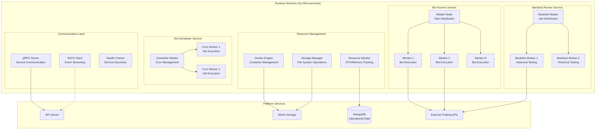

# Runtime Services

## 🎯 Service Overview

Runtime Services are a collection of specialized Go microservices that handle the execution of trading bots, backtesting, and scheduling operations. Built with high-performance Go and using master-worker patterns with gRPC communication, these services provide the core execution engine for the0 platform. They handle both real-time trading execution and historical backtesting with resource isolation and security enforcement.

### Key Responsibilities

- **Bot Execution**: Run live trading bots with real-time market data
- **Backtest Processing**: Execute historical strategy validation with performance analytics
- **Scheduled Execution**: Cron-based job scheduling for periodic bot runs
- **Resource Isolation**: Container-based execution with security boundaries
- **Performance Monitoring**: Track resource usage and execution metrics
- **Event Coordination**: Communicate with platform via NATS messaging

### Business Value

Runtime Services provide the execution foundation that transforms trading strategies from static configurations into live, profitable trading operations while ensuring security, scalability, and reliability across thousands of concurrent bot executions.

## 🛠️ Technology Stack

| Technology | Version | Purpose |
|------------|---------|---------|
| Go | 1.24+ | High-performance concurrent execution |
| gRPC | Latest | High-performance inter-service communication |
| NATS | 1.43+ | Event streaming and service coordination |
| Docker | Latest | Container isolation and security |
| MongoDB | 1.17+ | Operational data storage |
| MinIO | 7.x | Bot code and result storage |
| Kubernetes | Latest | Container orchestration and scaling |


### Architecture Patterns

- **Master-Worker Pattern**: Scalable task distribution and execution
- **Circuit Breaker**: Fault tolerance and graceful degradation
- **Resource Pooling**: Efficient connection and resource management
- **Event-Driven Architecture**: Loose coupling with NATS messaging
- **Bulkhead Pattern**: Isolation and failure containment

## 🏗️ Architecture & Design

### Service Architecture



### Component Breakdown

| Service | Responsibility | Technology |
|----------|----------------|------------|
| Bot Runner | Real-time trading bot execution with market data integration | Go, Docker, NATS |
| Backtest Runner | Historical strategy testing with performance analytics | Go, MongoDB, MinIO |
| Bot Scheduler | Cron-based job scheduling and execution | Go, Cron libraries |
| Communication Layer | gRPC services and NATS event handling | gRPC, NATS, Protocol Buffers |
| Resource Manager | Container lifecycle and resource isolation | Docker, cgroups |

## 📡 Service Communication

### gRPC Service Definitions

```protobuf
// Bot Runner service definition
service BotRunner {
    rpc ExecuteBot(ExecuteBotRequest) returns (stream BotExecutionResult);
    rpc StopBot(StopBotRequest) returns (StopBotResponse);
    rpc GetBotStatus(GetBotStatusRequest) returns (BotStatusResponse);
}

// Backtest Runner service definition
service BacktestRunner {
    rpc ExecuteBacktest(ExecuteBacktestRequest) returns (stream BacktestResult);
    rpc GetBacktestStatus(GetBacktestStatusRequest) returns (BacktestStatusResponse);
    rpc CancelBacktest(CancelBacktestRequest) returns (CancelBacktestResponse);
}

// Bot Scheduler service definition
service BotScheduler {
    rpc ScheduleBot(ScheduleBotRequest) returns (ScheduleBotResponse);
    rpc UnscheduledBot(UnscheduleBotRequest) returns (UnscheduleBotResponse);
    rpc GetScheduledJobs(GetScheduledJobsRequest) returns (GetScheduledJobsResponse);
}

message ExecuteBotRequest {
    string bot_id = 1;
    string bot_config = 2;
    string execution_id = 3;
    map<string, string> environment = 4;
    ResourceLimits resource_limits = 5;
}

message BotExecutionResult {
    string execution_id = 1;
    ExecutionStatus status = 2;
    BotMetrics metrics = 3;
    repeated BotTrade trades = 4;
    string error_message = 5;
    int64 timestamp = 6;
}
```

### NATS Event Integration

```go
// NATS event handler example
type RuntimeService struct {
    natsConn *nats.Conn
    mongoClient *mongo.Client
    dockerClient *client.APIClient
}

func (rs *RuntimeService) Start() error {
    // Connect to NATS
    conn, err := nats.Connect(nats.DefaultURL)
    if err != nil {
        return fmt.Errorf("failed to connect to NATS: %w", err)
    }
    rs.natsConn = conn

    // Subscribe to execution events
    _, err = conn.Subscribe("bot.execute.*", rs.handleExecuteBot)
    if err != nil {
        return fmt.Errorf("failed to subscribe to bot execution: %w", err)
    }

    // Subscribe to control events
    _, err = conn.Subscribe("bot.control.*", rs.handleControlBot)
    if err != nil {
        return fmt.Errorf("failed to subscribe to bot control: %w", err)
    }

    return nil
}

func (rs *RuntimeService) handleExecuteBot(msg *nats.Msg) {
    var req ExecuteBotRequest
    if err := json.Unmarshal(msg.Data, &req); err != nil {
        log.Printf("Failed to unmarshal execution request: %v", err)
        return
    }

    // Execute bot in isolated environment
    go rs.executeBotIsolated(req)

    // Acknowledge receipt
    msg.Ack()
}

func (rs *RuntimeService) executeBotIsolated(req ExecuteBotRequest) error {
    // Create container for bot execution
    ctx, cancel := context.WithTimeout(context.Background(), 24*time.Hour)
    defer cancel()

    container, err := rs.dockerClient.ContainerCreate(ctx, &container.Config{
        Image:        "python:3.11-slim",
        Cmd:          []string{"python", "/app/bot.py"},
        Env:          rs.buildEnvironment(req.Environment),
        WorkingDir:   "/app",
        AttachStdout: true,
        AttachStderr: true,
    }, &container.HostConfig{
        Resources: container.Resources{
            Memory:   req.ResourceLimits.MemoryMB * 1024 * 1024,
            NanoCPUs: req.ResourceLimits.CPUQuota * 1000 * 1000 * 1000,
        },
        NetworkMode: container.NetworkMode("none"), // No network access
        ReadonlyRootfs: true,
    }, nil)

    if err != nil {
        return rs.publishExecutionError(req.BotID, err)
    }

    // Start container and monitor execution
    if err := rs.dockerClient.ContainerStart(ctx, container.ID, types.ContainerStartOptions{}); err != nil {
        return rs.publishExecutionError(req.BotID, err)
    }

    // Monitor execution and publish results
    return rs.monitorExecution(ctx, container.ID, req.BotID)
}
```

## 🔧 Configuration

### Environment Variables

| Variable | Required | Default | Description |
|----------|----------|---------|-------------|
| `NATS_URL` | Yes | N/A | NATS server URL |
| `MONGODB_URI` | Yes | N/A | MongoDB connection string |
| `MINIO_ENDPOINT` | Yes | N/A | MinIO server endpoint |
| `MINIO_ACCESS_KEY` | Yes | N/A | MinIO access key |
| `MINIO_SECRET_KEY` | Yes | N/A | MinIO secret key |
| `DOCKER_HOST` | No | `unix:///var/run/docker.sock` | Docker daemon socket |
| `GRPC_PORT` | No | `50051` | gRPC service port |
| `MAX_CONCURRENT_JOBS` | No | `10` | Maximum concurrent bot executions |
| `RESOURCE_TIMEOUT` | No | `24h` | Maximum execution time |
| `LOG_LEVEL` | No | `info` | Logging level |

### Service Configuration

```go
// Configuration structure
type RuntimeConfig struct {
    NATS          NATSConfig          `yaml:"nats"`
    MongoDB       MongoDBConfig       `yaml:"mongodb"`
    MinIO         MinIOConfig         `yaml:"minio"`
    GRPC          GRPCConfig          `yaml:"grpc"`
    Docker        DockerConfig        `yaml:"docker"`
    ResourceLimits ResourceLimitsConfig `yaml:"resource_limits"`
}

type ResourceLimitsConfig struct {
    DefaultMemoryMB   int `yaml:"default_memory_mb"`
    DefaultCPUQuota   int `yaml:"default_cpu_quota"`
    MaxMemoryMB       int `yaml:"max_memory_mb"`
    MaxCPUQuota       int `yaml:"max_cpu_quota"`
    MaxConcurrentJobs  int `yaml:"max_concurrent_jobs"`
}

// Configuration loading
func LoadConfig(configPath string) (*RuntimeConfig, error) {
    data, err := os.ReadFile(configPath)
    if err != nil {
        return nil, fmt.Errorf("failed to read config: %w", err)
    }

    var config RuntimeConfig
    if err := yaml.Unmarshal(data, &config); err != nil {
        return nil, fmt.Errorf("failed to parse config: %w", err)
    }

    // Override with environment variables
    if natsURL := os.Getenv("NATS_URL"); natsURL != "" {
        config.NATS.URL = natsURL
    }

    return &config, nil
}
```

## 🚀 Development

### Local Development Setup

```bash
# 1. Clone and navigate to runtime services
git clone <repository-url>
cd the0/runtime

# 2. Install dependencies
go mod download

# 3. Start local services (Docker, MongoDB, NATS)
docker-compose up -d

# 4. Run tests
make test

# 5. Start services locally
make run-bot-runner
make run-backtest-runner
make run-scheduler
```

### Project Structure

```
runtime/
├── cmd/                         # Service entry points
│   ├── bot-runner/              # Bot runner service
│   ├── backtest-runner/          # Backtest service
│   └── scheduler/               # Bot scheduler service
├── internal/                    # Internal packages
│   ├── bot/                    # Bot execution logic
│   ├── backtest/               # Backtest processing
│   ├── scheduler/               # Job scheduling logic
│   ├── storage/                 # Storage interfaces (MongoDB, MinIO)
│   ├── messaging/               # NATS messaging
│   ├── grpc/                   # gRPC service implementations
│   ├── container/               # Docker container management
│   ├── monitoring/              # Metrics and health checks
│   └── security/               # Security isolation and validation
├── pb/                         # Generated protobuf files
├── configs/                    # Configuration files
├── deployments/                 # Kubernetes manifests
├── scripts/                     # Build and deployment scripts
├── Makefile                    # Build automation
├── go.mod                      # Go modules
└── go.sum                      # Go module checksums
```

### Key Development Patterns

```go
// Master-worker pattern implementation
type Master struct {
    workers    []Worker
    jobQueue   chan Job
    results    chan JobResult
    workerPool chan Worker
    done       chan bool
}

func NewMaster(numWorkers int) *Master {
    return &Master{
        workers:    make([]Worker, numWorkers),
        jobQueue:   make(chan Job, 100),
        results:    make(chan JobResult, 100),
        workerPool: make(chan Worker, numWorkers),
        done:       make(chan bool),
    }
}

func (m *Master) Start() {
    // Start workers
    for i := 0; i < len(m.workers); i++ {
        worker := NewWorker(i, m.jobQueue, m.results)
        m.workers[i] = worker
        m.workerPool <- worker
        go worker.Start()
    }

    // Handle job distribution
    go m.distributeJobs()

    // Collect results
    go m.collectResults()
}

func (m *Master) SubmitJob(job Job) {
    select {
    case m.jobQueue <- job:
        // Job queued successfully
    case <-time.After(5 * time.Second):
        // Timeout - job rejected
        panic("failed to queue job")
    }
}

// Resource isolation with Docker
func (e *Executor) executeInContainer(bot *Bot) (*Result, error) {
    ctx, cancel := context.WithTimeout(context.Background(), e.config.ResourceTimeout)
    defer cancel()

    // Create isolated container
    container, err := e.dockerClient.ContainerCreate(ctx, &container.Config{
        Image:     bot.Runtime.Image,
        Cmd:       bot.Runtime.Command,
        Env:       e.buildEnvironment(bot),
        WorkingDir: bot.Runtime.WorkingDir,
        User:       "nobody", // Non-root user
        ReadOnlyRootfs: true,  // Read-only root filesystem
    }, &container.HostConfig{
        Resources: container.Resources{
            Memory:   bot.ResourceLimits.MemoryMB * 1024 * 1024,
            NanoCPUs: bot.ResourceLimits.CPUQuota * 1000 * 1000 * 1000,
        },
        NetworkMode: "none", // No network access
        Tmpfs: map[string]string{
            "/tmp": "noexec,nosuid,size=100m", // Non-executable temp
        },
    }, nil)

    if err != nil {
        return nil, fmt.Errorf("failed to create container: %w", err)
    }

    defer e.dockerClient.ContainerRemove(ctx, container.ID, types.ContainerRemoveOptions{
        Force: true,
    })

    // Start container
    if err := e.dockerClient.ContainerStart(ctx, container.ID, types.ContainerStartOptions{}); err != nil {
        return nil, fmt.Errorf("failed to start container: %w", err)
    }

    // Monitor execution
    return e.monitorContainer(ctx, container.ID, bot)
}
```

## 🧪 Testing

### Test Structure

```bash
# Run all tests
make test

# Run tests with coverage
make test-coverage

# Run integration tests
make test-integration

# Run performance tests
make test-performance
```

### Test Categories

- **Unit Tests**: Individual function and component testing
- **Integration Tests**: Service integration with external dependencies
- **Performance Tests**: Load testing and benchmarking
- **Security Tests**: Container isolation and security validation

### Test Setup

```go
// Example service test
func TestBotExecution(t *testing.T) {
    // Setup test environment
    testConfig := &RuntimeConfig{
        NATS: NATSConfig{URL: "nats://localhost:4222"},
        MongoDB: MongoDBConfig{URI: "mongodb://localhost:27017/test"},
        MinIO: MinIOConfig{
            Endpoint: "localhost:9000",
            AccessKey: "testkey",
            SecretKey: "testsecret",
        },
    }

    // Create test bot
    testBot := &Bot{
        ID:     "test-bot-1",
        Config: `{"name": "test", "strategy": "simple"}`,
        Runtime: BotRuntime{
            Image:   "python:3.11-alpine",
            Command: []string{"python", "test_bot.py"},
        },
        ResourceLimits: ResourceLimits{
            MemoryMB: 512,
            CPUQuota: 1000,
        },
    }

    // Mock dependencies
    mockNATS := &MockNATS{}
    mockDocker := &MockDocker{}

    executor := NewBotExecutor(testConfig, mockNATS, mockDocker)

    // Execute test
    result, err := executor.Execute(testBot)

    // Verify results
    assert.NoError(t, err)
    assert.NotNil(t, result)
    assert.Equal(t, testBot.ID, result.BotID)
    assert.Equal(t, ExecutionStatusCompleted, result.Status)
}
```

## 📊 Performance & Scalability

### Performance Characteristics

| Metric | Target | Current | Notes |
|--------|--------|---------|-------|
| Bot Startup Time | <10s | ~5s | Container creation + code loading |
| Concurrent Bots | 100+ | ~50 | Per service instance |
| Memory per Bot | <512MB | ~256MB | Including isolation overhead |
| CPU Usage per Bot | <20% | ~10% | Of allocated resources |
| Event Processing Latency | <100ms | ~50ms | NATS message handling |

### Scaling Strategies

```go
// Horizontal scaling with load balancing
type LoadBalancer struct {
    workers    []Executor
    roundRobin int
    mutex      sync.Mutex
}

func (lb *LoadBalancer) SelectExecutor() Executor {
    lb.mutex.Lock()
    defer lb.mutex.Unlock()

    // Simple round-robin selection
    executor := lb.workers[lb.roundRobin%len(lb.workers)]
    lb.roundRobin++

    // Check executor health
    if !executor.IsHealthy() {
        // Find next healthy executor
        return lb.findHealthyExecutor()
    }

    return executor
}

// Circuit breaker pattern
type CircuitBreaker struct {
    maxFailures   int
    resetTimeout  time.Duration
    failures      int
    lastFailure   time.Time
    state         CircuitState
    mutex         sync.Mutex
}

func (cb *CircuitBreaker) Call(fn func() error) error {
    cb.mutex.Lock()
    defer cb.mutex.Unlock()

    if cb.state == CircuitOpen {
        if time.Since(cb.lastFailure) > cb.resetTimeout {
            cb.state = CircuitHalfOpen
        } else {
            return ErrCircuitOpen
        }
    }

    err := fn()

    if err != nil {
        cb.failures++
        cb.lastFailure = time.Now()

        if cb.failures >= cb.maxFailures {
            cb.state = CircuitOpen
        }
    } else {
        cb.reset()
    }

    return err
}
```

## 🔍 Monitoring & Observability

### Health Checks

```go
// Health check implementation
type HealthChecker struct {
    natsConn  *nats.Conn
    mongoConn *mongo.Client
    docker    *client.APIClient
}

func (hc *HealthChecker) Check() HealthStatus {
    status := HealthStatus{
        Status:  "healthy",
        Checks:  make(map[string]string),
    }

    // Check NATS connection
    if hc.natsConn == nil || hc.natsConn.Status() != nats.CONNECTED {
        status.Checks["nats"] = "disconnected"
        status.Status = "unhealthy"
    } else {
        status.Checks["nats"] = "connected"
    }

    // Check MongoDB connection
    ctx, cancel := context.WithTimeout(context.Background(), 5*time.Second)
    defer cancel()

    if err := hc.mongoConn.Ping(ctx); err != nil {
        status.Checks["mongodb"] = "disconnected"
        status.Status = "unhealthy"
    } else {
        status.Checks["mongodb"] = "connected"
    }

    // Check Docker daemon
    ctx, cancel = context.WithTimeout(context.Background(), 5*time.Second)
    defer cancel()

    if _, err := hc.docker.Ping(ctx); err != nil {
        status.Checks["docker"] = "disconnected"
        status.Status = "unhealthy"
    } else {
        status.Checks["docker"] = "connected"
    }

    return status
}
```

### Metrics Collection

```go
// Prometheus metrics
var (
    botExecutionsTotal = prometheus.NewCounterVec(
        prometheus.CounterOpts{
            Name: "bot_executions_total",
            Help: "Total number of bot executions",
        },
        []string{"status", "bot_type"},
    )

    botExecutionDuration = prometheus.NewHistogramVec(
        prometheus.HistogramOpts{
            Name:    "bot_execution_duration_seconds",
            Help:    "Bot execution duration in seconds",
            Buckets: prometheus.DefBuckets,
        },
        []string{"bot_type"},
    )

    activeExecutions = prometheus.NewGauge(
        prometheus.GaugeOpts{
            Name: "active_bot_executions",
            Help: "Current number of active bot executions",
        },
    )
)

func (e *Executor) recordExecutionMetrics(botType string, duration time.Duration, status string) {
    botExecutionsTotal.WithLabelValues(status, botType).Inc()
    botExecutionDuration.WithLabelValues(botType).Observe(duration.Seconds())
}

func (e *Executor) updateActiveExecutions(count int) {
    activeExecutions.Set(float64(count))
}
```

## 🛡️ Security

### Security Measures

- **Container Isolation**: Docker-based sandboxing with limited resources
- **Network Isolation**: Disabled network access or specific allowlists
- **Filesystem Protection**: Read-only root filesystem with limited mount points
- **Resource Limits**: CPU, memory, and disk I/O restrictions
- **User Privileges**: Non-root execution with minimal permissions

### Security Implementation

```go
// Secure container creation
func (e *Executor) createSecureContainer(bot *Bot) (*container.Container, error) {
    ctx := context.Background()

    return e.dockerClient.ContainerCreate(ctx, &container.Config{
        Image:     bot.Runtime.Image,
        User:       "65534", // nobody user
        WorkingDir: "/workspace",
        ReadOnlyRootfs: true,
        Env: []string{
            "PATH=/usr/local/bin:/usr/bin:/bin",
            "PYTHONPATH=/workspace",
        },
        SecurityOpt: []string{
            "no-new-privileges:true",
            "seccomp=default",
            "apparmor:docker-default",
        },
    }, &container.HostConfig{
        Resources: container.Resources{
            Memory:     bot.ResourceLimits.MemoryMB * 1024 * 1024,
            CPUPeriod: 100000, // 100ms period
            CPUQuota:   bot.ResourceLimits.CPUQuota * 1000,
            DiskQuota:   100 * 1024 * 1024, // 100MB disk limit
        },
        NetworkMode: "none", // No network access
        Tmpfs: map[string]string{
            "/tmp": "noexec,nosuid,size=10m",
        },
        ReadonlyRootfs: true,
        MaskPaths: []string{
            "/proc/kcore",
            "/proc/latency_stats",
            "/proc/timer_list",
            "/proc/timer_stats",
        },
    }, nil)
}

// Resource monitoring
func (e *Executor) monitorResources(containerID string) {
    stats, err := e.dockerClient.ContainerStats(context.Background(), containerID, false)
    if err != nil {
        log.Printf("Failed to get container stats: %v", err)
        return
    }

    for range stats {
        var memUsage, cpuUsage float64

        // Memory usage
        if stats.MemoryStats.Usage > 0 {
            memUsage = float64(stats.MemoryStats.Usage) / float64(stats.MemoryStats.Limit)
        }

        // CPU usage
        if len(stats.CPUStats.CPUUsage.PercpuUsage) > 0 {
            cpuUsage = float64(stats.CPUStats.CPUUsage.TotalUsage)
        }

        // Check limits
        if memUsage > 0.9 { // 90% memory usage
            e.terminateContainer(containerID, "Memory limit exceeded")
            return
        }

        if cpuUsage > 0.95 { // 95% CPU usage
            e.terminateContainer(containerID, "CPU limit exceeded")
            return
        }

        // Record metrics
        e.recordResourceMetrics(containerID, memUsage, cpuUsage)
    }
}
```

## 🚀 Deployment

### Docker Deployment

```dockerfile
# Runtime service Dockerfile
FROM golang:1.24-alpine AS builder

WORKDIR /app
COPY go.mod go.sum ./
RUN go mod download

COPY . .
RUN CGO_ENABLED=0 GOOS=linux go build -o runtime-service ./cmd/bot-runner

# Final image
FROM alpine:latest

RUN apk --no-cache add ca-certificates tzdata
WORKDIR /root/

COPY --from=builder /app/runtime-service .

# Create non-root user
RUN addgroup -g 1001 runtime && \
    adduser -D -s /bin/sh -u 1001 -G runtime runtime

USER runtime

EXPOSE 50051

CMD ["./runtime-service"]
```

### Kubernetes Deployment

```yaml
apiVersion: apps/v1
kind: Deployment
metadata:
  name: bot-runner
spec:
  replicas: 3
  selector:
    matchLabels:
      app: bot-runner
  template:
    metadata:
      labels:
        app: bot-runner
    spec:
      serviceAccountName: bot-runner
      containers:
      - name: bot-runner
        image: the0/bot-runner:latest
        ports:
        - containerPort: 50051
        env:
        - name: NATS_URL
          value: "nats://nats-service:4222"
        - name: MONGODB_URI
          valueFrom:
            secretKeyRef:
              name: the0-secrets
              key: mongodb-uri
        - name: DOCKER_HOST
          value: "unix:///var/run/docker.sock"
        resources:
          requests:
            memory: "256Mi"
            cpu: "250m"
          limits:
            memory: "1Gi"
            cpu: "1000m"
        volumeMounts:
        - name: docker-socket
          mountPath: /var/run/docker.sock
        livenessProbe:
          grpc:
            port: 50051
          initialDelaySeconds: 30
          periodSeconds: 10
        readinessProbe:
          grpc:
            port: 50051
          initialDelaySeconds: 5
          periodSeconds: 5
      volumes:
      - name: docker-socket
        hostPath:
          path: /var/run/docker.sock
---
apiVersion: v1
kind: Service
metadata:
  name: bot-runner-service
spec:
  selector:
    app: bot-runner
  ports:
  - port: 50051
    targetPort: 50051
  type: ClusterIP
```

## 🔄 Integration Points

### NATS Event Integration

```go
// Event publisher
type EventPublisher struct {
    conn *nats.Conn
    js   jetstream.JetStream
}

func (ep *EventPublisher) PublishBotExecution(result *ExecutionResult) error {
    event := map[string]interface{}{
        "type":      "bot.execution.completed",
        "timestamp": time.Now().UTC(),
        "data": map[string]interface{}{
            "bot_id":     result.BotID,
            "status":      result.Status,
            "duration":    result.Duration,
            "metrics":     result.Metrics,
            "trades":      result.Trades,
        },
    }

    data, err := json.Marshal(event)
    if err != nil {
        return fmt.Errorf("failed to marshal event: %w", err)
    }

    _, err = ep.js.Publish("bot.execution.completed", data)
    return err
}
```

### gRPC Service Integration

```go
// gRPC server implementation
type BotRunnerServer struct {
    pb.UnimplementedBotRunnerServer
    executor *Executor
}

func (s *BotRunnerServer) ExecuteBot(req *pb.ExecuteBotRequest, stream pb.BotRunner_ExecuteBotServer) error {
    // Validate request
    if err := s.validateRequest(req); err != nil {
        return fmt.Errorf("invalid request: %w", err)
    }

    // Execute bot
    go func() {
        result := s.executor.Execute(&Bot{
            ID:     req.BotId,
            Config: req.BotConfig,
            Runtime: parseRuntime(req.Runtime),
        })

        // Stream results
        for {
            select {
            case result := <-s.executor.Results:
                if result != nil {
                    stream.Send(&pb.BotExecutionResult{
                        ExecutionId: result.ExecutionID,
                        Status:      result.Status.String(),
                        Metrics:     convertMetrics(result.Metrics),
                        Timestamp:   result.Timestamp.Unix(),
                    })
                }
            case <-time.After(24 * time.Hour):
                stream.Send(&pb.BotExecutionResult{
                    Status:    "timeout",
                    ErrorMsg:  "Execution timeout exceeded",
                })
                return
            }
        }
    }()

    return nil
}
```

## 🐛 Troubleshooting

### Common Issues

1. **Container Start Failures**
   - **Symptoms**: Bot execution failures, container create errors
   - **Causes**: Invalid Docker images, resource limits, permission issues
   - **Solutions**: Check Docker daemon, verify resource limits, validate images
   - **Prevention**: Image validation, resource monitoring, proper permissions

2. **NATS Connection Issues**
   - **Symptoms**: Event publishing failures, coordination problems
   - **Causes**: Network issues, NATS server down, authentication failures
   - **Solutions**: Verify NATS URL, check network connectivity, validate credentials
   - **Prevention**: Connection health monitoring, automatic reconnection

3. **Memory Leaks**
   - **Symptoms**: Increasing memory usage, container crashes
   - **Causes**: Bot code memory leaks, insufficient garbage collection
   - **Solutions**: Monitor memory usage, implement resource limits
   - **Prevention**: Resource monitoring, automatic container recycling

### Debugging Tools

```bash
# Debug service execution
DEBUG=1 ./bot-runner --config config.yaml

# Check container logs
docker logs <container-id>

# Monitor resource usage
docker stats <container-id>

# Check NATS connection
nats-cli stream ls
```

## 📈 Future Roadmap

### Planned Enhancements

- **Multi-Cloud Support**: Run on AWS, GCP, Azure container services
- **Advanced Security**: Hardware-level isolation with gVisor or Kata Containers
- **Federated Execution**: Cross-region bot execution and coordination
- **ML-based Optimization**: AI-powered resource allocation and scheduling
- **WebAssembly Support**: Bot execution in WebAssembly sandbox

### Technical Debt

- **Error Handling**: Standardize error responses across all services
- **Metrics**: Enhance Prometheus metrics with custom business metrics
- **Configuration**: Dynamic configuration updates without restarts
- **Testing**: Increase integration test coverage

## 📚 Additional Resources

### Documentation

- [gRPC Documentation](https://grpc.io/docs/)
- [NATS Documentation](https://docs.nats.io/)
- [Docker Best Practices](https://docs.docker.com/develop/dev-best-practices/)
- [Kubernetes Patterns](https://kubernetes.io/docs/concepts/)

### Tools & Utilities

- **grpcurl**: gRPC debugging and testing
- **NATS CLI**: Message streaming debugging
- **Docker Compose**: Local development orchestration
- **Prometheus**: Metrics collection and alerting

### Related Services

- **API Server**: Service orchestration and coordination
- **Security Analyzer**: Code security validation
- **Frontend Dashboard**: Real-time monitoring interface

---

*Last updated: October 2024*