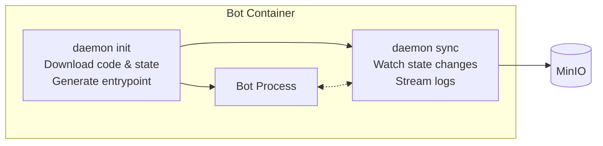
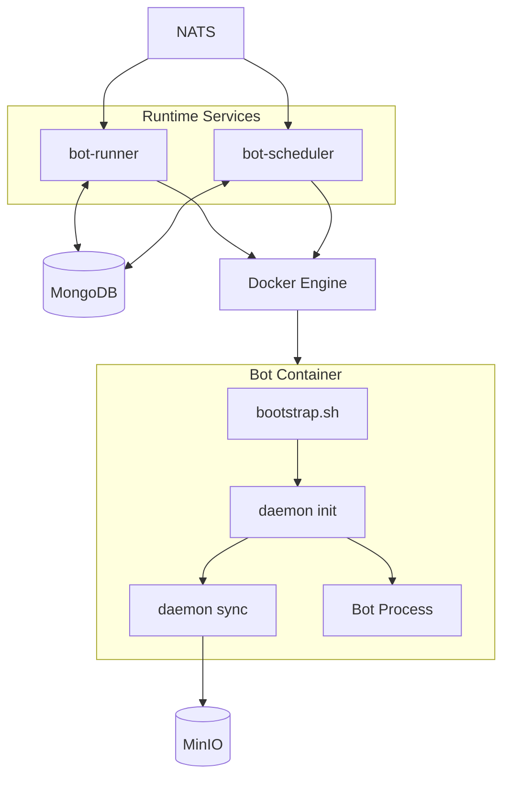
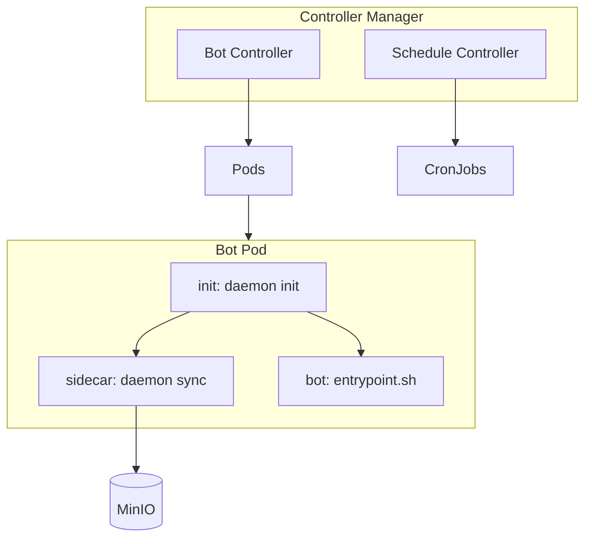

# the0 Runtime

The runtime is a unified container orchestration system for the0 platform that manages bot execution with persistent state.

## Overview

The runtime provides two deployment modes. **Docker mode** uses single-process services for local development and small deployments - bot-runner for live trading bots and bot-scheduler for cron-based scheduled execution. **Kubernetes mode** uses a controller-based deployment for production scale, managing bots as native K8s Pods and CronJobs.

## The Daemon Architecture

The runtime uses a **unified daemon architecture** where each bot container is self-managing. Rather than the orchestrator handling code download, state persistence, and log streaming, all of this is delegated to a daemon process running inside the container itself.



The daemon binary is embedded in each runtime base image. When a container starts, `daemon init` downloads the bot code and any existing state from MinIO, then generates a runtime-specific entrypoint script. The `daemon sync` process runs alongside the bot, watching for state file changes and uploading them to MinIO, while also periodically syncing logs.

This architecture means the same daemon logic runs in both Docker and Kubernetes modes. The only difference is how the daemon is orchestrated - in Docker mode via a bootstrap script, in K8s mode via init container and sidecar.

## Docker Mode

In Docker mode, a `bootstrap.sh` script within each container orchestrates the daemon:



The services query MongoDB for desired state and reconcile with Docker. When a bot should be running, the service starts a container. The container's bootstrap script handles the rest - downloading code, syncing state, and running the bot.

See [internal/docker/README.md](internal/docker/README.md) for details.

## Kubernetes Mode

In K8s mode, the daemon runs as init container and sidecar:



The controller creates Pods with three containers sharing volumes. The init container downloads code and state. The sidecar syncs state and logs continuously. The bot container runs the actual trading logic.

See [internal/k8s/README.md](internal/k8s/README.md) for details.

## State Persistence

Bot state is automatically synced to MinIO. When a bot writes to `/state/state.json`, the daemon detects the change via filesystem notifications and uploads the new state. On restart, `daemon init` downloads the existing state before the bot starts, ensuring continuity across container restarts.

For scheduled bots, the daemon performs a final sync when the bot completes, ensuring all state and logs are captured before the container terminates.

## Supported Runtimes

The platform supports Python 3.11, Node.js 20, Rust, C++, C# (.NET 8), Scala, and Haskell. Each runtime has a base image in `docker/images/` that includes the daemon binary and a bootstrap script.

## Quick Start

Using Docker Compose:

```bash
cd docker
make up
```

This starts all services including bot-runner and bot-scheduler. Runtime images are built automatically.

For Kubernetes:

```bash
cd k8s
make minikube-up
```

## Building

```bash
# Build the runtime binary
go build -o build/runtime ./cmd/app

# Build runtime images (for Docker mode)
cd docker && make build-images

# Run tests
go test ./...
```

See [CLAUDE.md](./CLAUDE.md) for detailed developer documentation.
