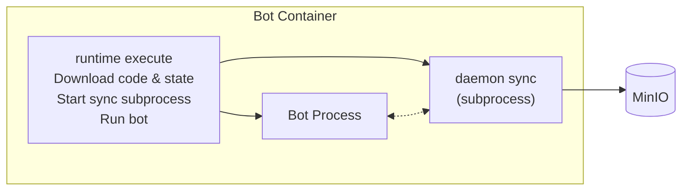
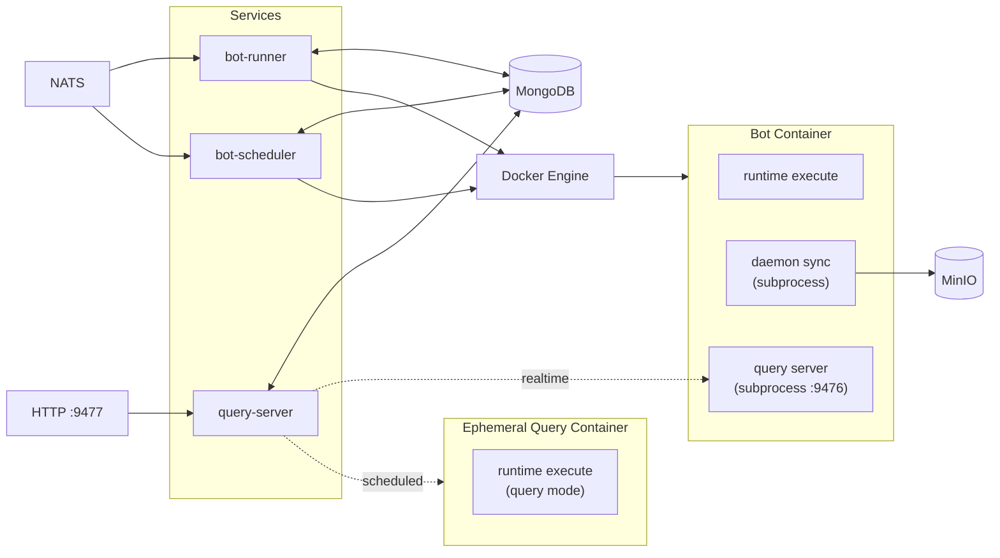
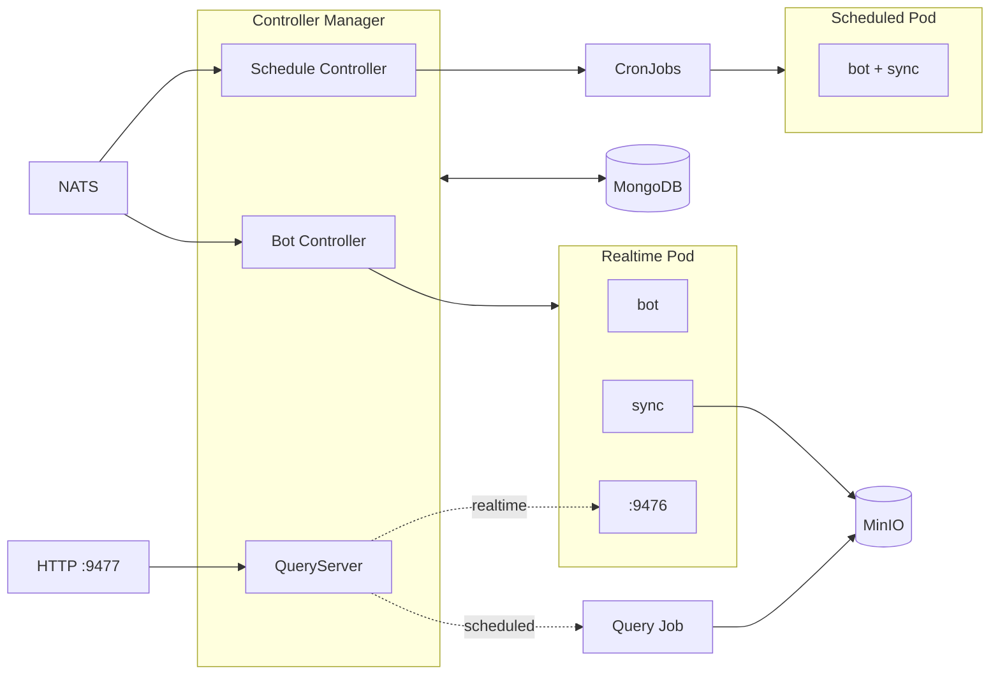
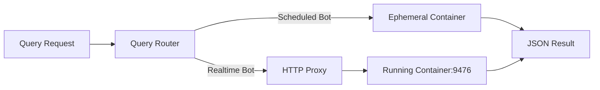

# the0 Runtime

The runtime is a unified container orchestration system for the0 platform that manages bot execution with persistent state.

## Overview

The runtime provides two deployment modes. **Docker mode** uses single-process services for local development and small deployments - bot-runner for live trading bots and bot-scheduler for cron-based scheduled execution. **Kubernetes mode** uses a controller-based deployment for production scale, managing bots as native K8s Pods and CronJobs.

## The Execute Architecture

The runtime uses a **unified execute architecture** where each bot container is self-managing. Rather than the orchestrator handling code download, state persistence, and log streaming, all of this is delegated to the `runtime execute` command running inside the container.



The runtime binary is embedded in each base image. When a container starts, `runtime execute` downloads the bot code and state from MinIO, starts the `daemon sync` subprocess for state/log persistence, and executes the bot process directly. For realtime bots with a query entrypoint, it also starts a query server subprocess on port 9476.

In Kubernetes mode, realtime bots use sidecars instead of subprocesses for better observability. Scheduled bots run as single containers with inline sync (same as Docker mode).

## Docker Mode

In Docker mode, each container runs `runtime execute` which handles everything:



The services query MongoDB for desired state and reconcile with Docker. When a bot should be running, the service starts a container. The `runtime execute` command handles the rest - downloading code/state from MinIO, starting subprocesses, and running the bot.

For realtime bots with a query entrypoint, `runtime execute` spawns a query server subprocess on port 9476. The standalone `query-server` (port 9477) proxies queries to this port. For scheduled bots, it spawns ephemeral containers with `QUERY_PATH` set.

See [internal/docker/README.md](internal/docker/README.md) for details.

## Kubernetes Mode

In K8s mode, realtime bots use sidecars for sync and query serving:



**Realtime bots** run as Pods with up to three containers sharing volumes:
- **bot**: Runs `runtime execute --skip-sync --skip-query-server` to execute the bot
- **sync**: Runs `daemon sync` to upload state/logs to MinIO
- **query-server** (if query entrypoint configured): Runs `runtime execute --query-server-only` on port 9476

**Scheduled bots** run as single-container Pods via CronJobs. The `runtime execute --skip-query-server` command spawns a sync subprocess that runs alongside the bot and does a final upload when the bot completes.

The QueryServer (HTTP port 9477) is embedded in the controller. For realtime bots, it proxies queries to the query-server sidecar. For scheduled bots, it creates ephemeral Jobs that write results to MinIO.

See [internal/k8s/README.md](internal/k8s/README.md) for details.

## State Persistence

Bot state is automatically synced to MinIO. The `daemon sync` process periodically (every 60s) computes a hash of the state directory and uploads changes to MinIO when detected. On restart, existing state is downloaded before the bot starts, ensuring continuity across container restarts.

For scheduled bots, the daemon performs a final sync when the bot completes, ensuring all state and logs are captured before the container terminates.

## Query System

The runtime provides a query API for reading computed data from bots without modifying state. Queries are useful for dashboards, portfolio summaries, and derived metrics.

**Realtime bots** run a query HTTP server on port 9476. Queries are proxied directly to the running container, providing low-latency (~10-50ms) responses.

**Scheduled bots** handle queries by spawning ephemeral containers. When a query arrives, the runtime starts a container with the `QUERY_PATH` environment variable set. The bot SDK detects this and runs in query mode instead of normal execution. This has higher latency (~1-3s) due to container startup.



See [internal/docker/README.md](internal/docker/README.md) and [internal/k8s/README.md](internal/k8s/README.md) for implementation details.

## Supported Runtimes

The platform supports Python 3.11, Node.js 20, Rust, C++, C# (.NET 8), Scala, and Haskell. A universal runtime image includes all language runtimes and the `runtime` binary.

## Quick Start

Using Docker Compose:

```bash
cd docker
make up
```

This starts all services including bot-runner and bot-scheduler. Runtime images are built automatically.

For Kubernetes:

```bash
cd k8s
make minikube-up
```

## Building

```bash
# Build the runtime binary
go build -o build/runtime ./cmd/app

# Build runtime images (for Docker mode)
cd docker && make build-images

# Run tests
go test ./...
```

See [CLAUDE.md](./CLAUDE.md) for detailed developer documentation.
