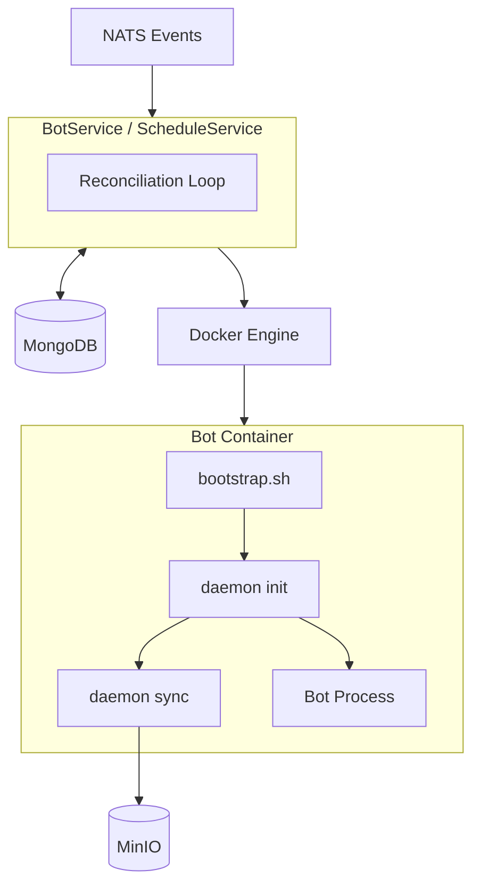
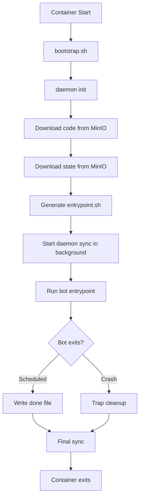

# Docker Mode

The Docker mode provides single-process services for running bots in containers. This is the recommended deployment for local development and small-to-medium deployments.

## Architecture

Docker mode uses a **daemon subprocess architecture** where each bot container is self-managing. The runtime services (bot-runner and bot-scheduler) only handle container lifecycle - starting, stopping, and restarting containers. All the complexity of code download, state persistence, and log streaming is delegated to a daemon process running inside each container.

## How It Works

### The Reconciliation Loop

Both BotService and ScheduleService use a reconciliation pattern. Every 30 seconds (configurable), the service queries MongoDB for the desired state - which bots should be running - and compares it against the actual state from Docker. If a bot should be running but isn't, the service starts it. If a container is running but the bot was disabled, the service stops it. If the configuration changed, the service restarts the container.

NATS integration is optional but recommended. Without NATS, changes only take effect at the next reconciliation interval. With NATS, the service receives events immediately and can act on them right away.

### Container Bootstrap

When a container starts, it runs `bootstrap.sh` which orchestrates the daemon. First, `daemon init` downloads the bot code and any existing state from MinIO, then generates a runtime-specific entrypoint script. Next, `daemon sync` starts in the background, watching for state file changes and periodically uploading logs. Finally, the actual bot process runs.

### State Persistence

The daemon sync process watches `/state/state.json` using filesystem notifications. When the bot writes state, the daemon detects the change and uploads it to MinIO. This happens with a small debounce to avoid excessive uploads during rapid writes. Logs are synced periodically rather than on every write.

For scheduled bots, the daemon also watches for a "done" file. When the bot completes and writes its exit code to this file, the daemon performs a final sync and then exits, allowing the container to terminate cleanly.

## Services

**BotService** manages live trading bots - containers that run continuously until stopped. These use `RestartPolicy: Always` so Docker automatically restarts them if they crash.

**ScheduleService** manages cron-based scheduled bots. It evaluates cron expressions to determine when bots should run, then starts containers that execute once and terminate. These use `RestartPolicy: Never` since completion is expected.

## Simplification from Previous Architecture

The previous architecture had multiple components in the runner: CodeManager for downloading code, ScriptManager for generating entrypoints, LogCollector for streaming logs, StateManager for persistence, and StateCollector for background sync. Each component added complexity and the Docker and K8s implementations diverged.

The daemon approach consolidates all of this into two commands (`daemon init` and `daemon sync`) that run identically in both Docker and K8s modes. The runner is now just container lifecycle management - about 40% less code with better separation of concerns.
