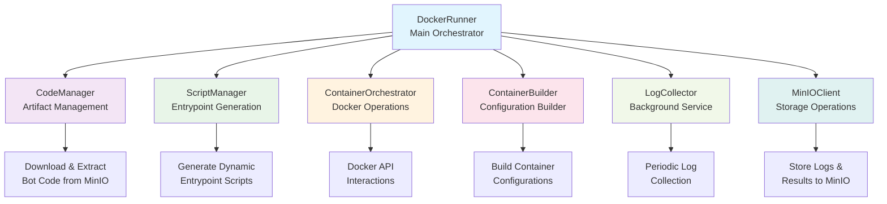

# Docker Mode Package

The `internal/docker` package provides single-process services for running bots in Docker containers. This is the recommended deployment mode for local development and small-to-medium deployments.

## Overview

This package contains:
- **BotService**: Manages live trading bot execution
- **ScheduleService**: Manages cron-based scheduled bot execution
- **ServiceState**: Thread-safe in-memory state management
- **DockerRunner**: Container lifecycle orchestration (shared by both services)

## Services

### BotService

**File:** `service.go`

BotService manages live trading bots using a reconciliation loop pattern.

```
┌─────────────────────────────────────────────────────────┐
│                      BotService                          │
│                                                          │
│  ┌─────────────┐  ┌─────────────┐  ┌─────────────────┐  │
│  │    NATS     │  │   Service   │  │  DockerRunner   │  │
│  │ (optional)  │──│    State    │──│                 │  │
│  └─────────────┘  └─────────────┘  └─────────────────┘  │
└─────────────────────────────────────────────────────────┘
```

**How it works:**
1. Queries MongoDB for enabled bots (desired state)
2. Lists running containers from Docker (actual state)
3. Reconciles: starts missing bots, stops extra containers
4. Detects config changes and restarts as needed
5. Repeats every `ReconcileInterval` (default: 30s)

**Key Configuration:**
```go
type BotServiceConfig struct {
    MongoURI          string        // Required
    NATSUrl           string        // Optional (enables instant updates)
    ReconcileInterval time.Duration // Default: 30s
    DBName            string        // Default: bot_runner
    Collection        string        // Default: bots
}
```

**NATS Integration (Optional):**
- Without NATS: Service polls MongoDB every reconcile interval
- With NATS: Bot changes are applied immediately via event subscription

### ScheduleService

**File:** `schedule_service.go`

ScheduleService manages cron-based scheduled bot execution.

**How it works:**
1. Queries MongoDB for enabled schedules
2. Evaluates cron expressions to find due schedules
3. Executes scheduled bots as terminating containers
4. Tracks execution state to prevent duplicate runs
5. Repeats every `CheckInterval` (default: 10s)

**Key Configuration:**
```go
type ScheduleServiceConfig struct {
    MongoURI      string        // Required
    NATSUrl       string        // Required (for API events)
    CheckInterval time.Duration // Default: 10s
    DBName        string        // Default: bot_scheduler
    Collection    string        // Default: bot_schedules
}
```

**NATS Integration (Required):**
- Receives schedule create/update/delete events from the API
- Required for schedule synchronization

### ServiceState

**File:** `state.go`

Thread-safe in-memory state management for running bots.

**Features:**
- Concurrent-safe map operations with RWMutex
- Deep copying to prevent data races
- Metrics tracking (reconcile count, active containers, failed restarts)

**Key Methods:**
```go
type ServiceState interface {
    SetRunningBot(bot *RunningBot)
    GetRunningBot(botID string) (*RunningBot, bool)
    GetAllRunningBots() map[string]*RunningBot
    RemoveRunningBot(botID string)
    GetMetrics() map[string]interface{}
}
```

---

## DockerRunner Module

A modular, component-based Docker execution environment for running bots and backtests in isolated containers.

### Architecture Overview

The Docker Runner follows a **component-based architecture** with clear separation of concerns. Each component handles a specific responsibility, making the system easier to test, maintain, and extend.



## Components

### 1. **DockerRunner** (Main Interface)
**File:** `docker_runner.go`

The main orchestrator that coordinates all components. It provides the public API for:
- Starting containers (bots & backtests)
- Stopping containers
- Querying container status
- Managing container lifecycle

**Key Methods:**
- `StartContainer()` - Starts a container (long-running or terminating)
- `StopContainer()` - Gracefully stops a container and cleans up resources
- `GetContainerStatus()` - Returns current container status
- `ListManagedContainers()` - Lists all active containers for a segment
- `GetContainerLogs()` - Retrieves container logs

### 2. **CodeManager** (Artifact Management)
**File:** `code_manager.go`

Handles downloading and extracting bot code from MinIO.

**Responsibilities:**
- Downloads ZIP archives from MinIO
- Extracts code to temporary directories
- Validates archive format
- Implements security checks (directory traversal prevention)

**Interface:**
```go
type CodeManager interface {
    FetchAndExtract(ctx context.Context, executable model.Executable) (string, error)
}
```

### 3. **ScriptManager** (Entrypoint Generation)
**File:** `script_manager.go`

Generates dynamic entrypoint scripts for containers using factory pattern.

**Responsibilities:**
- Orchestrates CodeEntrypointFactory and BashEntrypointFactory
- Creates runtime-specific wrapper scripts (Python/Node.js)
- Injects configuration into scripts
- Writes executable entrypoint.sh files

**Interface:**
```go
type ScriptManager interface {
    Create(ctx context.Context, executable model.Executable, botDir string) (string, error)
}
```

### 4. **ContainerOrchestrator** (Docker Operations)
**File:** `container_orchestrator.go`

Encapsulates all Docker API interactions.

**Responsibilities:**
- Pulling Docker images
- Creating and starting containers
- Running containers and waiting for completion
- Stopping containers gracefully
- Retrieving logs
- Copying files from containers
- Inspecting container status

**Interface:**
```go
type ContainerOrchestrator interface {
    PullImage(ctx context.Context, image string) error
    CreateAndStart(ctx context.Context, config, hostConfig) (containerID string, error)
    RunAndWait(ctx context.Context, config, hostConfig, resultPath) (*ContainerRunResult, error)
    Stop(ctx context.Context, containerID string, timeout time.Duration) error
    GetLogs(ctx context.Context, containerID string, tail int) (string, error)
    CopyFromContainer(ctx context.Context, containerID, srcPath string) ([]byte, error)
    GetStatus(ctx context.Context, containerID string) (*ContainerStatus, error)
    ListContainer(ctx context.Context, filter filters.Args) ([]*ContainerInfo, error)
}
```

### 5. **ContainerBuilder** (Configuration Builder)
**File:** `container_builder.go`

Fluent builder for constructing Docker container configurations.

**Responsibilities:**
- Building container.Config and container.HostConfig
- Setting environment variables
- Configuring volume mounts
- Applying resource limits (CPU, memory)
- Setting up labels for tracking

**Usage:**
```go
config, hostConfig := NewContainerBuilder(imageName).
    WithExecutable(executable).
    WithCommand(shell, scriptPath).
    WithBinds(volumeMount).
    WithResources(memoryLimit, cpuShares).
    WithAutoRemove(true).
    Build()
```

### 6. **LogCollector** (Background Service)
**File:** `log_collector.go`

Background service that periodically collects logs from running containers.

**Responsibilities:**
- Runs on a ticker (default: 30 seconds)
- Collects incremental logs from all managed containers
- Stores logs to MinIO via MinIOLogger
- Handles errors gracefully without blocking other containers

**Interface:**
```go
type LogCollector interface {
    Start() // Starts background collection
    Stop()  // Gracefully stops collection
}
```

### 7. **DockerRunnerConfig** (Configuration Management)
**File:** `docker_runner_config.go`

Manages environment-based configuration.

**Environment Variables:**

| Variable | Required | Default | Description |
|----------|----------|---------|-------------|
| `MINIO_ENDPOINT` | Yes | - | MinIO server endpoint |
| `MINIO_ACCESS_KEY` | Yes | - | MinIO access key |
| `MINIO_SECRET_KEY` | Yes | - | MinIO secret key |
| `MINIO_SSL` | No | `false` | Use SSL for MinIO |
| `MINIO_CODE_BUCKET` | No | `custom-bots` | Bucket for bot code |
| `MINIO_BACKTESTS_BUCKET` | No | `test-results` | Bucket for results |
| `TEMP_DIR` | No | `/tmp/runtime` | Temp directory |
| `BOT_MEMORY_LIMIT_MB` | No | `512` | Memory limit (MB) |
| `BOT_CPU_SHARES` | No | `512` | CPU shares |

## Execution Flows

### Long-Running Container (Bot)

```
1. Validate executable configuration
2. Download & extract code from MinIO
3. Pull Docker image (if needed)
4. Generate entrypoint script
5. Build container configuration
6. Create & start container
7. Track in managedContainers map
8. Return ExecutionResult with container ID
9. Background LogCollector streams logs to MinIO
```

**Characteristics:**
- `IsLongRunning: true`
- `AutoRemove: true`
- Returns immediately after starting
- Logs collected in background
- No result file expected

### Terminating Container (Backtest)

```
1. Validate executable configuration
2. Download & extract code from MinIO
3. Pull Docker image (if needed)
4. Generate entrypoint script
5. Build container configuration
6. Create & start container
7. Wait for completion
8. Collect logs
9. Copy result.json (if PersistResults: true)
10. Store analysis to MinIO
11. Remove container & cleanup directories
12. Return ExecutionResult with output & results
```

**Characteristics:**
- `IsLongRunning: false`
- `AutoRemove: false` (manual cleanup after result extraction)
- Waits for completion
- Logs included in response
- Result file copied and stored if `PersistResults: true`

## Container Configuration

### Volume Mounts
Containers mount the bot code directory at a path matching the entrypoint type:
- `/bot` for bot entrypoint
- `/backtest` for backtest entrypoint

### Network Mode
Uses `host` network mode to:
- Bypass gVisor network isolation (for GKE)
- Inherit pod's DNS configuration
- Simplify networking

### Resource Limits
Configurable via environment variables:
- Memory: Default 512MB
- CPU Shares: Default 512 (half CPU)

### Labels
All containers tagged with:
- `runtime.id`: Bot/backtest ID
- `runtime.entrypoint`: Script filename (e.g., "main.py")
- `runtime.managed`: "true"
- `runtime.segment`: Segment number

## Error Handling

- **Fail-fast validation**: Entrypoint validation happens early in `StartContainer()`
- **Graceful degradation**: Continues without MinIO logging if unavailable
- **Resource cleanup**: Ensures directories and containers are cleaned up even on errors
- **Permission fixing**: Handles containers creating root-owned files

## Testing

The module includes comprehensive integration tests covering:
- ✅ Entrypoint script generation (bot vs backtest)
- ✅ Runtime support (Python 3.11, Node.js 20)
- ✅ Long-running container lifecycle
- ✅ Terminating container execution
- ✅ Multiple entrypoints in same bot
- ✅ Result file extraction and storage
- ✅ Log collection

Run tests:
```bash
go test -v ./internal/docker-runner/...
```

## Usage Example

```go
// Create runner
runner, err := NewDockerRunner(DockerRunnerOptions{
    Logger: logger,
})
if err != nil {
    return err
}
defer runner.Close()

// Start a long-running bot
executable := model.Executable{
    ID:         "my-bot-123",
    Runtime:    "python3.11",
    Entrypoint: "bot",
    EntrypointFiles: map[string]string{
        "bot":      "main.py",
        "backtest": "backtest.py",
    },
    IsLongRunning: true,
    FilePath:      "my-bot.zip",
    Config: map[string]any{
        "param1": "value1",
    },
}

result, err := runner.StartContainer(ctx, executable)
if err != nil {
    return err
}

// For long-running: result.ContainerID available
// For terminating: result.Output and result.ResultFileContents available
```

## Design Principles

1. **Single Responsibility**: Each component has one clear purpose
2. **Dependency Injection**: Components are injected, not created internally
3. **Interface-based**: All components implement interfaces for testability
4. **DRY**: `executable` struct is the single source of truth
5. **Builder Pattern**: Container configuration uses fluent builder
6. **Factory Pattern**: Entrypoint scripts generated via factories
7. **Concurrent**: Background log collection runs independently
8. **Graceful Cleanup**: All resources cleaned up properly

## Future Enhancements

- [ ] Support for additional runtimes (Go, Rust, etc.)
- [ ] Configurable log collection interval per container
- [ ] Metrics collection (container start time, resource usage)
- [ ] Health checks for long-running containers
- [ ] Automatic container restart on failure
