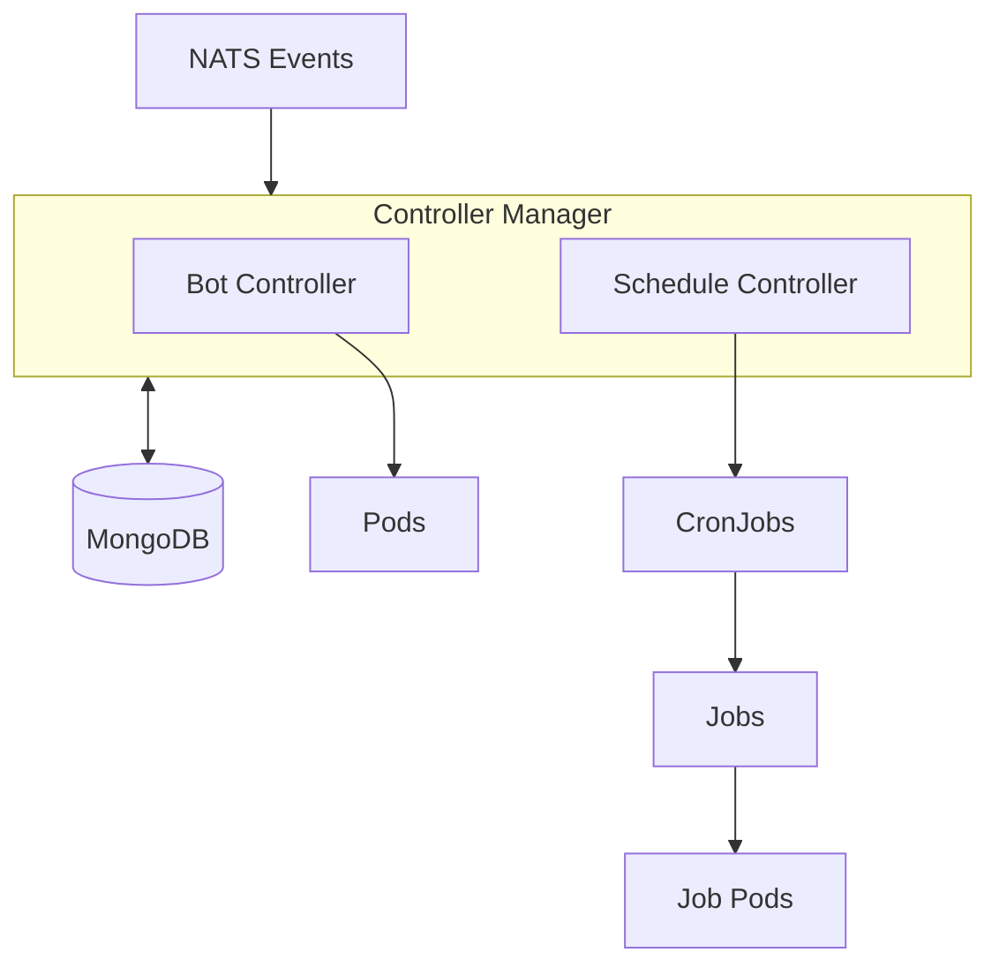
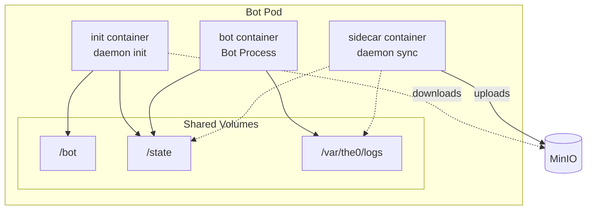

# Kubernetes Mode

The Kubernetes mode provides a controller-based deployment for running bots at scale. Each bot becomes its own Pod, leveraging Kubernetes for scheduling, health checks, and automatic restarts.

Use Kubernetes mode when running more than ~1000 bots per host, when high availability is required, or when you need K8s-native observability and management.

## Architecture

The controller manager runs two reconciliation controllers that watch MongoDB for desired state and manage Kubernetes resources accordingly. The Bot Controller manages Pods for live trading bots, while the Schedule Controller manages CronJobs for scheduled bots.

## Pod Structure

Unlike Docker mode where a single container runs everything, Kubernetes mode splits the daemon into separate containers that share volumes. This follows the Kubernetes sidecar pattern and provides better visibility into each component's health.

The **init container** runs `daemon init` to download bot code and existing state from MinIO, then generates the entrypoint script. It writes to the shared volumes and exits.

The **sidecar container** runs `daemon sync` continuously, watching the state directory for changes and periodically syncing logs to MinIO. For scheduled bots, it also watches for a "done" file to know when to perform a final sync and exit.

The **bot container** runs the actual bot code using the runtime-specific base image (Python, Node.js, etc.). It reads code from `/bot`, reads and writes state to `/state`, and writes logs to `/var/the0/logs`.

## How It Works

### Realtime Bots

For live trading bots, the Bot Controller creates Pods with `RestartPolicy: Always`. When the bot crashes, Kubernetes automatically restarts the bot container. The sidecar continues running throughout, ensuring state and logs are synced even across restarts.

The controller watches for changes via NATS events and also runs periodic reconciliation. When a bot is disabled, the controller deletes the Pod. When configuration changes, it deletes and recreates the Pod with the new settings.

### Scheduled Bots

For scheduled bots, the Schedule Controller creates CronJobs rather than Pods directly. Kubernetes handles the cron scheduling, creating a new Job (and thus a new Pod) at each scheduled time.

These Pods use `RestartPolicy: Never` since completion is expected. When the bot finishes, it writes its exit code to a "done" file. The sidecar detects this, performs a final state and log sync, and exits. The Job then completes and Kubernetes cleans up according to the CronJob's history limits.

## Comparison with Docker Mode

Both modes use the same daemon commands (`daemon init` and `daemon sync`) with the same logic. The difference is in how they're orchestrated:

In Docker mode, `bootstrap.sh` runs both daemon commands within a single container. The sync runs as a background process, and shell traps handle cleanup on exit.

In Kubernetes mode, the daemon commands run in separate containers. The init container runs `daemon init` once at startup. The sidecar container runs `daemon sync` continuously. Kubernetes handles the coordination and lifecycle management.

This separation provides better observability in K8s - you can see the status of each container independently, view their logs separately, and Kubernetes can restart individual containers if needed.
