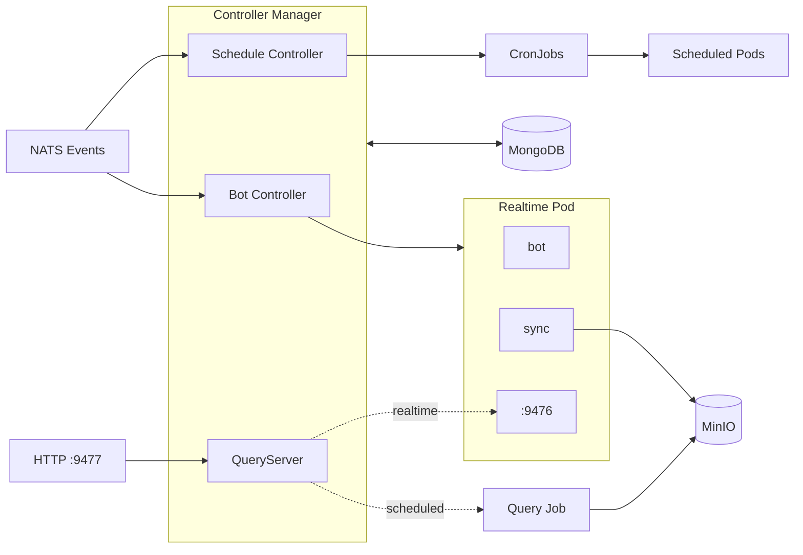
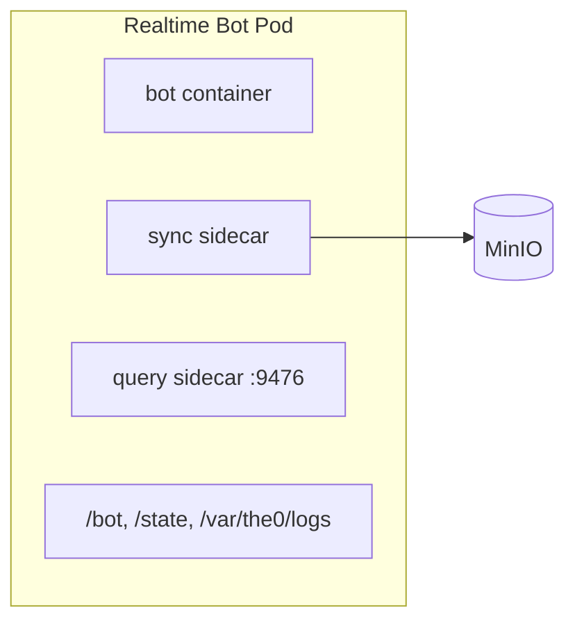
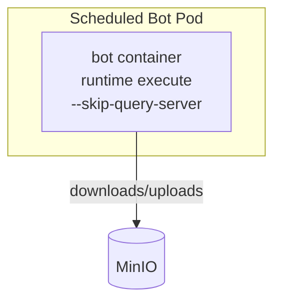

# Kubernetes Mode

The Kubernetes mode provides a controller-based deployment for running bots at scale. Each bot becomes its own Pod, leveraging Kubernetes for scheduling, health checks, and automatic restarts.

Use Kubernetes mode when running more than ~1000 bots per host, when high availability is required, or when you need K8s-native observability and management.

## Architecture

The controller manager runs two reconciliation controllers that watch MongoDB for desired state and manage Kubernetes resources accordingly. The Bot Controller manages Pods for live trading bots, while the Schedule Controller manages CronJobs for scheduled bots.

## Pod Structure

Kubernetes mode uses different pod structures for realtime and scheduled bots.

### Realtime Bot Pods

Realtime bots use sidecars for sync and query serving, providing better observability:

- **bot**: Runs `runtime execute --skip-sync --skip-query-server` which downloads code/state from MinIO and runs the bot
- **sync**: Runs `daemon sync` continuously, uploading state changes and logs to MinIO
- **query** (if query entrypoint configured): Runs `runtime execute --query-server-only` serving queries on port 9476

### Scheduled Bot Pods

Scheduled bots run as single containers (no sidecars), same as Docker mode:

The single container runs `runtime execute --skip-query-server` which downloads code/state, starts a sync subprocess that runs alongside the bot, executes the bot, and the sync subprocess does a final upload when the bot completes.

## How It Works

### Realtime Bots

The Bot Controller creates Pods with sync and query sidecars. When the bot crashes, Kubernetes automatically restarts the bot container. The sidecars continue running throughout, ensuring state and logs are synced even across restarts.

The controller watches for changes via NATS events and also runs periodic reconciliation. When a bot is disabled, the controller deletes the Pod. When configuration changes, it deletes and recreates the Pod with the new settings.

### Scheduled Bots

The Schedule Controller creates CronJobs rather than Pods directly. Kubernetes handles the cron scheduling, creating a new Job (and thus a new Pod) at each scheduled time.

These Pods use `RestartPolicy: Never` since completion is expected. The single container runs `runtime execute --skip-query-server` which downloads code/state, starts a sync subprocess that runs alongside the bot, executes the bot, and the sync subprocess does a final upload when the bot completes. The Job then completes and Kubernetes cleans up according to the CronJob's history limits.

## Comparison with Docker Mode

Both modes use the same underlying commands (`runtime execute` and `daemon sync`) with the same logic. The difference is in how they're orchestrated:

**Docker mode**: `runtime execute` runs everything within a single container. It downloads code/state, spawns `daemon sync` and optionally query server as subprocesses, and executes the bot. Signal handlers ensure cleanup on exit.

**K8s realtime bots**: Use sidecars instead of subprocesses. The bot container runs `runtime execute --skip-sync --skip-query-server`. Separate sidecar containers run `daemon sync` and the query server. This provides better observability - you can see the status of each container independently and view their logs separately.

**K8s scheduled bots**: Run as single containers, same as Docker mode. The `runtime execute --skip-query-server` command spawns a sync subprocess that runs alongside the bot and does a final upload when the bot completes.

## Query Execution

Kubernetes mode supports querying bots for computed data without affecting state.

### Realtime Bot Queries

For running pods with a query entrypoint, queries are proxied to the query sidecar on port 9476:

1. QueryServer (port 9477) receives HTTP request
2. Resolves pod IP for the bot
3. HTTP proxy to pod IP:9476 (the query sidecar)
4. Response returned (~10-50ms latency)

### Scheduled Bot Queries

For scheduled bots, queries create ephemeral K8s Jobs:

1. K8sQueryHandler receives request
2. PodGenerator creates query pod spec with `QUERY_PATH` env var
3. Job is created with TTL cleanup (5 minutes)
4. Job pod runs, writes result to MinIO
5. Handler downloads result from MinIO
6. Job auto-cleans up (~1-3s latency)
